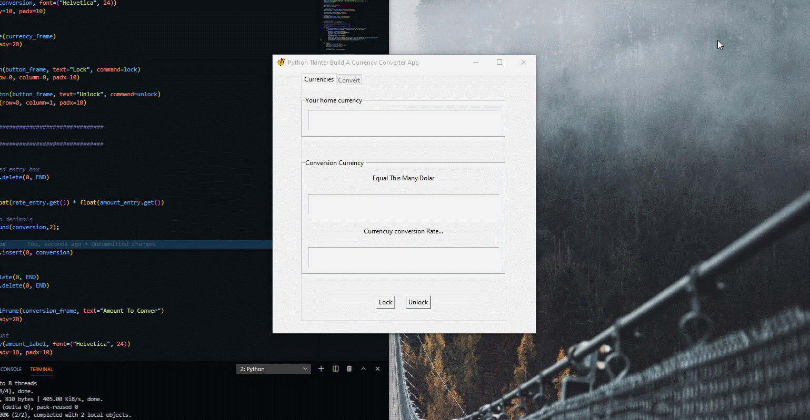
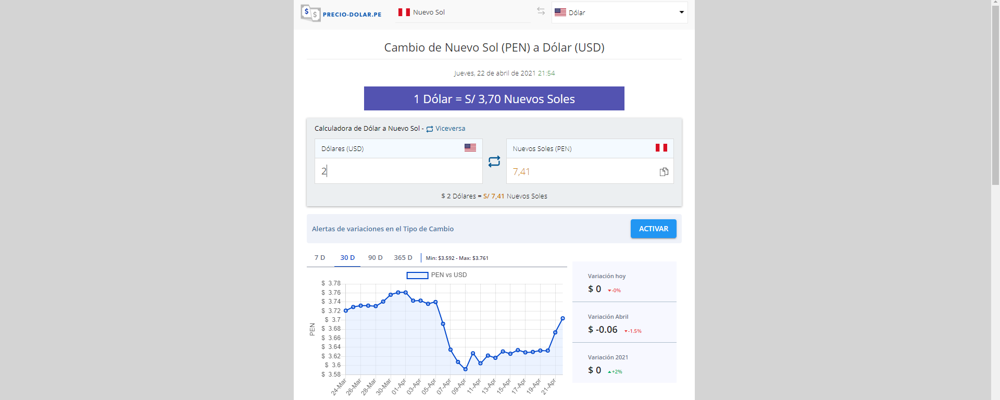

### Python Tkinter Build A Currency Converter App

<table>
  <tr>
    <td align="center" style="padding=0;width=50%;">
      
    </td>
  </tr>
</table>

<table>
  <tr>
    <td align="center" style="padding=0;width=50%;">
      
    </td>
  </tr>
</table>