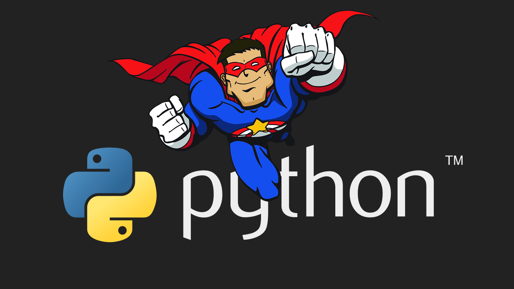
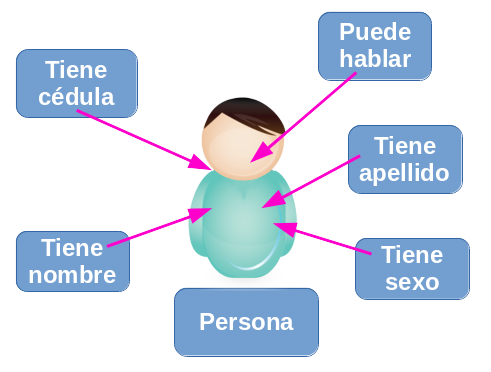
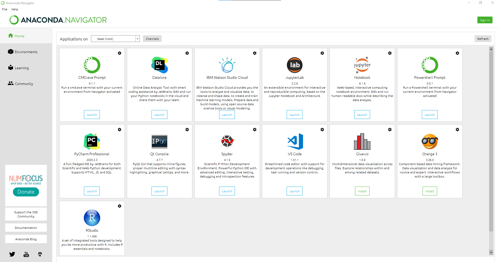
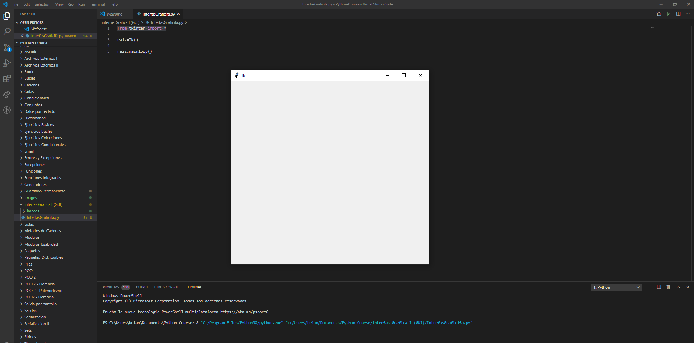
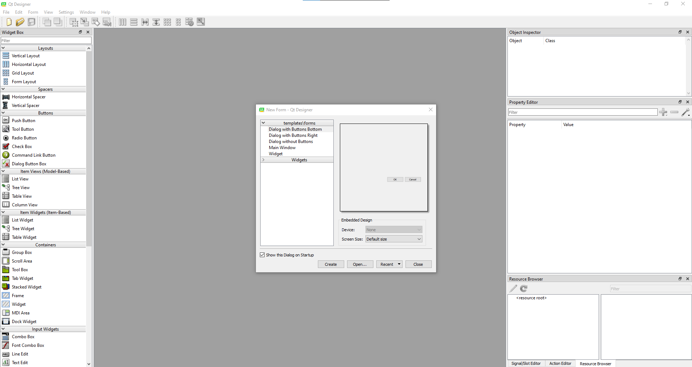
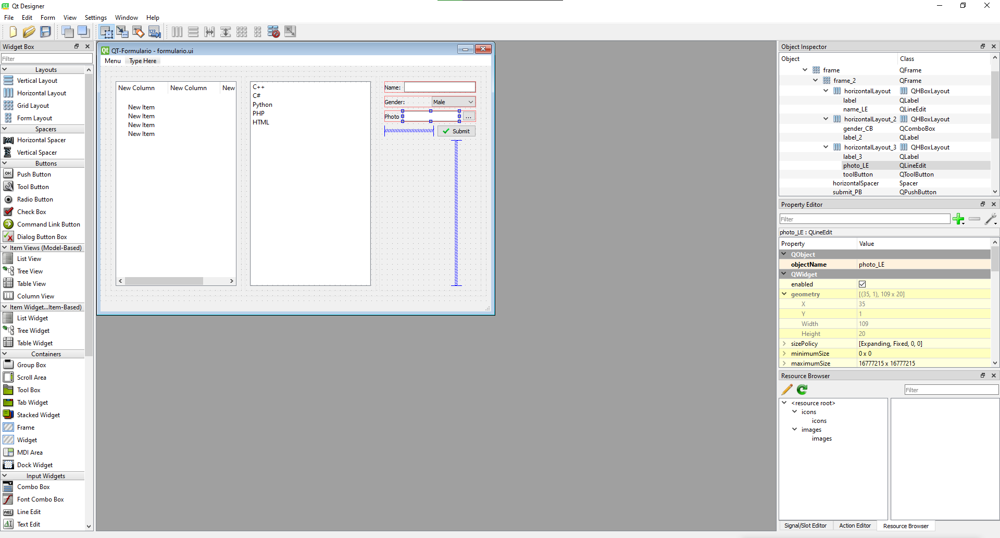
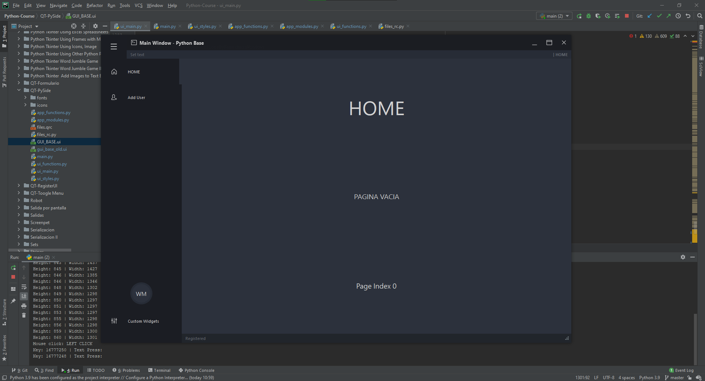
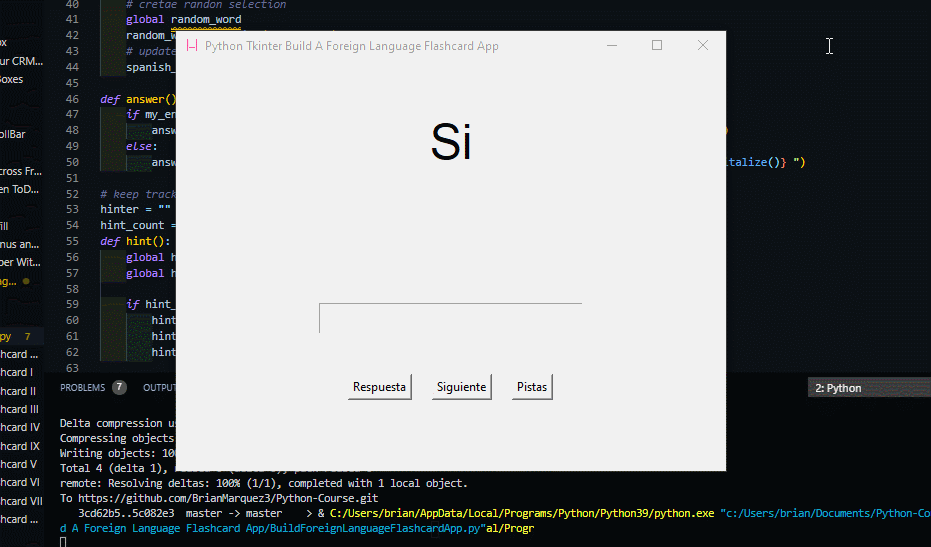
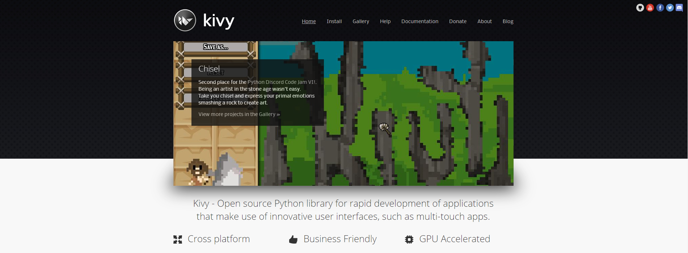

<h2 align="center">Learn Python Programming 🐍 from Zero to Hero #1 | Building Projects </h2>

<p align="center">
  
   </a>
    
  </a>
  <a href="https://github.com/BrianMarquez3/Python-Course/stargazers">
    
  </a>
  <a href="https://github.com/BrianMarquez3/Python-Course/network">
    
  </a>
    
  </a>
  
  </a>
    
  </a>
  
  </a>
    
  </a>
  
   </a>
   <a href="https://github.com/BrianMarquez3/Python-Course/network">
    
  </a><br>
 
  
  
  
</p>
  
<table align="center">
  <tr>
    <td align="center" style="padding=0;width=50%;">
      
    </td>
  </tr>
</table>


## HackerRank Python Certificate

<a href="Skills%20Certification/PythonBasic.png">
      

<a href="Skills%20Certification/Badges/python_5_star.png">
      

</a>


## Tabla de contenidos


 Numeration   | Check  |    Topic      |   Quantization   |    Edit Gitpot    |    Downloads    |  link  |
| ------------ |--------|-------------- |----------------- |------------------ |---------------- |-------- |
|  002   |:heavy_check_mark: | [Que es Python](#Que-es-Python)  | :hourglass:     |✅ | 💾 | [ ⬅️ Atras](https://github.com/BrianMarquez3) | 
|  003   |:heavy_check_mark: | [Creador](#Creador)  | :hourglass: |✅ | 💾 |  [ ⬅️ Atras](https://github.com/BrianMarquez3) | 
|  004   |:heavy_check_mark: | [Historia](#historia)  | :hourglass: |✅ | 💾 |  [ ⬅️ Atras](https://github.com/BrianMarquez3) | 
|  005   |:heavy_check_mark: | [Ejemplos](#Ejemplos)  | :hourglass: | ✅ | 💾 |  [ ⬅️ Atras](https://github.com/BrianMarquez3) | 
|  006   |:heavy_check_mark: | [Comandos](#Comandos) | :hourglass: | ✅ | 💾 |  [ ⬅️ Atras](https://github.com/BrianMarquez3) | 
|  007   |:heavy_check_mark: | [Variables](#Variables ) | :hourglass: | ✅ | 💾 |  [ ⬅️ Atras](https://github.com/BrianMarquez3) |
|  008   |:heavy_check_mark: | [Tuplas](#Tuplas ) | :hourglass: | ✅ | 💾 |  [ ⬅️ Atras](https://github.com/BrianMarquez3) |
|  009   |:heavy_check_mark: | [Instalación](#Instalación)  | :hourglass: | ✅ | 💾 |  [ ⬅️ Atras](https://github.com/BrianMarquez3) | 
|  010   |:heavy_check_mark: | [Ramas](#Ramas)  | :hourglass: | ✅ | 💾 |  [ ⬅️ Atras](https://github.com/BrianMarquez3) | 
|  011   |:heavy_check_mark: | [POO Programación orientada a objetos](#POO-Programación-orientada-a-objetos)  | :hourglass: | ✅ | 💾 |  [ ⬅️ Atras](https://github.com/BrianMarquez3) | 
|  012   |:heavy_check_mark: | [Install Jupyter Notebook](#Install-Jupyter-Notebook) | :hourglass: | ✅ | 💾 |  [ ⬅️ Atras](https://github.com/BrianMarquez3) | 
|  013   |:heavy_check_mark: | [Anaconda](#Anaconda) | :hourglass: | ✅ | 💾 |  [ ⬅️ Atras](https://github.com/BrianMarquez3) | 
|  014   |:heavy_check_mark: | [Buenas Practicas En Commits De Git](#Buenas-Practicas-En-Commits-De-Git) | :hourglass: | ✅ | 💾 |  [ ⬅️ Atras](https://github.com/BrianMarquez3) | 
|  015  |:heavy_check_mark: | [Build A Foreign Language Flashcard App](#Build-A-Foreign-Language-Flashcard-App) | :hourglass: | ✅ | 💾 |  [ ⬅️ Atras](https://github.com/BrianMarquez3) | 
|  016   |:heavy_check_mark: | [Archivos Externos I](#Archivos-Externos-I)| :hourglass: | ✅ | 💾 |  [ ⬅️ Atras](https://github.com/BrianMarquez3) | 
|  017   |:heavy_check_mark: | [Archivos Externos II](#Archivos-Externos-II)| :hourglass: | ✅ | 💾 |  [ ⬅️ Atras](https://github.com/BrianMarquez3) | 
|  018   |:heavy_check_mark: | [BBDD](#BBDD) | :hourglass: | ✅ | 💾 |  [ ⬅️ Atras](https://github.com/BrianMarquez3) | 
|  019   |:heavy_check_mark: | [A I Programming with Python](#A-I-Programming-with-Python) | :hourglass: | ✅ | 💾 |  [ ⬅️ Atras](https://github.com/BrianMarquez3) | 
|  020  |:heavy_check_mark: | [Bucles](#Bucles) | :hourglass: | ✅ | 💾 |  [ ⬅️ Atras](https://github.com/BrianMarquez3) | 
|  021  |:heavy_check_mark: | [Cadenas](#Cadenas) | :hourglass: |  ✅| 💾 |  [ ⬅️ Atras](https://github.com/BrianMarquez3) | 
|  022  |:heavy_check_mark: | [Christmas Tree](#Christmas-tree) | :hourglass: | ✅ | 💾 |  [ ⬅️ Atras](https://github.com/BrianMarquez3) | 
|  023  |:heavy_check_mark: | [Colas](#colas) | :hourglass: | ✅ | 💾 |  [ ⬅️ Atras](https://github.com/BrianMarquez3) | 
|  024  |:heavy_check_mark: | [Condicionales](#Condicionales) | :hourglass: | ✅ | 💾 |  [ ⬅️ Atras](https://github.com/BrianMarquez3) | 
|  025  |:heavy_check_mark: | [Conjuntos](#Conjuntos) | :hourglass: | ✅ | 💾 |  [ ⬅️ Atras](https://github.com/BrianMarquez3) | 
|  026  |:heavy_check_mark: | [Datos por teclado](#Datos-por-teclado) | :hourglass: | ✅ | 💾 |  [ ⬅️ Atras](https://github.com/BrianMarquez3) | 
|  027  |:heavy_check_mark: | [Decoradores](#Decoradores) | :hourglass: | ✅ | 💾 |  [ ⬅️ Atras](https://github.com/BrianMarquez3) | 
|  028  |:heavy_check_mark: | [Diccionarios](#Diccionarios) | :hourglass: | ✅ | 💾 |  [ ⬅️ Atras](https://github.com/BrianMarquez3) |
|  029  |:heavy_check_mark: | [Documentacion y Pruebas](#Documentacion-y-Pruebas) | :hourglass: | ✅ |💾 |  [ ⬅️ Atras](https://github.com/BrianMarquez3) | 
|  030  |:heavy_check_mark: | [Email](#Email) | :hourglass: | ✅ | - |  [ ⬅️ Atras](https://github.com/BrianMarquez3) | 
|  031  |:heavy_check_mark: | [Errores y Excepciones](#Errores-y-Excepciones) | :hourglass: | ✅ | 💾 |  [ ⬅️ Atras](https://github.com/BrianMarquez3) | 
|  032  |:heavy_check_mark: | [Estructura General](#Estructura-General) | :hourglass: | ✅ | 💾 |  [ ⬅️ Atras](https://github.com/BrianMarquez3) |
|  033  |:heavy_check_mark: | [Excepciones](#Excepciones) | :hourglass: | ✅ | 💾 |  [ ⬅️ Atras](https://github.com/BrianMarquez3) |  
|  034  |:heavy_check_mark: | [Estructura General](#Estructura-General) | :hourglass: | ✅ | 💾 |  [ ⬅️ Atras](https://github.com/BrianMarquez3) |
|  035  |:heavy_check_mark: | [Funciones Establecidas](#Funciones-Establecidas) | :hourglass: | ✅ | 💾 |  [ ⬅️ Atras](https://github.com/BrianMarquez3) |  
|  036  |:heavy_check_mark: | [Funciones](#Funciones) | :hourglass: | ✅ | 💾 |  [ ⬅️ Atras](https://github.com/BrianMarquez3) |  
|  037  |:heavy_check_mark: | [Git](#Git) | :hourglass: | ✅ | 💾 |  [ ⬅️ Atras](https://github.com/BrianMarquez3) |  
|  038  |:heavy_check_mark: | [Generadores](#Generadores) | :hourglass: | ✅ | 💾 |  [ ⬅️ Atras](https://github.com/BrianMarquez3) |  
|  039  |:heavy_check_mark: | [Generacion Ejecutables](#Generacion-Ejecutables) | :hourglass: | ✅ | 💾 |  [ ⬅️ Atras](https://github.com/BrianMarquez3) |  
|  040  |:heavy_check_mark: | [Geographic Map of Peru](#Geographic-Map-of-Peru) | :hourglass: | ✅ | 💾 |  [ ⬅️ Atras](https://github.com/BrianMarquez3) |  
|  041  |:heavy_check_mark: | [Geographical plottings](#Geographical-plottings) | :hourglass: | ✅ | 💾 |  [ ⬅️ Atras](https://github.com/BrianMarquez3) |  
|  042  |:heavy_check_mark: | [Guardado Permanenete](#Guardado-Permanenete) | :hourglass: | ✅ | 💾 |  [ ⬅️ Atras](https://github.com/BrianMarquez3) | 
|  043  |:heavy_check_mark: | [Interfas Grafica](#Interfas-Grafica) | :hourglass: | ✅ | 💾 |  [ ⬅️ Atras](https://github.com/BrianMarquez3) | 
|  044  |:heavy_check_mark: | [Listas](#Listas) | :hourglass: | ✅ | 💾 |  [ ⬅️ Atras](https://github.com/BrianMarquez3) | 
|  045  |:heavy_check_mark: | [Metodos de Cadenas](#Metodos-de-Cadenas) | :hourglass: | ✅ | 💾 |  [ ⬅️ Atras](https://github.com/BrianMarquez3) | 
|  046  |:heavy_check_mark: | [Modulos Usabiidad](#Modulos-Usabiidad) | :hourglass: | ✅ | 💾 |  [ ⬅️ Atras](https://github.com/BrianMarquez3) | 
|  047  |:heavy_check_mark: | [Modulos](#Modulos) | :hourglass: | ✅ | 💾 |  [ ⬅️ Atras](https://github.com/BrianMarquez3) |
|  048  |:heavy_check_mark: | [POO](#POO) | :hourglass: | ✅ | 💾 |  [ ⬅️ Atras](https://github.com/BrianMarquez3) |
|  049  |:heavy_check_mark: | [Paquetes](#Paquetes) | :hourglass: | ✅ | 💾 |  [ ⬅️ Atras](https://github.com/BrianMarquez3) |
|  050  |:heavy_check_mark: | [Paquetes Distribuibles](#Paquetes-Distribuibles) | :hourglass: | ✅ | 💾 |  [ ⬅️ Atras](https://github.com/BrianMarquez3) |
|  051  |:heavy_check_mark: | [Simulando Pilas](#Simulando-Pilas) | :hourglass: | ✅ | 💾 |  [ ⬅️ Atras](https://github.com/BrianMarquez3) |
|  052  |:heavy_check_mark: | [Plotly and cufflinks](#Plotly-and-cufflinks) | :hourglass: | ✅ | 💾 |  [ ⬅️ Atras](https://github.com/BrianMarquez3) |
|  053  |:heavy_check_mark: | [Practica Guiada ](#Practica-Guiada ) | :hourglass: |✅ | 💾 |  [ ⬅️ Atras](https://github.com/BrianMarquez3) |
|  054  |:heavy_check_mark: | [Proyect Dictionary](#Proyect-Dictionary ) | :hourglass: | ✅ | 💾 |  [ ⬅️ Atras](https://github.com/BrianMarquez3) |
|  055  |:heavy_check_mark: | [Proyect Game hangmen](#Proyect-Game-hangmen ) | :hourglass: |✅ | 💾 |  [ ⬅️ Atras](https://github.com/BrianMarquez3) |
|  056  |:heavy_check_mark: | [Reconocimiento Facial](#Reconocimiento-Facial ) | :hourglass: | ✅ | 💾 |  [ ⬅️ Atras](https://github.com/BrianMarquez3) |
|  057  |:heavy_check_mark: | [Robot](#Robot ) | :hourglass: | ✅ | 💾 |  [ ⬅️ Atras](https://github.com/BrianMarquez3) |
|  058  |:heavy_check_mark: | [Salida por pantalla](#Salida-por-pantalla ) | :hourglass: |✅ | 💾 |  [ ⬅️ Atras](https://github.com/BrianMarquez3) |
|  059  |:heavy_check_mark: | [Screenpet](#Screenpet ) | :hourglass: | ✅ | 💾 |  [ ⬅️ Atras](https://github.com/BrianMarquez3) |
|  060  |:heavy_check_mark: | [Serializacion](#Serializacion ) | :hourglass: | ✅ | 💾 |  [ ⬅️ Atras](https://github.com/BrianMarquez3) |
|  062  |:heavy_check_mark: | [Sets](#Sets ) | :hourglass: | ✅ | 💾|  [ ⬅️ Atras](https://github.com/BrianMarquez3) |
|  062  |:heavy_check_mark: | [Strings](#Strings ) | :hourglass: | ✅ | 💾 |  [ ⬅️ Atras](https://github.com/BrianMarquez3) |
|  063  |:heavy_check_mark: | [Test SQLServer](#Test-SQLServer ) | :hourglass: | ✅| 💾 |  [ ⬅️ Atras](https://github.com/BrianMarquez3) |
|  064  |:heavy_check_mark: | [Tipos de datos](#Tipos-de-datos ) | :hourglass: | ✅| 💾 |  [ ⬅️ Atras](https://github.com/BrianMarquez3) |
|  065  |:heavy_check_mark: | [ValidacionEmail](#ValidacionEmail ) | :hourglass: | ✅ | 💾 |  [ ⬅️ Atras](https://github.com/BrianMarquez3) |

* Pyhotn QT Designer

 Numeration   | Check  |    Topic      |   Quantization   |    Edit Gitpot    |    Downloads    |  link  |
| ------------ |--------|-------------- |----------------- |------------------ |---------------- |-------- |
|  066   |:heavy_check_mark: | [QT Designer](#QT-Designer) | :hourglass: | ✅ | 💾 |  [ ⬅️ Atras](https://github.com/BrianMarquez3) | 
|  067  |:heavy_check_mark: | [QT-Formulario](#QT-Formulario ) | :hourglass: | ✅ | 💾 |  [ ⬅️ Atras](https://github.com/BrianMarquez3) |
|  068  |:heavy_check_mark: | [QT-Formulario](#QT-Formulario ) | :hourglass: | ✅ | 💾 |  [ ⬅️ Atras](https://github.com/BrianMarquez3) |
|  069  |:heavy_check_mark: | [QT-PySide](#QT-PySide ) | :hourglass: | ✅ |💾 |  [ ⬅️ Atras](https://github.com/BrianMarquez3) |
|  070  |:heavy_check_mark: | [QT-RegisterUI](#QT-RegisterUI ) | :hourglass: | ✅ | 💾 |  [ ⬅️ Atras](https://github.com/BrianMarquez3) |
|  071  |:heavy_check_mark: | [QT-RenderTimeCalculator](#QT-RenderTimeCalculator ) | :hourglass: | ✅ | 💾 |  [ ⬅️ Atras](https://github.com/BrianMarquez3) |
|  072  |:heavy_check_mark: | [QT-Toogle Menu](#QT-Toogle-Menu ) | :hourglass: | ✅ | 💾 |  [ ⬅️ Atras](https://github.com/BrianMarquez3) |

* Pyhotn Tkinter

 Numeration   | Check  |    Topic      |   Quantization   |    Edit Gitpot    |    Downloads    |  link  |
| ------------ |--------|-------------- |----------------- |------------------ |---------------- |-------- |
|  073   |:heavy_check_mark: | [Interface Grafica TKINTER](#Interface-Grafica-TKINTER) | :hourglass: | ✅ | 💾 |  [ ⬅️ Atras](https://github.com/BrianMarquez3) | 
|  074   |:heavy_check_mark: | [Pyhton Tkinter Add ZipCode](#Pyhton-Tkinter-Add-ZipCode)  | :hourglass:     | ✅ | 💾 | [ ⬅️ Atras](https://github.com/BrianMarquez3) | 
|  074   |:heavy_check_mark: | [Pyhton Tkinter Get Height and Width](#Pyhton-Tkinter-Get-Height-and-Width)  | :hourglass:     | ✅ | 💾 | [ ⬅️ Atras](https://github.com/BrianMarquez3) | 
|  075   |:heavy_check_mark: | [Python TKinter Build An MP3 Player](#Python-TKinter-Build-An-MP3-Player)  | :hourglass:     | ✅ | 💾 | [ ⬅️ Atras (https://github.com/BrianMarquez3) | 
|  076   |:heavy_check_mark: | [Python TKinter Button Bitmaps](#Python-TKinter-Button-Bitmaps)  | :hourglass:     | ✅ | 💾 | [ ⬅️ Atras](https://github.com/BrianMarquez3) | 
|  077   |:heavy_check_mark: | [Python TKinter Changing The Mouse Cursor](#Python-TKinter-Changing-The-Mouse-Cursor)  | :hourglass:     | ✅ | 💾 | [ ⬅️ Atras](https://github.com/BrianMarquez3) | 
|  078   |:heavy_check_mark: | [Python TKinter How To Ring The System Bell](#Python-TKinter-How-To-Ring-The-System-Bell)  | :hourglass:     | ✅ | 💾 | [ ⬅️ Atras](https://github.com/BrianMarquez3) | 
|  079   |:heavy_check_mark: | [Python TKinter Using Entry Boxes On Canvas](#Python-TKinter-Using-Entry-Boxes-On-Canvas)  | :hourglass:     | ✅ | 💾 | [ ⬅️ Atras](https://github.com/BrianMarquez3) | 
|  100   |:heavy_check_mark: | [Python TKinter Using config to update widget](#Python-TKinter-Using-config-to-pdate-widget)  | :hourglass:     | ✅ | 💾 | [ ⬅️ Atras](https://github.com/BrianMarquez3) | 
|  101   |:heavy_check_mark: | [Python Tkinter Add Images to Text Box](#Python-Tkinter-Add-Images-to-Text-Box)  | :hourglass:     | ✅ | 💾 | [ ⬅️ Atras](https://github.com/BrianMarquez3) | 
|  102   |:heavy_check_mark: | [Python Tkinter Add Input Boxes For Our CRM Tool](#Python-Tkinter-Add-Input-Boxes-For-Our-CRM-Tool)  | :hourglass:     | ✅ | 💾 | [ ⬅️ Atras](https://github.com/BrianMarquez3) | 
|  103   |:heavy_check_mark: | [Python Tkinter Add Scrollbars to List Boxes](#Python-Tkinter-Add-Scrollbars-to-List-Boxes)  | :hourglass:     | ✅ | 💾 | [ ⬅️ Atras](https://github.com/BrianMarquez3) | 
|  104   |:heavy_check_mark: | [Python Tkinter Adding Frames](#Python-Tkinter-Adding-Frames)  | :hourglass:     | ✅ | 💾 | [ ⬅️ Atras](https://github.com/BrianMarquez3) | 
|  105   |:heavy_check_mark: | [Python Tkinter Adding Full Screen ScrollBar](#Python-Tkinter-Adding-Full-Screen-ScrollBar)  | :hourglass:     | ✅ | 💾 | [ ⬅️ Atras](https://github.com/BrianMarquez3) | 
|  106   |:heavy_check_mark: | [Python Tkinter Adding a Status Bar](#Python-Tkinter-Adding-a-Status-Bar)  | :hourglass:     | ✅ | 💾 | [ ⬅️ Atras](https://github.com/BrianMarquez3) | 
|  107   |:heavy_check_mark: | [Python Tkinter All List](#Python-Tkinter-All-List)  | :hourglass:     | ✅ | 💾 | [ ⬅️ Atras](https://github.com/BrianMarquez3) | 
|  108   |:heavy_check_mark: | [Python Tkinter Ballon Text Tools](#Python-Tkinter-Ballon-Text-Tools)  | :hourglass:     | ✅ | 💾 | [ ⬅️ Atras](https://github.com/BrianMarquez3) | 
|  109   |:heavy_check_mark: | [Python Tkinter Basic Search and Autofill](#Python-Tkinter-Basic-Search-and-Autofills)  | :hourglass:     | ✅ | 💾 | [ ⬅️ Atras](https://github.com/BrianMarquez3) | 
|  110   |:heavy_check_mark: | [Python Tkinter Binding Dropdown Menus and Combo Boxes](#Python-Tkinter-Binding-Dropdown-Menus-and-Combo-Boxes)  | :hourglass:     | ✅ | 💾 | [ ⬅️ Atras](https://github.com/BrianMarquez3) | 
|  111   |:heavy_check_mark: | [Python Tkinter Bitcoin Price Web Scraper With BeautifulSoup](#Python-Tkinter-Bitcoin-Price-Web-Scraper-With-BeautifulSoup)  | :hourglass:     | ✅ | 💾 | [ ⬅️ Atras](https://github.com/BrianMarquez3) | 
|  112   |:heavy_check_mark: | [Build A Foreign Language Flashcard App](#Build-A-Foreign-Language-Flashcard-App)  | :hourglass:     | ✅ | 💾 | [ ⬅️ Atras](https://github.com/BrianMarquez3) | 
|  123   |:heavy_check_mark: | [Python Tkinter Build A text Editor](#Python-Tkinter-Build-A-text-Editor)  | :hourglass:     | ✅ | 💾 | [ ⬅️ Atras](https://github.com/BrianMarquez3) | 
|  124   |:heavy_check_mark: | [Python Tkinter Build a Paint APP](#Python-Tkinter-Build-a-Paint-APP)  | :hourglass:     | ✅ | 💾 | [ ⬅️ Atras](https://github.com/BrianMarquez3) | 
|  125   |:heavy_check_mark: | [Python Tkinter Build an Imagen Viewer](#Python-Tkinter-Build-an-Imagen-Viewer)  | :hourglass:     | ✅ | 💾 | [ ⬅️ Atras](https://github.com/BrianMarquez3) | 
|  126   |:heavy_check_mark: | [Python Tkinter Building out Database](#Python-Tkinter-Building-out-Database)  | :hourglass:     | ✅ | 💾 | [ ⬅️ Atras](https://github.com/BrianMarquez3) | 
|  127   |:heavy_check_mark: | [Python Tkinter Button Mouse on Hover Popup Message](#Python-Tkinter-Button-Mouse-on-Hover-Popup-Message)  | :hourglass:     | ✅ | 💾 | [ ⬅️ Atras](https://github.com/BrianMarquez3) | 
|  128   |:heavy_check_mark: | [Python Tkinter Change Colors Weather App](#Python-Tkinter-Change-Colors-Weather-App)  | :hourglass:     | ✅ | 💾 | [ ⬅️ Atras](https://github.com/BrianMarquez3) | 
|  129   |:heavy_check_mark: | [Python Tkinter Checkboxes](#Python-Tkinter-Checkboxes)  | :hourglass:     | ✅ | 💾 | [ ⬅️ Atras](https://github.com/BrianMarquez3) | 
|  130   |:heavy_check_mark: | [Python Tkinter Classes](#Python-Tkinter-Classes)  | :hourglass:     | ✅ | 💾 | [ ⬅️ Atras](https://github.com/BrianMarquez3) |
|  131   |:heavy_check_mark: | [Python Tkinter Color Changing Number Guessing Game](#Python-Tkinter-Color-Changing-Number-Guessing-Game)  | :hourglass:     | ✅ | 💾 | [ ⬅️ Atras](https://github.com/BrianMarquez3) |
|  132   |:heavy_check_mark: | [Python Tkinter Color Picker](#Python-Tkinter-Color-Picker)  | :hourglass:     | ✅ | 💾 | [ ⬅️ Atras](https://github.com/BrianMarquez3) |
|  133   |:heavy_check_mark: | [Python Tkinter Create CRM database Tool](#Python-Tkinter-Create-CRM-database-Tool)  | :hourglass:     | ✅ | 💾 | [ ⬅️ Atras](https://github.com/BrianMarquez3) |
|  134   |:heavy_check_mark: | [Python Tkinter Create New Windows](#Python-Tkinter-Create-New-Windows)  | :hourglass:     | ✅ | 💾 | [ ⬅️ Atras](https://github.com/BrianMarquez3) |
|  135   |:heavy_check_mark: | [Python Tkinter Create Tab in Your GUI](#Python-Tkinter-Create-Tab-in-Your-GUI)  | :hourglass:     | ✅ | 💾 | [ ⬅️ Atras](https://github.com/BrianMarquez3) |
|  136   |:heavy_check_mark: | [Python Tkinter Create a Data Picker Calendar](#Python-Tkinter-Create-a-Data-Picker-Calendar)  | :hourglass:     | ✅ | 💾 | [ ⬅️ Atras](https://github.com/BrianMarquez3) |
|  137   |:heavy_check_mark: | [Python Tkinter Create a Database and Table CRM](#Python-Tkinter-Create-a-Database-and-Table-CRM)  | :hourglass:     | ✅ | 💾 | [ ⬅️ Atras](https://github.com/BrianMarquez3) |
|  138   |:heavy_check_mark: | [Python Tkinter Creating Buttons](#Python-Tkinter-Creating-Buttons)  | :hourglass:     | ✅ | 💾 | [ ⬅️ Atras](https://github.com/BrianMarquez3) |
|  139   |:heavy_check_mark: | [Python Tkinter Creating Input fields ](#Python-Tkinter-Creating-Input-fields )  | :hourglass:     | ✅ | 💾 | [ ⬅️ Atras](https://github.com/BrianMarquez3) |
|  140   |:heavy_check_mark: | [Python Tkinter Creating Multiple Entry Boxes Automatically ](#Python-Tkinter-Creating-Multiple-Entry-Boxes-Automatically )  | :hourglass:     | ✅ | 💾 | [ ⬅️ Atras](https://github.com/BrianMarquez3) |
|  141   |:heavy_check_mark: | [Python-Tkinter-Custom-Message-Box-Popups](#Python-Tkinter-Custom-Message-Box-Popups )  | :hourglass:     | ✅ | 💾 | [ ⬅️ Atras](https://github.com/BrianMarquez3) |
|  142   |:heavy_check_mark: | [Python Tkinter Dates and 2020 Countdown App ](#Python-Tkinter-Dates-and-2020-Countdown-App )  | :hourglass:     | ✅ | 💾 | [ ⬅️ Atras](https://github.com/BrianMarquez3) |
|  143   |:heavy_check_mark: | [Python Tkinter Delete Frame Children Widgets ](#Python-Tkinter-Delete-Frame-Children-Widgets )  | :hourglass:     | ✅ | 💾 | [ ⬅️ Atras](https://github.com/BrianMarquez3) |
|  144   |:heavy_check_mark: | [Python Tkinter Delete Frame Children Widgets ](#Python-Tkinter-Delete-Frame-Children-Widgets )  | :hourglass:     | ✅ | 💾 | [ ⬅️ Atras](https://github.com/BrianMarquez3) |
|  145   |:heavy_check_mark: | [Python Tkinter Delete a Record](#Python-Tkinter-Delete-a-Record)  | :hourglass:     | ✅ | 💾 | [ ⬅️ Atras](https://github.com/BrianMarquez3) | 
|  146   |:heavy_check_mark: | [Python Tkinter Dependent Drop Downs and List Boxes](#Python-Tkinter-Dependent-Drop-Downs-and-List-Boxes)  | :hourglass:     | ✅ | 💾 | [ ⬅️ Atras](https://github.com/BrianMarquez3) | 
|  147   |:heavy_check_mark: | [Python Tkinter Dont Packon the same Line](#Python-Tkinter-Dont-Packon-the-same-Line)  | :hourglass:     | ✅ | 💾 | [ ⬅️ Atras](https://github.com/BrianMarquez3) | 
|  148   |:heavy_check_mark: | [Python Tkinter Drag and Drop Images With the Mouse](#Python-Tkinter-Drag-and-Drop-Images-With-the-Mouse)  | :hourglass:     | ✅ | 💾 | [ ⬅️ Atras](https://github.com/BrianMarquez3) | 
|  149   |:heavy_check_mark: | [Python Tkinter Drag and Drop Images With the Mouse](#Python-Tkinter-Drag-and-Drop-Images-With-the-Mouse)  | :hourglass:     | ✅ | 💾 | [ ⬅️ Atras](https://github.com/BrianMarquez3) | 
|  150   |:heavy_check_mark: | [Python Tkinter Drop Box Database Search CRM](#Python-Tkinter-Drop-Box-Database-Search-CRM)  | :hourglass:     | ✅ | 💾 | [ ⬅️ Atras](https://github.com/BrianMarquez3) | 
|  151   |:heavy_check_mark: | [Python Tkinter Dropdown Menus](#Python-Tkinter-Dropdown-Menus)  | :hourglass:     | ✅ | 💾 | [ ⬅️ Atras](https://github.com/BrianMarquez3) | 
|  152   |:heavy_check_mark: | [Python Tkinter Dybamically Resize Buttons when Resizing a Window](#Python-Tkinter-Dybamically-Resize-Buttons-when-Resizing-a-Windows)  | :hourglass:     | ✅ | 💾 | [ ⬅️ Atras](https://github.com/BrianMarquez3) | 
|  153   |:heavy_check_mark: | [Python Tkinter Dynamically Resize Background Images](#Python-Tkinter-Dynamically-Resize-Background-Images)  | :hourglass:     | ✅ | 💾 | [ ⬅️ Atras](https://github.com/BrianMarquez3) | 
|  154   |:heavy_check_mark: | [Python Tkinter Export CRM Database to Excel File](#Python-Tkinter-Export-CRM-Database-to-Excel-File)  | :hourglass:     | ✅ | 💾 | [ ⬅️ Atras](https://github.com/BrianMarquez3) | 
|  155   |:heavy_check_mark: | [Python Tkinter How Draw Lines and Shapes with Canvas](#Python-Tkinter-How-Draw-Lines-and-Shapes-with-Canvas)  | :hourglass:     | ✅ | 💾 | [ ⬅️ Atras](https://github.com/BrianMarquez3) | 
|  156   |:heavy_check_mark: | [Python Tkinter How To Animate Widgets](#Python-Tkinter-How-To-Animate-Widgets)  | :hourglass:     | ✅ | 💾 | [ ⬅️ Atras](https://github.com/BrianMarquez3) | 
|  157   |:heavy_check_mark: | [Python Tkinter How To Define Custom Fonts](Python-Tkinter-How-To-Define-Custom-Fonts)  | :hourglass:     | ✅ | 💾 | [ ⬅️ Atras](https://github.com/BrianMarquez3) | 
|  158   |:heavy_check_mark: | [Python Tkinter How To Dynamically Resize Button Text](#Python-Tkinter-How-To-Dynamically-Resize-Button-Text)  | :hourglass:     | ✅ | 💾 | [ ⬅️ Atras](https://github.com/BrianMarquez3) | 
|  159   |:heavy_check_mark: | [Python Tkinter How To Read A PDF File](#Python-Tkinter-How-To-Read-A-PDF-ile)  | :hourglass:     | ✅ | 💾 | [ ⬅️ Atras](https://github.com/BrianMarquez3) | 
|  160   |:heavy_check_mark: | [Python Tkinter How To Resize Your App With The Sizegrip Widget](#Python-Tkinter-How-To-Resize-Your-App-With-The-Sizegrip-Widget)  | :hourglass:     | ✅ | 💾 | [ ⬅️ Atras](https://github.com/BrianMarquez3) | 
|  161   |:heavy_check_mark: | [Python Tkinter How To Risize Entry Box heigh](#Python-Tkinter-How-To-Risize-Entry-Box-heigh)  | :hourglass:     | ✅ | 💾 | [ ⬅️ Atras](https://github.com/BrianMarquez3) | 
|  162   |:heavy_check_mark: | [Python Tkinter How To Use HTML In Your Tkinter App](#Python-Tkinter-How-To-Use-HTML-In-Your-Tkinter-App)  | :hourglass:     | ✅ | 💾 | [ ⬅️ Atras](https://github.com/BrianMarquez3) | 
|  163   |:heavy_check_mark: | [Python Tkinter How To Use Images as Backgrounds](#Python-Tkinter-How-To-Use-Images-as-Backgrounds)  | :hourglass:     | ✅ | 💾 | [ ⬅️ Atras](https://github.com/BrianMarquez3) | 
|  164   |:heavy_check_mark: | [Python Tkinter How To Use The Message Widget For Blocks of Text](#Python-Tkinter-How-To-Use-he-Message-Widget-For-Blocks-of-Texts)  | :hourglass:     | ✅ | 💾 | [ ⬅️ Atras](https://github.com/BrianMarquez3) | 
|  165   |:heavy_check_mark: | [Python Tkinter How To add Excel Spreadsheet columns to listbox](#Python-Tkinter-How-To-add-Excel-Spreadsheet-columns-to-listbox)  | :hourglass:     | ✅ | 💾 | [ ⬅️ Atras](https://github.com/BrianMarquez3) | 
|  166   |:heavy_check_mark: | [Python Tkinter How To ser Tab Order and Focus](#Python-Tkinter-How-To-ser-Tab-Order-and-Focus)  | :hourglass:     | ✅ | 💾 | [ ⬅️ Atras](https://github.com/BrianMarquez3) | 
|  167   |:heavy_check_mark: | [Python Tkinter How Validate an Entry Widget Integer](#Python-Tkinter-How-Validate-an-Entry-Widget-Integer)  | :hourglass:     | ✅ | 💾 | [ ⬅️ Atras](https://github.com/BrianMarquez3) | 
|  168   |:heavy_check_mark: | [Python Tkinter How to Center Windows on the Screen](#Python-Tkinter-How-to-Center-Windows-on-the-Screen)  | :hourglass:     | ✅ | 💾 | [ ⬅️ Atras](https://github.com/BrianMarquez3) | 
|  169   |:heavy_check_mark: | [Python Tkinter How to Open External Programns](#Python-Tkinter-How-to-Open-External-Programns)  | :hourglass:     | ✅ | 💾 | [ ⬅️ Atras](https://github.com/BrianMarquez3) | 
|  170   |:heavy_check_mark: | [Python Tkinter How to Reset a Spinbox with Tkinter](#Python-Tkinter-How-to-Reset-a-Spinbox-with-Tkinter)  | :hourglass:     | ✅ | 💾 | [ ⬅️ Atras](https://github.com/BrianMarquez3) | 
|  171   |:heavy_check_mark: | [Python Tkinter How to Resize Images](#Python-Tkinter-How-to-Resize-Images)  | :hourglass:     | ✅ | 💾 | [ ⬅️ Atras](https://github.com/BrianMarquez3) | 
|  172   |:heavy_check_mark: | [Python Tkinter How to Resize a Window Dynamically](#Python-Tkinter-How-to-Resize-a-Window-Dynamically)  | :hourglass:     | ✅ | 💾 | [ ⬅️ Atras](https://github.com/BrianMarquez3) | 
|  173   |:heavy_check_mark: | [Python Tkinter How to Unlock the Hidden Keys of f a Widget](#Python-Tkinter-How-to-Unlock-the-Hidden-Keys-of-f-a-Widget)  | :hourglass:     | ✅ | 💾 | [ ⬅️ Atras](https://github.com/BrianMarquez3) | 
|  174   |:heavy_check_mark: | [Python Tkinter Image Buttons and Rounded Buttons](#Python-Tkinter-Image-Buttons-and-Rounded-Buttons)  | :hourglass:     | ✅ | 💾 | [ ⬅️ Atras](https://github.com/BrianMarquez3) | 
|  175   |:heavy_check_mark: | [Python Tkinter Keyboard Event Binding](#Python-Tkinter-Keyboard-Event-Bindings)  | :hourglass:     | ✅ | 💾 | [ ⬅️ Atras](https://github.com/BrianMarquez3) | 
|  176   |:heavy_check_mark: | [Python Tkinter List Boxes](#Python-Tkinter-List-Boxes)  | :hourglass:     | ✅ | 💾 | [ ⬅️ Atras](https://github.com/BrianMarquez3) | 
|  177   |:heavy_check_mark: | [Python Tkinter Lookup Customer By Last Name CRM](#Python-Tkinter-Lookup-Customer-By-Last-Name-CRM)  | :hourglass:     | ✅ | 💾 | [ ⬅️ Atras](https://github.com/BrianMarquez3) | 
|  178   |:heavy_check_mark: | [Python Tkinter Lookup all CustomersCRM](#Python-Tkinter-Lookup-all-CustomersCRM)  | :hourglass:     | ✅ | 💾 | [ ⬅️ Atras](https://github.com/BrianMarquez3) | 
|  179   |:heavy_check_mark: | [Python Tkinter MariaDB](#Python-Tkinter-MariaDB)  | :hourglass:     | ✅ | 💾 | [ ⬅️ Atras](https://github.com/BrianMarquez3) | 
|  180   |:heavy_check_mark: | [Python Tkinter Matplolib Charts](#Python-Tkinter-Matplolib-Charts)  | :hourglass:     | ✅ | 💾 | [ ⬅️ Atras](https://github.com/BrianMarquez3) | 
|  181   |:heavy_check_mark: | [Python Tkinter Menu Bars](#Python-Tkinter-Menu-Bars)  | :hourglass:     | ✅ | 💾 | [ ⬅️ Atras](https://github.com/BrianMarquez3) | 
|  182   |:heavy_check_mark: | [Python Tkinter Message Boxes](#Python-Tkinter-Message-Boxes)  | :hourglass:     | ✅ | 💾 | [ ⬅️ Atras](https://github.com/BrianMarquez3) | 
|  183   |:heavy_check_mark: | [Python Tkinter Mouse On Hover Image Animation](#Python-Tkinter-Mouse-On-Hover-Image-Animation)  | :hourglass:     | ✅ | 💾 | [ ⬅️ Atras](https://github.com/BrianMarquez3) | 
|  184   |:heavy_check_mark: | [Python Tkinter Move Canvas shapes with Arrow Keys](#Python-Tkinter-Move-Canvas-shapes-with-Arrow-Keys)  | :hourglass:     | ✅ | 💾 | [ ⬅️ Atras](https://github.com/BrianMarquez3) | 
|  185   |:heavy_check_mark: | [Python Tkinter Multiple CRM search Results](#Python-Tkinter-Multiple-CRM-search-Results)  | :hourglass:     | ✅ | 💾 | [ ⬅️ Atras](https://github.com/BrianMarquez3) | 
|  186   |:heavy_check_mark: | [Python Tkinter On Off Button Switch](#Python-Tkinter-On-Off-Button-Switch)  | :hourglass:     | ✅ | 💾 | [ ⬅️ Atras](https://github.com/BrianMarquez3) | 
|  187   |:heavy_check_mark: | [Python Tkinter Open Excell Spreadsheet](#Python-Tkinter-Open-Excell-Spreadsheet)  | :hourglass:     | ✅ | 💾 | [ ⬅️ Atras](https://github.com/BrianMarquez3) | 
|  188   |:heavy_check_mark: | [Python Tkinter Open Files Dialog Box](#Python-Tkinter-Open-Files-Dialog-Box)  | :hourglass:     | ✅ | 💾 | [ ⬅️ Atras](https://github.com/BrianMarquez3) | 
|  189   |:heavy_check_mark: | [Python Tkinter Overwrite Grid Labels](#Python-Tkinter-Overwrite-Grid-Labels)  | :hourglass:     | ✅ | 💾 | [ ⬅️ Atras](https://github.com/BrianMarquez3) | 
|  190   |:heavy_check_mark: | [Python Tkinter Paned Windows ](#Python-Tkinter-Paned-Windows)  | :hourglass:     | ✅ | 💾 | [ ⬅️ Atras](https://github.com/BrianMarquez3) | 
|  191   |:heavy_check_mark: | [Python Tkinter Positioning ](#Python-Tkinter-Positioning )  | :hourglass:     | ✅ | 💾 | [ ⬅️ Atras](https://github.com/BrianMarquez3) | 
|  192   |:heavy_check_mark: | [Python Tkinter Progress Bars](#Python-Tkinter-Progress-Bars)  | :hourglass:     | ✅ | 💾 | [ ⬅️ Atras](https://github.com/BrianMarquez3) | 
|  193   |:heavy_check_mark: | [Python Tkinter Radio Butttons](#Python-Tkinter-Radio-Butttons)  | :hourglass:     | ✅ | 💾 | [ ⬅️ Atras](https://github.com/BrianMarquez3) | 
|  194   |:heavy_check_mark: | [Python Tkinter Random Winner Generador](#Python-Tkinter-Random-Winner-Generador)  | :hourglass:     | ✅ | 💾 | [ ⬅️ Atras](https://github.com/BrianMarquez3) | 
|  195   |:heavy_check_mark: | [Python Tkinter Read and Write to Text Files](#Python-Tkinter-Read-and-Write-to-Text-Files)  | :hourglass:     | ✅ | 💾 | [ ⬅️ Atras](https://github.com/BrianMarquez3) | 
|  196   |:heavy_check_mark: | [Python Tkinter Remove Labels](#ython-Tkinter-Remove-Labels)  | :hourglass:     | ✅ | 💾 | [ ⬅️ Atras](https://github.com/BrianMarquez3) | 
|  197   |:heavy_check_mark: | [Python Tkinter Right Click Menu Popups](#Python-Tkinter-Right-Click-Menu-Popups)  | :hourglass:     | ✅ | 💾 | [ ⬅️ Atras](https://github.com/BrianMarquez3) | 
|  198   |:heavy_check_mark: | [Python Tkinter Rock Paper Scissors Game ](#Python-Tkinter-Rock-Paper-Scissors-Game )  | :hourglass:     | ✅ | 💾 | [ ⬅️ Atras](https://github.com/BrianMarquez3) | 
|  199   |:heavy_check_mark: | [Python Tkinter Save To Dat File Instead of Databases](#Python-Tkinter-Save-To-Dat-File-Instead-of-Databases)  | :hourglass:     | ✅ | 💾 | [ ⬅️ Atras](https://github.com/BrianMarquez3) | 
|  200   |:heavy_check_mark: | [Python Tkinter Secret Label Copying Hach](#Python-Tkinter-Secret-Label-Copying-Hach)  | :hourglass:     | ✅ | 💾 | [ ⬅️ Atras](https://github.com/BrianMarquez3) | 
|  201   |:heavy_check_mark: | [Python Tkinter Sliders](#Python-Tkinter-Sliders)  | :hourglass:     | ✅ | 💾 | [ ⬅️ Atras](https://github.com/BrianMarquez3) | 
|  202   |:heavy_check_mark: | [Python Tkinter Sounds and Music](#Python-Tkinter-Sounds-and-Music)  | :hourglass:     | ✅ | 💾 | [ ⬅️ Atras](https://github.com/BrianMarquez3) | 
|  203   |:heavy_check_mark: | [Python Tkinter Spinboxes](#Python-Tkinter-Spinboxes)  | :hourglass:     | ✅ | 💾 | [ ⬅️ Atras](https://github.com/BrianMarquez3) | 
|  204   |:heavy_check_mark: | [Python Tkinter Standalone EXE Executable ](#Python-Tkinter-Standalone-EXE-Executable)  | :hourglass:     | ✅ | 💾 | [ ⬅️ Atras](https://github.com/BrianMarquez3) | 
|  205   |:heavy_check_mark: | [Python Tkinter Text Box](#Python-Tkinter-Text-Box )  | :hourglass:     | ✅ | 💾 | [ ⬅️ Atras](https://github.com/BrianMarquez3) | 
|  206   |:heavy_check_mark: | [Python Tkinter Threading](#Python-Tkinter-Threading)  | :hourglass:     | ✅ | 💾 | [ ⬅️ Atras](https://github.com/BrianMarquez3) | 
|  207   |:heavy_check_mark: | [Python Tkinter Tic Tac Toe Game](#Python-Tkinter-Tic-Tac-Toe-Game)  | :hourglass:     | ✅ | 💾 | [ ⬅️ Atras](https://github.com/BrianMarquez3) | 
|  208   |:heavy_check_mark: | [Python Tkinter Tile Matching Game ](#Python-Tkinter-Tile-Matching-Game )  | :hourglass:     | ✅ | 💾 | [ ⬅️ Atras](https://github.com/BrianMarquez3) | 
|  209   |:heavy_check_mark: | [Python Tkinter Timers and Clocks ](#Python-Tkinter-Timers-and-Clocks )  | :hourglass:     | ✅ | 💾 | [ ⬅️ Atras](https://github.com/BrianMarquez3) | 
|  210   |:heavy_check_mark: | [Python Tkinter Transparent Windows](#Python-Tkinter-Transparent-Windows)  | :hourglass:     | ✅ | 💾 | [ ⬅️ Atras](https://github.com/BrianMarquez3) | 
|  211   |:heavy_check_mark: | [Python Tkinter Treeview](#Python-Tkinter-Treeview)  | :hourglass:     | ✅ | 💾 | [ ⬅️ Atras](https://github.com/BrianMarquez3) | 
|  213   |:heavy_check_mark: | [Python Tkinter Undo and Redo Text Button ](#Python-Tkinter-Undo-and-Redo-Text-Button )  | :hourglass:     | ✅ | 💾 | [ ⬅️ Atras](https://github.com/BrianMarquez3) | 
|  214   |:heavy_check_mark: | [Python Tkinter Unicode Character & Special Characters](#Python-Tkinter-Unicode-Character-&-Special-Characters)  | :hourglass:     | ✅ | 💾 | [ ⬅️ Atras](https://github.com/BrianMarquez3) | 
|  215   |:heavy_check_mark: | [Python ](#Python-Tkinter-Unicode-Character-&-Special-Characters)  | :hourglass:     | ✅ | 💾 | [ ⬅️ Atras](https://github.com/BrianMarquez3) | 
|  216   |:heavy_check_mark: | [Python Tkinter Unicode Character & Special Characters](#Python-Tkinter-Unicode-Character-&-Special-Characters)  | :hourglass:     | ✅ | 💾 | [ ⬅️ Atras](https://github.com/BrianMarquez3) | 
|  217   |:heavy_check_mark: | [Python Tkinter Update MariaDb records](#Python-Tkinter-Update-MariaDb-records)  | :hourglass:     | ✅ | 💾 | [ ⬅️ Atras](https://github.com/BrianMarquez3) | 
|  218   |:heavy_check_mark: | [Python Tkinter Update a Record](#Python-Tkinter-Update-a-Record)  | :hourglass:     | ✅ | 💾 | [ ⬅️ Atras](https://github.com/BrianMarquez3) | 
|  219   |:heavy_check_mark: | [Python Tkinter Using Config to update](#Python-Tkinter-Using-Config-to-update)  | :hourglass:     | ✅ | 💾 | [ ⬅️ Atras](https://github.com/BrianMarquez3) | 
|  220   |:heavy_check_mark: | [Python Tkinter Using Database](#Python-Tkinter-Using-Database)  | :hourglass:     | ✅ | 💾 | [ ⬅️ Atras](https://github.com/BrianMarquez3) | 
|  221   |:heavy_check_mark: | [Python Tkinter Using Excel Spreadsheets](#PPython-Tkinter-Using-Excel-Spreadsheets)  | :hourglass:     | ✅ | 💾 | [ ⬅️ Atras](https://github.com/BrianMarquez3) | 
|  222   |:heavy_check_mark: | [Python Tkinter Using Frames with Menus](#[Python-Tkinter-Using-Frames-with-Menus)  | :hourglass:     | ✅ | 💾 | [ ⬅️ Atras](https://github.com/BrianMarquez3) | 
|  223   |:heavy_check_mark: | [Python Tkinter Using Icons Image](#Python-Tkinter-Using-Icons-Image)  | :hourglass:     | ✅ | 💾 | [ ⬅️ Atras](https://github.com/BrianMarquez3) | 
|  224   |:heavy_check_mark: | [Python Tkinter Using Other Python Programs in you App](#Python-Tkinter-Using-Other-Python-Programs-in-you-App)  | :hourglass:     | ✅ | 💾 | [ ⬅️ Atras](https://github.com/BrianMarquez3) | 
|  225   |:heavy_check_mark: | [Python Tkinter Window Resizer Control Panel](#Python-Tkinter-Window-Resizer-Control-Panel)  | :hourglass:     | ✅ | 💾 | [ ⬅️ Atras](https://github.com/BrianMarquez3) | 
|  226   |:heavy_check_mark: | [Python Tkinter Word Jumble Game ](#Python-Tkinter-Word-Jumble-Game )  | :hourglass:     | ✅ | 💾 | [ ⬅️ Atras](https://github.com/BrianMarquez3) | 
|  227   |:heavy_check_mark: | [Python Tkinter how To Create a Splash Screen](#Python-Tkinter-how-To-Create-a-Splash-Screen)  | :hourglass:     | ✅ | 💾 | [ ⬅️ Atras](https://github.com/BrianMarquez3) | 
|  228   |:heavy_check_mark: | [Python Tkinter one SIded Widget Padding](#Python-Tkinter-one-SIded-Widget-Padding)  | :hourglass:     | ✅ | 💾 | [ ⬅️ Atras](https://github.com/BrianMarquez3) | 
|  229   |:heavy_check_mark: | [Python tkinter How to Disable or Delete a Menu item](#Python-tkinter-How-to-Disable-or-Delete-a-Menu-item)  | :hourglass:     | ✅ | 💾 | [ ⬅️ Atras](https://github.com/BrianMarquez3) | 
|  A    |:heavy_check_mark: | [Play List Spotify](#Spotify) | :hourglass: | ✅ | 💾 |  [ ⬅️ Atras](https://github.com/BrianMarquez3) | 
|  B    |:heavy_check_mark: | [Book](#book)| :hourglass: | ✅ | 💾|  [ ⬅️ Atras](https://github.com/BrianMarquez3) | 

---

<table align="center">
  <tr>
    <td align="center" style="padding=0;width=50%;">
      
    </td>
  </tr>
  <h3 align="center"> Paradigma: Multiparadigma: orientado a objetos, imperativo, funcional, reflexivo  </h3>
</table>

## Que es Python

Python es un lenguaje de programación interpretado cuya filosofía hace hincapié en la legibilidad de su código. Se trata de un lenguaje de programación multiparadigma, ya que soporta orientación a objetos, programación imperativa y, en menor medida, programación funcional. Es un lenguaje interpretado, dinámico y multiplataforma.

Es administrado por la Python Software Foundation. Posee una licencia de código abierto, denominada Python Software Foundation License, que es compatible con la Licencia pública general de GNU a partir de la versión 2.1.1, e incompatible en ciertas versiones anteriores. [WIKIPEDIA](https://es.wikipedia.org/wiki/Python).<br>

---
## Creador

<table align="center">
<h3 align="center"> Guido van Rossum  </h3>
  <tr>
    <td align="center" style="padding=0;width=50%;">
      
    </td>
  </tr>
  <h3 align="center"> Sistema de tipos: Fuertemente tipado, dinámico </h3>
</table>

<p>Guido van Rossum es un informático,1​ conocido por ser el autor del lenguaje de programación Python. Nació y creció en los Países Bajos.

En el ambiente de los desarrolladores del lenguaje Python también se le conoce por el título BDFL (Benevolent Dictator for Life), teniendo asignada la tarea de fijar las directrices sobre la evolución de Python, así como la de tomar decisiones finales sobre el lenguaje que todos los desarrolladores acatan. Van Rossum tiene fama de ser bastante conservador, realizando pocos cambios al lenguaje entre versiones sucesivas, intentando mantener siempre la compatibilidad con versiones anteriores. El 12 de julio de 2018, con un mensaje enviado a la lista de python-committers, anunció su retiro de los procesos de decisión. Desde noviembre del 2020 es parte de la División de Desarrolladores de la empresa Microsoft [WIKIPEDIA](https://es.wikipedia.org/wiki/Guido_van_Rossum).<br> </p>

---
## Historia

Python fue creado a finales de los ochenta por Guido van Rossum en el Centro para las Matemáticas y la Informática (CWI, Centrum Wiskunde & Informatica), en los Países Bajos, como un sucesor del lenguaje de programación ABC, capaz de manejar excepciones e interactuar con el sistema operativo Amoeba.

El nombre del lenguaje proviene de la afición de su creador por los humoristas británicos Monty Python.

Van Rossum es el principal autor de Python, y su continuo rol central en decidir la dirección de Python es reconocido, refiriéndose a él como Benevolente Dictador Vitalicio (en inglés: Benevolent Dictator for Life, BDFL); sin embargo el 12 de julio de 2018 declinó de dicha situación de honor sin dejar un sucesor o sucesora y con una declaración altisonante:

En 1991, van Rossum publicó el código de la versión 0.9.0 en alt.sources. En esta etapa del desarrollo ya estaban presentes clases con herencia, manejo de excepciones, funciones y los tipos modulares, como: str, list, dict, entre otros. Además en este lanzamiento inicial aparecía un sistema de módulos adoptado de Modula-3; van Rossum describe el módulo como «una de las mayores unidades de programación de Python». El modelo de excepciones en Python es parecido al de Modula-3, con la adición de una cláusula else. En el año 1994 se formó comp.lang.python, el foro de discusión principal de Python, marcando un hito en el crecimiento del grupo de usuarios de este lenguaje.
[WIKIPEDIA](https://es.wikipedia.org/wiki/Python).<br>

### Ejemplos

```js
print("Hello, World!")
```

```js
>>> 2 + 3
5
```
---
## Comandos

_Verifica la versión de Python_

```
python --version
```
_Actualizar Git_
```
git update
```

_Actualiza el  PIP de Python_

```
python -m pip install --upgrade pip
```

_Creacion de un Instalador_

```
pip install pyinstaller
```

_Creacion de un .exe_

```
pyinstaller --windowed nombreArchivo.py
```

_Creacion de un .exe - un solo archivo_

```
pyinstaller --windowed --onefile nombreArchivo.py
```

_Listado de Modulos instalados en Python_

```
pip list 
```

_Desinstalar Modulos_

```
pip uninstall nombreModulo
```

_Conector Base de datos - SQL SERVER_

```
pip install pyodbc
```

_Conector Base de datos - MariaDB_

```
pip3 install mariadb
```

_Conector Base de datos - Mysql_

```
pip install mysql-connector
```
```
pip install mysql-connector-python
```
```
pip install mysql-connector-python-rf
```

_Instalar Pillow_

```
pip install pillow
```

_Instalar Requests_

```
pip install requests
```

_Instalar Numpy_

```
pip install numpy
```

_Instalar Matplotlib_

```
pip install matplotlib
```

_Instalar tkcalendar_

```
pip install tkcalendar
```
_Instalar Pyttsx3_

```
pip install pyttsx3
```
_Instalar Pip Riview_

```
pip install pip-review
```

_Actualizar todos lo Paquetes_

```
pip-review --local --interactive
```

_Instalar Pygame_

```
pip install pygame
```

_Instalar Openpyxl_

```
pip install openpyxl
```

_Instalar Pandas_

```
pip install pandas
```

_Instalar xlrd_

```
pip install xlrd
```

_Instalar Jupyter_

```
pip install jupyter
```

_Instalar Freeze_

```
pip install freeze
```

_Instalar pyqt5_

```
pip install pyqt5
```

_Instalar pyside2_

```
pip install pyside2
```

_Instalar PyPDF2_

```
pip install PyPDF2
```

_Instalar pytimeparse_

```
pip install pytimeparse
```

_BeautifulSoup_
```
pip install beautifulsoup4
```

_Mysqlclient_
```
pip install mysqlclient
```

_pip install requests_

```
pip install requests
```

_Django_

[https://www.djangoproject.com/download/]

_Kivy_

```
python -m pip install kivy
```
---
## Instalación

📦 [Install Python](https://www.python.org/) Instalador de Python.<br>
📦 [Install Anaconda](https://www.anaconda.com/) Intalador de Anaconda.<br> [BLOG](https://www.anaconda.com/blog).<br>
📦 [Install Visual studio Code](https://code.visualstudio.com/) Intalador de Visual Studio Code
📦 [Install Pycharm](https://www.jetbrains.com/es-es/pycharm/download/#section=windows) Intalador de Pycharm


| Caracteristicas            | Visual Code |   Anaconda   |   
|----------------------------|:-----------:|:------------:|
| Codigo Abierto             |      ❌     |      ✔️     |      
| Multiplataforma            |      ✔️     |      ✔️     |     
| Soporte                    |      ✔️     |      ✔️     |      
| Ciencia de datos           |      ❌     |      ✔️     |  
| Rapidez                    |      ✔️     |      ✔️     |     

---
### Notas 

- Puedes utilizar otro editor de código pero no tendrás soporte. se recomienda usar los editores mencionados.

### Ramas

Ver todas las Ramas [Ramas](https://github.com/BrianMarquez3/Python-Course/settings/branches)
---

## POO Programación orientada a objetos

La programación orientada a objetos (POO, u OOP según sus siglas en inglés) es un paradigma de programación que viene a innovar la forma de obtener resultados. Los objetos manipulan los datos de entrada para la obtención de datos de salida específicos, donde cada objeto ofrece una funcionalidad especial.

- herencia.
- cohesión.
- abstracción.
- polimorfismo.
- acoplamiento.
- encapsulación.




Muchos de los objetos prediseñados de los lenguajes de programación actuales permiten la agrupación en bibliotecas o librerías, sin embargo, muchos de estos lenguajes permiten al usuario la creación de sus propias bibliote

```js
#!/usr/bin/env python3
import tkinter as tk

class Application(tk.Frame):
    def __init__(self, master=None):
        tk.Frame.__init__(self, master)
        self.grid()
        self.createWidgets()
    
    def createWidgets(self):
        self.mondialLabel = tk.Label(self, text='Hola, Mundo!')
        self.mondialLabel.config(bg="#00ffff")
        self.mondialLabel.grid()
        self.quitButton = tk.Button(self, text='Quit', command=self.quit)
        self.quitButton.grid()

if __name__ == '__main__':
    app = Application()
    app.master.title('Aplicación de muestra')
    app.mainloop()
```

Los siguientes son los pasos para crear una aplicación Tkinter junto con la sintaxis:

- Primero, necesitamos importar el módulo Tkinter.
- En segundo lugar, necesitamos crear una ventana de contenedor.
- Luego, agregamos cualquier número de widgets a la ventana del contenedor.
- Por último, aplicamos el activador de eventos en los widgets.

---
## Buenas Practicas En Commits De Git

 - Estructura del Mensaje

El mensaje de un commit consiste en 3 diferentes partes separadas por una linea en blanco: el titulo, un cuerpo opcional y un pie opcional. Algo como lo siguiente:

[Udacity Git Commit Message Style Guide](https://udacity.github.io/git-styleguide/)

```js
type: subject

body

footer
```

- Example Commit Message

```
feat: Summarize changes in around 50 characters or less

More detailed explanatory text, if necessary. Wrap it to about 72
characters or so. In some contexts, the first line is treated as the
subject of the commit and the rest of the text as the body. The
blank line separating the summary from the body is critical (unless
you omit the body entirely); various tools like `log`, `shortlog`
and `rebase` can get confused if you run the two together.

Explain the problem that this commit is solving. Focus on why you
are making this change as opposed to how (the code explains that).
Are there side effects or other unintuitive consequenses of this
change? Here's the place to explain them.

Further paragraphs come after blank lines.

 - Bullet points are okay, too

 - Typically a hyphen or asterisk is used for the bullet, preceded
   by a single space, with blank lines in between, but conventions
   vary here

If you use an issue tracker, put references to them at the bottom,
like this:

Resolves: #123
See also: #456, #789
```
---
## Install Jupyter Notebook


```
pip install jupyter
```

- Ejecuta Jupyter

```
jupyter notebook
```
- Instalar Temas

```
pip install jupyterthemes
```

- Actualizar Jupyter

```
pip install --upgrade jupyterthemes
```

```
pip install --upgrade notebook
```

- Seleccionar un Tema

Mostar listado

```
jt -l
```

Seleccionar

```
jt -t nombretema
```

---

## Anaconda

_Anaconda Navigator_

Anaconda es un distribución libre y abierta1​ de los lenguajes Python y R, utilizada en ciencia de datos, y aprendizaje automático (machine learning). Esto incluye procesamiento de grandes volúmenes de información, análisis predictivo y cómputos científicos. Está orientado a simplificar el despliegue y administración de los paquetes de software. [WIKIPEDIA](https://es.wikipedia.org/wiki/Anaconda_(distribuci%C3%B3n_de_Python)).<br>



📦 [Install Anaconda](https://www.anaconda.com/) Intalador de Anaconda.<br>

---


## Archivos Externos I

| Carpeta      | Link         |   Home     |  Code       | Version     | Estado      |
|--------------|:-----------:|:-----------:|:-----------:|:-----------:|:-----------:| 
| [Archivos Externos I](https://github.com/BrianMarquez3/Python-Course/tree/master/Archivos%20Externos%20I)          |     :heavy_check_mark:      | ⬅️ [Atras](#Tabla-de-contenidos) | yes | yes |  :heavy_check_mark:  |

## Archivos Externos II

| Carpeta      | Link         |   Home     |  Code       | Version     | Estado      |
|--------------|:-----------:|:-----------:|:-----------:|:-----------:|:-----------:| 
| [Archivos Externos II](https://github.com/BrianMarquez3/Python-Course/tree/master/Archivos%20Externos%20I)          |     :heavy_check_mark:      | ⬅️ [Atras](#Tabla-de-contenidos) | yes | yes |  :heavy_check_mark:  |

## BBDD

| Carpeta      | Link         |   Home     |  Code       | Version     | Estado      |
|--------------|:-----------:|:-----------:|:-----------:|:-----------:|:-----------:| 
| [BBDD I](https://github.com/BrianMarquez3/Python-Course/tree/master/BBDD%20I)          |     :heavy_check_mark:      | ⬅️ [Atras](#Tabla-de-contenidos) | yes | yes |  :heavy_check_mark:  |
| [BBDD II](https://github.com/BrianMarquez3/Python-Course/tree/master/BBDD%20II)          |     :heavy_check_mark:      | ⬅️ [Atras](#Tabla-de-contenidos) | yes | yes |  :heavy_check_mark:  |
| [BBDD III](https://github.com/BrianMarquez3/Python-Course/tree/master/BBDD%20III)          |     :heavy_check_mark:      | ⬅️ [Atras](#Tabla-de-contenidos) | yes | yes |  :heavy_check_mark:  |
| [BBDD IV](https://github.com/BrianMarquez3/Python-Course/tree/master/BBDD%20IV)          |     :heavy_check_mark:      | ⬅️ [Atras](#Tabla-de-contenidos) | yes | yes |  :heavy_check_mark:  |

## Bucles 

| Carpeta      | Link         |   Home     |  Code       | Version     | Estado      |
|--------------|:-----------:|:-----------:|:-----------:|:-----------:|:-----------:| 
| [Bucles](https://github.com/BrianMarquez3/Python-Course/tree/master/Bucles)          |     :heavy_check_mark:      | ⬅️ [Atras](#Tabla-de-contenidos) | yes | yes |  :heavy_check_mark:  |


## Cadenas

| Carpeta      | Link         |   Home     |  Code       | Version     | Estado      |
|--------------|:-----------:|:-----------:|:-----------:|:-----------:|:-----------:| 
| [Cadenas](https://github.com/BrianMarquez3/Python-Course/tree/master/Cadenas)          |     :heavy_check_mark:      | ⬅️ [Atras](#Tabla-de-contenidos) | yes | yes |  :heavy_check_mark:  |


## Christmas Tree

| Carpeta      | Link         |   Home     |  Code       | Version     | Estado      |
|--------------|:-----------:|:-----------:|:-----------:|:-----------:|:-----------:| 
| [Christmas Tree](https://github.com/BrianMarquez3/Python-Course/tree/master/Christmas%20tree)          |     :heavy_check_mark:      | ⬅️ [Atras](#Tabla-de-contenidos) | yes | yes |  :heavy_check_mark:  |

## Colas

| Carpeta      | Link         |   Home     |  Code       | Version     | Estado      |
|--------------|:-----------:|:-----------:|:-----------:|:-----------:|:-----------:| 
| [Colas](https://github.com/BrianMarquez3/Python-Course/tree/master/Colas)          |     :heavy_check_mark:      | ⬅️ [Atras](#Tabla-de-contenidos) | yes | yes |  :heavy_check_mark:  |

## Condicionales

| Carpeta      | Link         |   Home     |  Code       | Version     | Estado      |
|--------------|:-----------:|:-----------:|:-----------:|:-----------:|:-----------:| 
| [Condicionales](https://github.com/BrianMarquez3/Python-Course/tree/master/Condicionales)          |     :heavy_check_mark:      | ⬅️ [Atras](#Tabla-de-contenidos) | yes | yes |  :heavy_check_mark:  |

## Conjuntos

| Carpeta      | Link         |   Home     |  Code       | Version     | Estado      |
|--------------|:-----------:|:-----------:|:-----------:|:-----------:|:-----------:| 
| [Conjuntos](https://github.com/BrianMarquez3/Python-Course/tree/master/Conjuntos)          |     :heavy_check_mark:      | ⬅️ [Atras](#Tabla-de-contenidos) | yes | yes |  :heavy_check_mark:  |

## Datos por teclado

| Carpeta      | Link         |   Home     |  Code       | Version     | Estado      |
|--------------|:-----------:|:-----------:|:-----------:|:-----------:|:-----------:| 
| [Datos por teclado](https://github.com/BrianMarquez3/Python-Course/tree/master/Datos%20por%20teclado)          |     :heavy_check_mark:      | ⬅️ [Atras](#Tabla-de-contenidos) | yes | yes |  :heavy_check_mark:  |
| [Ingreso por Teclado](https://github.com/BrianMarquez3/Python-Course/tree/master/Ingreso%20por%20Teclado)          |     :heavy_check_mark:      | ⬅️ [Atras](#Tabla-de-contenidos) | yes | yes |  :heavy_check_mark:  |


## Decoradores 

| Carpeta      | Link         |   Home     |  Code       | Version     | Estado      |
|--------------|:-----------:|:-----------:|:-----------:|:-----------:|:-----------:| 
| [Decoradores I](https://github.com/BrianMarquez3/Python-Course/tree/master/Decoradores%20I)          |     :heavy_check_mark:      | ⬅️ [Atras](#Tabla-de-contenidos) | yes | yes |  :heavy_check_mark:  |
| [Decoradores II](https://github.com/BrianMarquez3/Python-Course/tree/master/Decoradores%20II)          |     :heavy_check_mark:      | ⬅️ [Atras](#Tabla-de-contenidos) | yes | yes |  :heavy_check_mark:  |


## Diccionarios 

| Carpeta      | Link         |   Home     |  Code       | Version     | Estado      |
|--------------|:-----------:|:-----------:|:-----------:|:-----------:|:-----------:| 
| [Diccionarios](https://github.com/BrianMarquez3/Python-Course/tree/master/Diccionarios)          |     :heavy_check_mark:      | ⬅️ [Atras](#Tabla-de-contenidos) | yes | yes |  :heavy_check_mark:  |
| [Diccionario Simple](https://github.com/BrianMarquez3/Python-Course/tree/master/Diccionario%20Simple)          |     :heavy_check_mark:      | ⬅️ [Atras](#Tabla-de-contenidos) | yes | yes |  :heavy_check_mark:  |


## Documentacion y Pruebas 

| Carpeta      | Link         |   Home     |  Code       | Version     | Estado      |
|--------------|:-----------:|:-----------:|:-----------:|:-----------:|:-----------:| 
| [Documentacion y Pruebas I](https://github.com/BrianMarquez3/Python-Course/tree/master/Documentacion%20y%20Pruebas)          |     :heavy_check_mark:      | ⬅️ [Atras](#Tabla-de-contenidos) | yes | yes |  :heavy_check_mark:  |
| [Documentacion y Pruebas II](https://github.com/BrianMarquez3/Python-Course/tree/master/Documentacion%20y%20Pruebas%20II)          |     :heavy_check_mark:      | ⬅️ [Atras](#Tabla-de-contenidos) | yes | yes |  :heavy_check_mark:  |
| [Documentacion y Pruebas III](https://github.com/BrianMarquez3/Python-Course/tree/master/Documentacion%20y%20Pruebas%20III)          |     :heavy_check_mark:      | ⬅️ [Atras](#Tabla-de-contenidos) | yes | yes |  :heavy_check_mark:  |


## Email

| Carpeta      | Link         |   Home     |  Code       | Version     | Estado      |
|--------------|:-----------:|:-----------:|:-----------:|:-----------:|:-----------:| 
| [Email](https://github.com/BrianMarquez3/Python-Course/tree/master/Email)          |     :heavy_check_mark:      | ⬅️ [Atras](#Tabla-de-contenidos) | yes | yes |  :heavy_check_mark:  |


## Errores y Excepciones

| Carpeta      | Link         |   Home     |  Code       | Version     | Estado      |
|--------------|:-----------:|:-----------:|:-----------:|:-----------:|:-----------:| 
| [Errores y Excepciones](https://github.com/BrianMarquez3/Python-Course/tree/master/Errores%20y%20Excepciones)          |     :heavy_check_mark:      | ⬅️ [Atras](#Tabla-de-contenidos) | yes | yes |  :heavy_check_mark:  |

## Estructura General

| Carpeta      | Link         |   Home     |  Code       | Version     | Estado      |
|--------------|:-----------:|:-----------:|:-----------:|:-----------:|:-----------:| 
| [Estructura General](https://github.com/BrianMarquez3/Python-Course/tree/master/Estructura%20General)          |     :heavy_check_mark:      | ⬅️ [Atras](#Tabla-de-contenidos) | yes | yes |  :heavy_check_mark:  |


## Excepciones
| Carpeta      | Link         |   Home     |  Code       | Version     | Estado      |
|--------------|:-----------:|:-----------:|:-----------:|:-----------:|:-----------:| 
| [Excepciones](https://github.com/BrianMarquez3/Python-Course/tree/master/Excepciones)          |     :heavy_check_mark:      | ⬅️ [Atras](#Tabla-de-contenidos) | yes | yes |  :heavy_check_mark:  |
| [Expresiones Regulares I](https://github.com/BrianMarquez3/Python-Course/tree/master/Expresiones%20Regulares%20I)          |     :heavy_check_mark:      | ⬅️ [Atras](#Tabla-de-contenidos) | yes | yes |  :heavy_check_mark:  |
| [Expresiones Regulares II](https://github.com/BrianMarquez3/Python-Course/tree/master/Expresiones%20Regulares%20II)          |     :heavy_check_mark:      | ⬅️ [Atras](#Tabla-de-contenidos) | yes | yes |  :heavy_check_mark:  |
| [Expresiones Regulares II](https://github.com/BrianMarquez3/Python-Course/tree/master/Expresiones%20Regulares%20III)          |     :heavy_check_mark:      | ⬅️ [Atras](#Tabla-de-contenidos) | yes | yes | 
| [Expresiones Regulares IV](https://github.com/BrianMarquez3/Python-Course/tree/master/Expresiones%20Regulares%20IV)          |     :heavy_check_mark:      | ⬅️ [Atras](#Tabla-de-contenidos) | yes | yes | 

## Funciones Establecidas

| Carpeta      | Link         |   Home     |  Code       | Version     | Estado      |
|--------------|:-----------:|:-----------:|:-----------:|:-----------:|:-----------:| 
| [Funcion Filter](https://github.com/BrianMarquez3/Python-Course/tree/master/Funcion%20Filter)          |     :heavy_check_mark:      | ⬅️ [Atras](#Tabla-de-contenidos) | yes | yes |  :heavy_check_mark:  |
| [Funcion Map](https://github.com/BrianMarquez3/Python-Course/tree/master/Funcion%20Map)          |     :heavy_check_mark:      | ⬅️ [Atras](#Tabla-de-contenidos) | yes | yes |  :heavy_check_mark:  |
| [Funciones Integradas](https://github.com/BrianMarquez3/Python-Course/tree/master/Funciones%20Integradas)          |     :heavy_check_mark:      | ⬅️ [Atras](#Tabla-de-contenidos) | yes | yes |  :heavy_check_mark:  |
| [Funciones Lambda](https://github.com/BrianMarquez3/Python-Course/tree/master/Funciones%20Lambda)          |     :heavy_check_mark:      | ⬅️ [Atras](#Tabla-de-contenidos) | yes | yes |  :heavy_check_mark:  |
| [Lambda](https://github.com/BrianMarquez3/Python-Course/tree/master/Lambda)          |     :heavy_check_mark:      | ⬅️ [Atras](#Tabla-de-contenidos) | yes | yes |  :heavy_check_mark:  |


### Lambda

En Python, una función Lambda se refiere a una pequeña función anónima. Las llamamos “funciones anónimas” porque técnicamente carecen de nombre.

Al contrario que una función normal, no la definimos con la palabra clave estándar def que utilizamos en Python. En su lugar, las funciones Lambda se definen como una línea que ejecuta una sola expresión. Este tipo de funciones pueden tomar cualquier número de argumentos, pero solo pueden tener una expresión.

```python
#Escribo p1 y p2 como parámetros 1 y 2 de la función.
lambda p1, p2: expresión 
```

Como mejor te lo puedo explicar es enseñándote un ejemplo básico, vamos a ver una función normal y un ejemplo de Lambda:

```python
#Aquí tenemos una función creada para sumar.
def suma(x,y):
    return(x + y)

#Aquí tenemos una función Lambda que también suma.
lambda x,y : x + y

#Para poder utilizarla necesitamos guardarla en una variable.
suma_dos = lambda x,y : x + y
```

## Aplicación de Lambdas

Quiero darte algunas ideas de dónde se podrían aplicar las Lambdas. A continuación he creado algunos ejemplos aplicando las Lambdas con diferentes objetivos. Así podras entender mejor como funcionan.

## Lambda en Pandas DataFrame con el método apply()

Se me ocurre que podemos aplicar una función Lambda a data cleaning en Pandas con el método apply(), algo que creo nos puede ser de utilidad para evitar crear un bucle que vaya recorriendo todo el DataFrame:


## Funciones

| Carpeta      | Link         |   Home     |  Code       | Version     | Estado      |
|--------------|:-----------:|:-----------:|:-----------:|:-----------:|:-----------:| 
| [Funciones](https://github.com/BrianMarquez3/Python-Course/tree/master/Funciones)          |     :heavy_check_mark:      | ⬅️ [Atras](#Tabla-de-contenidos) | yes | yes |  :heavy_check_mark:  |


## Git

| Carpeta      | Link         |   Home     |  Code       | Version     | Estado      |
|--------------|:-----------:|:-----------:|:-----------:|:-----------:|:-----------:| 
| [Git](https://github.com/BrianMarquez3/Python-Course/blob/master/GIT/Commint/Commit.txt)          |     :heavy_check_mark:      | ⬅️ [Atras](#Tabla-de-contenidos) | yes | yes |  :heavy_check_mark:  |


## Generadores

| Carpeta      | Link         |   Home     |  Code       | Version     | Estado      |
|--------------|:-----------:|:-----------:|:-----------:|:-----------:|:-----------:| 
| [Generadores](https://github.com/BrianMarquez3/Python-Course/tree/master/Generadores)          |     :heavy_check_mark:      | ⬅️ [Atras](#Tabla-de-contenidos) | yes | yes |  :heavy_check_mark:  |


## Generacion Ejecutables

| Carpeta      | Link         |   Home     |  Code       | Version     | Estado      |
|--------------|:-----------:|:-----------:|:-----------:|:-----------:|:-----------:| 
| [Generacion Ejecutables](https://github.com/BrianMarquez3/Python-Course/tree/master/Generacion%20Ejecutables)          |     :heavy_check_mark:      | ⬅️ [Atras](#Tabla-de-contenidos) | yes | yes |  :heavy_check_mark:  |


## Geographic Map of Peru

| Carpeta      | Link         |   Home     |  Code       | Version     | Estado      |
|--------------|:-----------:|:-----------:|:-----------:|:-----------:|:-----------:| 
| [Geographic Map of Peru](https://github.com/BrianMarquez3/Python-Course/tree/master/Geographic%20Map%20of%20Peru)          |     :heavy_check_mark:      | ⬅️ [Atras](#Tabla-de-contenidos) | yes | yes |  :heavy_check_mark:  |


## Geographical plottings

| Carpeta      | Link         |   Home     |  Code       | Version     | Estado      |
|--------------|:-----------:|:-----------:|:-----------:|:-----------:|:-----------:| 
| [Geographical plottings](https://github.com/BrianMarquez3/Python-Course/tree/master/Geographical%20plottings)          |     :heavy_check_mark:      | ⬅️ [Atras](#Tabla-de-contenidos) | yes | yes |  :heavy_check_mark:  |


## Guardado Permanenete

| Carpeta      | Link         |   Home     |  Code       | Version     | Estado      |
|--------------|:-----------:|:-----------:|:-----------:|:-----------:|:-----------:| 
| [Guardado Permanenete](https://github.com/BrianMarquez3/Python-Course/tree/master/Guardado%20Permanenete)          |     :heavy_check_mark:      | ⬅️ [Atras](#Tabla-de-contenidos) | yes | yes |  :heavy_check_mark:  |


## Interfas Grafica

| Carpeta      | Link         |   Home     |  Code       | Version     | Estado      |
|--------------|:-----------:|:-----------:|:-----------:|:-----------:|:-----------:| 
| [Interfas Grafica I (GUI)](https://github.com/BrianMarquez3/Python-Course/tree/master/interfas%20Grafica%20I%20(GUI))          |     :heavy_check_mark:      | ⬅️ [Atras](#Tabla-de-contenidos) | yes | yes |  :heavy_check_mark:  |
| [Interfas Grafica II (GUI)](https://github.com/BrianMarquez3/Python-Course/tree/master/Interfas%20Grafica%20II%20(Gui))          |     :heavy_check_mark:      | ⬅️ [Atras](#Tabla-de-contenidos) | yes | yes |  :heavy_check_mark:  |
| [Interfas Grafica III (GUI))](https://github.com/BrianMarquez3/Python-Course/tree/master/Interfas%20Grafica%20III%20(GUI))          |     :heavy_check_mark:      | ⬅️ [Atras](#Tabla-de-contenidos) | yes | yes |  :heavy_check_mark:  |
| [Interfas Grafica IV (GUI)](https://github.com/BrianMarquez3/Python-Course/tree/master/Interfas%20Grafica%20IV%20(GUI))          |     :heavy_check_mark:      | ⬅️ [Atras](#Tabla-de-contenidos) | yes | yes |  :heavy_check_mark:  |
| [Interfas Grafica V (GUI)](https://github.com/BrianMarquez3/Python-Course/tree/master/Interfas%20Grafica%20V%20(GUI))          |     :heavy_check_mark:      | ⬅️ [Atras](#Tabla-de-contenidos) | yes | yes |  :heavy_check_mark:  |
| [Interfas Grafica VI (GUI)](https://github.com/BrianMarquez3/Python-Course/tree/master/Interfas%20Grafica%20VI%20(GUI))          |     :heavy_check_mark:      | ⬅️ [Atras](#Tabla-de-contenidos) | yes | yes |  :heavy_check_mark:  |
| [Interfas Grafica VII (GUI)](https://github.com/BrianMarquez3/Python-Course/tree/master/Interfas%20Grafica%20VII%20(GUI))          |     :heavy_check_mark:      | ⬅️ [Atras](#Tabla-de-contenidos) | yes | yes |  :heavy_check_mark:  |
| [Interfas Grafica VIII (GUI)](https://github.com/BrianMarquez3/Python-Course/tree/master/Interfas%20Grafica%20VIII%20(GUI))          |     :heavy_check_mark:      | ⬅️ [Atras](#Tabla-de-contenidos) | yes | yes |  :heavy_check_mark:  |
| [Interfas Grafica IX (GUI)](https://github.com/BrianMarquez3/Python-Course/tree/master/Interfas%20Grafica%20IX%20(GUI))          |     :heavy_check_mark:      | ⬅️ [Atras](#Tabla-de-contenidos) | yes | yes |  :heavy_check_mark:  |
| [Interfas Grafica X (GUI)](https://github.com/BrianMarquez3/Python-Course/tree/master/Interfas%20Grafica%20X%20(GUI))          |     :heavy_check_mark:      | ⬅️ [Atras](#Tabla-de-contenidos) | yes | yes |  :heavy_check_mark:  |
| [Interfas Grafica XI (GUI)](https://github.com/BrianMarquez3/Python-Course/tree/master/Interfas%20Grafica%20XI%20(GUI))          |     :heavy_check_mark:      | ⬅️ [Atras](#Tabla-de-contenidos) | yes | yes |  :heavy_check_mark:  |
| [Interfas Grafica XII (GUI)](https://github.com/BrianMarquez3/Python-Course/tree/master/Interfas%20Grafica%20XII%20(GUI))          |     :heavy_check_mark:      | ⬅️ [Atras](#Tabla-de-contenidos) | yes | yes |  :heavy_check_mark:  |
| [Interfas Grafica XIII (GUI)](https://github.com/BrianMarquez3/Python-Course/tree/master/Interfas%20Grafica%20XIII%20(GUI))          |     :heavy_check_mark:      | ⬅️ [Atras](#Tabla-de-contenidos) | yes | yes |  :heavy_check_mark:  |


## Listas

| Carpeta      | Link         |   Home     |  Code       | Version     | Estado      |
|--------------|:-----------:|:-----------:|:-----------:|:-----------:|:-----------:| 
| [Listas](https://github.com/BrianMarquez3/Python-Course/tree/master/Listas)          |     :heavy_check_mark:      | ⬅️ [Atras](#Tabla-de-contenidos) | yes | yes |  :heavy_check_mark:  |


## Metodos de Cadenas

| Carpeta      | Link         |   Home     |  Code       | Version     | Estado      |
|--------------|:-----------:|:-----------:|:-----------:|:-----------:|:-----------:| 
| [Metodos de Cadenas](https://github.com/BrianMarquez3/Python-Course/tree/master/Metodos%20de%20Cadenas)          |     :heavy_check_mark:      | ⬅️ [Atras](#Tabla-de-contenidos) | yes | yes |  :heavy_check_mark:  |


## Modulos Usabiidad

| Carpeta      | Link         |   Home     |  Code       | Version     | Estado      |
|--------------|:-----------:|:-----------:|:-----------:|:-----------:|:-----------:| 
| [Modulos Usabiidad](https://github.com/BrianMarquez3/Python-Course/tree/master/Modulos%20Usabiidad)          |     :heavy_check_mark:      | ⬅️ [Atras](#Tabla-de-contenidos) | yes | yes |  :heavy_check_mark:  |


## Modulos

| Carpeta      | Link         |   Home     |  Code       | Version     | Estado      |
|--------------|:-----------:|:-----------:|:-----------:|:-----------:|:-----------:| 
| [Modulos](https://github.com/BrianMarquez3/Python-Course/tree/master/Modulos)          |     :heavy_check_mark:      | ⬅️ [Atras](#Tabla-de-contenidos) | yes | yes |  :heavy_check_mark:  |


## POO

| Carpeta      | Link         |   Home     |  Code       | Version     | Estado      |
|--------------|:-----------:|:-----------:|:-----------:|:-----------:|:-----------:| 
| [POO](https://github.com/BrianMarquez3/Python-Course/tree/master/POO)          |     :heavy_check_mark:      | ⬅️ [Atras](#Tabla-de-contenidos) | yes | yes |  :heavy_check_mark:  |
| [POO 2](https://github.com/BrianMarquez3/Python-Course/tree/master/POO%202)          |     :heavy_check_mark:      | ⬅️ [Atras](#Tabla-de-contenidos) | yes | yes |  :heavy_check_mark:  |
| [POO - Polimorfismo](https://github.com/BrianMarquez3/Python-Course/tree/master/POO%202%20-%20Polimorfismo)          |     :heavy_check_mark:      | ⬅️ [Atras](#Tabla-de-contenidos) | yes | yes |  :heavy_check_mark:  |
| [POO - Herencia](https://github.com/BrianMarquez3/Python-Course/tree/master/POO%202%20-%20Herencia)          |     :heavy_check_mark:      | ⬅️ [Atras](#Tabla-de-contenidos) | yes | yes |  :heavy_check_mark:  |
| [POO - Herencia II](https://github.com/BrianMarquez3/Python-Course/tree/master/POO2%20-%20Herencia)          |     :heavy_check_mark:      | ⬅️ [Atras](#Tabla-de-contenidos) | yes | yes |  :heavy_check_mark:  |


## Paquetes

| Carpeta      | Link         |   Home     |  Code       | Version     | Estado      |
|--------------|:-----------:|:-----------:|:-----------:|:-----------:|:-----------:| 
| [Paquetes](https://github.com/BrianMarquez3/Python-Course/tree/master/Paquetes)          |     :heavy_check_mark:      | ⬅️ [Atras](#Tabla-de-contenidos) | yes | yes |  :heavy_check_mark:  |

## Paquetes Distribuibles

| Carpeta      | Link         |   Home     |  Code       | Version     | Estado      |
|--------------|:-----------:|:-----------:|:-----------:|:-----------:|:-----------:| 
| [Paquetes Distribuibles](https://github.com/BrianMarquez3/Python-Course/tree/master/Paquetes_Distribuibles)          |     :heavy_check_mark:      | ⬅️ [Atras](#Tabla-de-contenidos) | yes | yes |  :heavy_check_mark:  |


## Simulando Pilas

| Carpeta      | Link         |   Home     |  Code       | Version     | Estado      |
|--------------|:-----------:|:-----------:|:-----------:|:-----------:|:-----------:| 
| [Simulando Pilas](https://github.com/BrianMarquez3/Python-Course/tree/master/Pilas)          |     :heavy_check_mark:      | ⬅️ [Atras](#Tabla-de-contenidos) | yes | yes |  :heavy_check_mark:  |


## Plotly and cufflinks

| Carpeta      | Link         |   Home     |  Code       | Version     | Estado      |
|--------------|:-----------:|:-----------:|:-----------:|:-----------:|:-----------:| 
| [Plotly and cufflinks](https://github.com/BrianMarquez3/Python-Course/tree/master/Plotly%20and%20cufflinks)          |     :heavy_check_mark:      | ⬅️ [Atras](#Tabla-de-contenidos) | yes | yes |  :heavy_check_mark:  |


## Practica Guiada 

| Carpeta      | Link         |   Home     |  Code       | Version     | Estado      |
|--------------|:-----------:|:-----------:|:-----------:|:-----------:|:-----------:| 
| [Practica Guiada I](https://github.com/BrianMarquez3/Python-Course/tree/master/Practica%20Guiada%20I)          |     :heavy_check_mark:      | ⬅️ [Atras](#Tabla-de-contenidos) | yes | yes |  :heavy_check_mark:  |
| [Practica Guiada II](https://github.com/BrianMarquez3/Python-Course/tree/master/Practica%20Guiada%20II)          |     :heavy_check_mark:      | ⬅️ [Atras](#Tabla-de-contenidos) | yes | yes |  :heavy_check_mark:  |
| [Practica Guiada III](https://github.com/BrianMarquez3/Python-Course/tree/master/Practica%20Guiada%20III)          |     :heavy_check_mark:      | ⬅️ [Atras](#Tabla-de-contenidos) | yes | yes |  :heavy_check_mark:  |
| [Practica Guiada IV](https://github.com/BrianMarquez3/Python-Course/tree/master/Practica%20Guiada%20IV)          |     :heavy_check_mark:      | ⬅️ [Atras](#Tabla-de-contenidos) | yes | yes |  :heavy_check_mark:  |
| [Practica Guiada V](https://github.com/BrianMarquez3/Python-Course/tree/master/Practica%20Guiada%20V)          |     :heavy_check_mark:      | ⬅️ [Atras](#Tabla-de-contenidos) | yes | yes |  :heavy_check_mark:  |
| [Practica Guiada VI](https://github.com/BrianMarquez3/Python-Course/tree/master/Practica%20Guiada%20VI)          |     :heavy_check_mark:      | ⬅️ [Atras](#Tabla-de-contenidos) | yes | yes |  :heavy_check_mark:  |

## Proyect Dictionary

| Carpeta      | Link         |   Home     |  Code       | Version     | Estado      |
|--------------|:-----------:|:-----------:|:-----------:|:-----------:|:-----------:| 
| [Proyect Dictionary](https://github.com/BrianMarquez3/Python-Course/tree/master/Proyect%20Dictionary)          |     :heavy_check_mark:      | ⬅️ [Atras](#Tabla-de-contenidos) | yes | yes |  :heavy_check_mark:  |


## Proyect Game hangmen


| Carpeta      | Link         |   Home     |  Code       | Version     | Estado      |
|--------------|:-----------:|:-----------:|:-----------:|:-----------:|:-----------:| 
| [Proyect Game hangmen](https://github.com/BrianMarquez3/Python-Course/tree/master/Proyect%20Game%20hangmen)          |     :heavy_check_mark:      | ⬅️ [Atras](#Tabla-de-contenidos) | yes | yes |  :heavy_check_mark:  |


## Reconocimiento Facial

| Carpeta      | Link         |   Home     |  Code       | Version     | Estado      |
|--------------|:-----------:|:-----------:|:-----------:|:-----------:|:-----------:| 
| [Reconocimiento Facial](https://github.com/BrianMarquez3/Python-Course/tree/master/Reconocimiento%20Facial)          |     :heavy_check_mark:      | ⬅️ [Atras](#Tabla-de-contenidos) | yes | yes |  :heavy_check_mark:  |

## Robot

| Carpeta      | Link         |   Home     |  Code       | Version     | Estado      |
|--------------|:-----------:|:-----------:|:-----------:|:-----------:|:-----------:| 
| [Robot](https://github.com/BrianMarquez3/Python-Course/tree/master/Robot)          |     :heavy_check_mark:      | ⬅️ [Atras](#Tabla-de-contenidos) | yes | yes |  :heavy_check_mark:  |


## Salida por pantalla

| Carpeta      | Link         |   Home     |  Code       | Version     | Estado      |
|--------------|:-----------:|:-----------:|:-----------:|:-----------:|:-----------:| 
| [Salida por pantalla](https://github.com/BrianMarquez3/Python-Course/tree/master/Salida%20por%20pantalla)          |     :heavy_check_mark:      | ⬅️ [Atras](#Tabla-de-contenidos) | yes | yes |  :heavy_check_mark:  |
| [Salidas](https://github.com/BrianMarquez3/Python-Course/tree/master/Salidas)          |     :heavy_check_mark:      | ⬅️ [Atras](#Tabla-de-contenidos) | yes | yes |  :heavy_check_mark:  |


## Screenpet

| Carpeta      | Link         |   Home     |  Code       | Version     | Estado      |
|--------------|:-----------:|:-----------:|:-----------:|:-----------:|:-----------:| 
| [Screenpet](https://github.com/BrianMarquez3/Python-Course/tree/master/Screenpet)          |     :heavy_check_mark:      | ⬅️ [Atras](#Tabla-de-contenidos) | yes | yes |  :heavy_check_mark:  |


## Serializacion

| Carpeta      | Link         |   Home     |  Code       | Version     | Estado      |
|--------------|:-----------:|:-----------:|:-----------:|:-----------:|:-----------:| 
| [Screenpet I](https://github.com/BrianMarquez3/Python-Course/tree/master/Serializacion)          |     :heavy_check_mark:      | ⬅️ [Atras](#Tabla-de-contenidos) | yes | yes |  :heavy_check_mark:  |

| [Screenpet II](https://github.com/BrianMarquez3/Python-Course/tree/master/Serializacion%20II)          |     :heavy_check_mark:      | ⬅️ [Atras](#Tabla-de-contenidos) | yes | yes |  :heavy_check_mark:  |


## Sets

| Carpeta      | Link         |   Home     |  Code       | Version     | Estado      |
|--------------|:-----------:|:-----------:|:-----------:|:-----------:|:-----------:| 
| [Sets](https://github.com/BrianMarquez3/Python-Course/tree/master/Sets)          |     :heavy_check_mark:      | ⬅️ [Atras](#Tabla-de-contenidos) | yes | yes |  :heavy_check_mark:  |

## Strings

| Carpeta      | Link         |   Home     |  Code       | Version     | Estado      |
|--------------|:-----------:|:-----------:|:-----------:|:-----------:|:-----------:| 
| [String](https://github.com/BrianMarquez3/Python-Course/tree/master/Strings)          |     :heavy_check_mark:      | ⬅️ [Atras](#Tabla-de-contenidos) | yes | yes |  :heavy_check_mark:  |


## Test SQLServer


| Carpeta      | Link         |   Home     |  Code       | Version     | Estado      |
|--------------|:-----------:|:-----------:|:-----------:|:-----------:|:-----------:| 
| [Test SQLServer](https://github.com/BrianMarquez3/Python-Course/tree/master/Test%20SQLServer)          |     :heavy_check_mark:      | ⬅️ [Atras](#Tabla-de-contenidos) | yes | yes |  :heavy_check_mark:  |

## Tipos de datos


| Carpeta      | Link         |   Home     |  Code       | Version     | Estado      |
|--------------|:-----------:|:-----------:|:-----------:|:-----------:|:-----------:| 
| [Tipos de datos](https://github.com/BrianMarquez3/Python-Course/tree/master/Tipos%20de%20datos)          |     :heavy_check_mark:      | ⬅️ [Atras](#Tabla-de-contenidos) | yes | yes |  :heavy_check_mark:  |


## Tuplas

| Carpeta      | Link         |   Home     |  Code       | Version     | Estado      |
|--------------|:-----------:|:-----------:|:-----------:|:-----------:|:-----------:| 
| [Tuplas](https://github.com/BrianMarquez3/Python-Course/tree/master/Tuplas)          |     :heavy_check_mark:      | ⬅️ [Atras](#Tabla-de-contenidos) | yes | yes |  :heavy_check_mark:  |

## ValidacionEmail

| Carpeta      | Link         |   Home     |  Code       | Version     | Estado      |
|--------------|:-----------:|:-----------:|:-----------:|:-----------:|:-----------:| 
| [ValidacionEmail](https://github.com/BrianMarquez3/Python-Course/tree/master/ValidacionEmail)          |     :heavy_check_mark:      | ⬅️ [Atras](#Tabla-de-contenidos) | yes | yes |  :heavy_check_mark:  |


## Variables

| Carpeta      | Link         |   Home     |  Code       | Version     | Estado      |
|--------------|:-----------:|:-----------:|:-----------:|:-----------:|:-----------:| 
| [Variables](https://github.com/BrianMarquez3/Python-Course/tree/master/Variables)          |     :heavy_check_mark:      | ⬅️ [Atras](#Tabla-de-contenidos) | yes | yes |  :heavy_check_mark:  |


## Python Tkinter

### Interface Grafica TKINTER


<!---->

El Tkinter módulo ("interfaz Tk") es la interfaz estándar de Python para el kit de herramientas Tk GUI. Tanto Tk como Tkinterestán disponibles en la mayoría de las plataformas Unix, así como en los sistemas Windows. (Tk en sí no es parte de Python; se mantiene en ActiveState).

Ejecutar desde la línea de comando debería abrir una ventana que demuestre una interfaz Tk simple, que le permita saber que está instalado correctamente en su sistema y que también muestre qué versión de Tcl / Tk está instalada, para que pueda leer la documentación específica de Tcl / Tk versión.python -m TkinterTkinter

```
from tkinter import *
```

---

## QT Designer


Qt Designer es una herramienta para crear rápidamente interfaces gráficas de usuario con widgets del marco Qt GUI . Le brinda una interfaz simple de arrastrar y soltar para diseñar componentes como botones, campos de texto, cuadros combinados y más. Aquí hay una captura de pantalla de Qt Designer en Windows.

[Qt Designer Download](https://build-system.fman.io/qt-designer-download)

- Crear Entorno

 ```
 python -m venv entornoQt
 ``` 

- Ingreso al Entorno (Steps)

[`cd entornoQt`](https://github.com/BrianMarquez3/Python-Course) <br>
[`cd Scripts`](https://github.com/BrianMarquez3/Python-Course) <br>
[`activate`](https://github.com/BrianMarquez3/Python-Course) <br>
[`python --version`](https://github.com/BrianMarquez3/Python-Course) <br>

- Librerias

 _Instalar Freeze_

```
pip install freeze
```

_Instalar Freese_

```
pip install pyqt5
```

_Instalar pyside2_

```
pip install pyside2
```

- Generate Python

```
pyside2-uic example.iu.ui > ui_example.py
```

```
pyuic5 -x example.iu.ui -o ui_example5.py
```

```
pyrcc5 -o source5.py source.qrc
```

```
pyside2-rcc source.qrc > source2.py
```
- Home



- Example



- BUILD_UI

```
pyside2-uic.exe example.ui -o example.py
```
- BUILD_ICON
 
```
pyside2-rcc.exe example1.qrc -o example1_rc.py
```

- Python Menu



---

## QT-Formulario

| Carpeta      | Link         |   Home     |  Code       | Version     | Estado      |
|--------------|:-----------:|:-----------:|:-----------:|:-----------:|:-----------:| 
| [QT-Formulario](https://github.com/BrianMarquez3/Python-Course/tree/master/QT-Formulario)          |     :heavy_check_mark:      | ⬅️ [Atras](#Tabla-de-contenidos) | yes | yes |  :heavy_check_mark:  |

## QT-PySide


| Carpeta      | Link         |   Home     |  Code       | Version     | Estado      |
|--------------|:-----------:|:-----------:|:-----------:|:-----------:|:-----------:| 
| [QT-PySide](https://github.com/BrianMarquez3/Python-Course/tree/master/QT-PySide)          |     :heavy_check_mark:      | ⬅️ [Atras](#Tabla-de-contenidos) | yes | yes |  :heavy_check_mark:  |


## QT-RegisterUI


| Carpeta      | Link         |   Home     |  Code       | Version     | Estado      |
|--------------|:-----------:|:-----------:|:-----------:|:-----------:|:-----------:| 
| [QT-RegisterUI](https://github.com/BrianMarquez3/Python-Course/tree/master/QT-RegisterUI)          |     :heavy_check_mark:      | ⬅️ [Atras](#Tabla-de-contenidos) | yes | yes |  :heavy_check_mark:  |


## QT-RenderTimeCalculator


| Carpeta      | Link         |   Home     |  Code       | Version     | Estado      |
|--------------|:-----------:|:-----------:|:-----------:|:-----------:|:-----------:| 
| [QT-RenderTimeCalculator](https://github.com/BrianMarquez3/Python-Course/tree/master/QT-RenderTimeCalculator)          |     :heavy_check_mark:      | ⬅️ [Atras](#Tabla-de-contenidos) | yes | yes |  :heavy_check_mark:  |

## QT-Toogle Menu


| Carpeta      | Link         |   Home     |  Code       | Version     | Estado      |
|--------------|:-----------:|:-----------:|:-----------:|:-----------:|:-----------:| 
| [QT-Toogle Menu](https://github.com/BrianMarquez3/Python-Course/tree/master/QT-Toogle%20Menu)          |     :heavy_check_mark:      | ⬅️ [Atras](#Tabla-de-contenidos) | yes | yes |  :heavy_check_mark:  |

---
 

## Pyhton Tkinter Add ZipCode

| Carpeta      | Link         |   Home     |  Code       | Version     | Estado      |
|--------------|:-----------:|:-----------:|:-----------:|:-----------:|:-----------:| 
| [Pyhton Tkinter Add ZipCode](https://github.com/BrianMarquez3/Python-Course/tree/master/Pyhton%20Tkinter%20Add%20ZipCode)          |     :heavy_check_mark:      | ⬅️ [Atras](#Tabla-de-contenidos) | yes | yes |  :heavy_check_mark:  |

## Pyhton Tkinter Get Height and Width

| Carpeta      | Link         |   Home     |  Code       | Version     | Estado      |
|--------------|:-----------:|:-----------:|:-----------:|:-----------:|:-----------:| 
| [Pyhton Tkinter Get Height and Width](https://github.com/BrianMarquez3/Python-Course/tree/master/Pyhton%20Tkinter%20Get%20Height%20and%20Width)          |     :heavy_check_mark:      | ⬅️ [Atras](#Tabla-de-contenidos) | yes | yes |  :heavy_check_mark:  |

 >>>>>>>>>>>>>>>>>>>>>>>>>>>>>>>>>>>>>>>>>>>>>>>>>>>>>>>
## Python TKinter Build An MP3 Player

| Carpeta      | Link         |   Home     |  Code       | Version     | Estado      |
|--------------|:-----------:|:-----------:|:-----------:|:-----------:|:-----------:| 
| [Python TKinter Build An MP3 Player](https://github.com/BrianMarquez3/Python-Course/tree/master/Python%20TKinter%20Build%20An%20MP3%20Player)          |     :heavy_check_mark:      | ⬅️ [Atras](#Tabla-de-contenidos) | yes | yes |  :heavy_check_mark:  |

## Python TKinter Button Bitmaps

| Carpeta      | Link         |   Home     |  Code       | Version     | Estado      |
|--------------|:-----------:|:-----------:|:-----------:|:-----------:|:-----------:| 
| [Python TKinter Button Bitmaps](https://github.com/BrianMarquez3/Python-Course/tree/master/Python%20TKinter%20Button%20Bitmaps)          |     :heavy_check_mark:      | ⬅️ [Atras](#Tabla-de-contenidos) | yes | yes |  :heavy_check_mark:  |

## Python TKinter Changing The Mouse Cursor

| Carpeta      | Link         |   Home     |  Code       | Version     | Estado      |
|--------------|:-----------:|:-----------:|:-----------:|:-----------:|:-----------:| 
| [Python TKinter Changing The Mouse Cursor](https://github.com/BrianMarquez3/Python-Course/tree/master/Python%20TKinter%20Changing%20The%20Mouse%20Cursor)          |     :heavy_check_mark:      | ⬅️ [Atras](#Tabla-de-contenidos) | yes | yes |  :heavy_check_mark:  |

## Python TKinter How To Ring The System Bell

| Carpeta      | Link         |   Home     |  Code       | Version     | Estado      |
|--------------|:-----------:|:-----------:|:-----------:|:-----------:|:-----------:| 
| [Python TKinter How To Ring The System Bell](https://github.com/BrianMarquez3/Python-Course/tree/master/Python%20TKinter%20How%20To%20Ring%20The%20System%20Bell)          |     :heavy_check_mark:      | ⬅️ [Atras](#Tabla-de-contenidos) | yes | yes |   :heavy_check_mark:  |

## Python TKinter Using Entry Boxes On Canvas

| Carpeta      | Link         |   Home     |  Code       | Version     | Estado      |
|--------------|:-----------:|:-----------:|:-----------:|:-----------:|:-----------:| 
| [Python TKinter Using Entry Boxes On Canvas](https://github.com/BrianMarquez3/Python-Course/tree/master/Python%20TKinter%20Using%20Entry%20Boxes%20On%20Canvas)          |     :heavy_check_mark:      | ⬅️ [Atras](#Tabla-de-contenidos) | yes | yes |  :heavy_check_mark:  | 


## Python TKinter Using config to update widget

| Carpeta      | Link         |   Home     |  Code       | Version     | Estado      |
|--------------|:-----------:|:-----------:|:-----------:|:-----------:|:-----------:| 
| [Python TKinter Using config() to update widget](https://github.com/BrianMarquez3/Python-Course/tree/master/Python%20TKinter%20Using%20config()%20to%20update%20widget)          |     :heavy_check_mark:      | ⬅️ [Atras](#Tabla-de-contenidos) | yes | yes |  :heavy_check_mark:  | 


## Python Tkinter Add Images to Text Box

| Carpeta      | Link         |   Home     |  Code       | Version     | Estado      |
|--------------|:-----------:|:-----------:|:-----------:|:-----------:|:-----------:| 
| [Python Tkinter Add Images to Text Box](https://github.com/BrianMarquez3/Python-Course/tree/master/Python%20Tkinter%20%20Add%20Images%20to%20Text%20Box)          |     :heavy_check_mark:      | ⬅️ [Atras](#Tabla-de-contenidos) | yes | yes |   :heavy_check_mark:  |


## Python Tkinter Add Input Boxes For Our CRM Tool

| Carpeta      | Link         |   Home     |  Code       | Version     | Estado      |
|--------------|:-----------:|:-----------:|:-----------:|:-----------:|:-----------:| 
| [Python Tkinter Add Input Boxes For Our CRM Tool](https://github.com/BrianMarquez3/Python-Course/tree/master/Python%20Tkinter%20Add%20Input%20Boxes%20For%20Our%20CRM%20Tool)          |     :heavy_check_mark:      | ⬅️ [Atras](#Tabla-de-contenidos) | yes | yes |   :heavy_check_mark:  |


## Python Tkinter Add Scrollbars to List Boxes

| Carpeta      | Link         |   Home     |  Code       | Version     | Estado      |
|--------------|:-----------:|:-----------:|:-----------:|:-----------:|:-----------:| 
| [Python Tkinter Add Scrollbars to List Boxes](https://github.com/BrianMarquez3/Python-Course/tree/master/Python%20Tkinter%20Add%20Scrollbars%20to%20List%20Boxes)          |     :heavy_check_mark:      | ⬅️ [Atras](#Tabla-de-contenidos) | yes | yes |   :heavy_check_mark:  |


## Python Tkinter Adding Frames

| Carpeta      | Link         |   Home     |  Code       | Version     | Estado      |
|--------------|:-----------:|:-----------:|:-----------:|:-----------:|:-----------:| 
| [Python Tkinter Adding Frames](https://github.com/BrianMarquez3/Python-Course/tree/master/Python%20Tkinter%20Adding%20Frames)          |     :heavy_check_mark:      | ⬅️ [Atras](#Tabla-de-contenidos) | yes | yes |   :heavy_check_mark:  |


## Python Tkinter Adding Full Screen ScrollBar

| Carpeta      | Link         |   Home     |  Code       | Version     | Estado      |
|--------------|:-----------:|:-----------:|:-----------:|:-----------:|:-----------:| 
| [Python Tkinter Adding Full Screen ScrollBar](https://github.com/BrianMarquez3/Python-Course/tree/master/Python%20Tkinter%20Adding%20Full%20Screen%20ScrollBar)          |     :heavy_check_mark:      | ⬅️ [Atras](#Tabla-de-contenidos) | yes | yes |   :heavy_check_mark:  |

## Python Tkinter Adding a Status Bar

| Carpeta      | Link         |   Home     |  Code       | Version     | Estado      |
|--------------|:-----------:|:-----------:|:-----------:|:-----------:|:-----------:| 
| [Python Tkinter Adding a Status Bar](https://github.com/BrianMarquez3/Python-Course/tree/master/Python%20Tkinter%20Adding%20a%20Status%20Bar)          |     :heavy_check_mark:      | ⬅️ [Atras](#Tabla-de-contenidos) | yes | yes |   :heavy_check_mark:  |


## Python Tkinter All List

| Carpeta      | Link         |   Home     |  Code       | Version     | Estado      |
|--------------|:-----------:|:-----------:|:-----------:|:-----------:|:-----------:| 
| [Python Tkinter All List I](https://github.com/BrianMarquez3/Python-Course/tree/master/Python%20Tkinter%20All%20List%20I)          |     :heavy_check_mark:      | ⬅️ [Atras](#Tabla-de-contenidos) | yes | yes |   :heavy_check_mark:  |
| [Python Tkinter All List II Cross and Uncross From ToDo List](https://github.com/BrianMarquez3/Python-Course/tree/master/Python%20Tkinter%20All%20List%20II%20Cross%20and%20Uncross%20From%20ToDo%20List)          |     :heavy_check_mark:      | ⬅️ [Atras](#Tabla-de-contenidos) | yes | yes |   :heavy_check_mark:  |
| [Python Tkinter All List III Save and Open ToDo Lists](https://github.com/BrianMarquez3/Python-Course/tree/master/Python%20Tkinter%20All%20List%20III%20Save%20and%20Open%20ToDo%20Lists)          |     :heavy_check_mark:      | ⬅️ [Atras](#Tabla-de-contenidos) | yes | yes |   :heavy_check_mark:  |


## Python Tkinter Ballon Text Tools

| Carpeta      | Link         |   Home     |  Code       | Version     | Estado      |
|--------------|:-----------:|:-----------:|:-----------:|:-----------:|:-----------:| 
| [Python Tkinter Ballon Text Tools](https://github.com/BrianMarquez3/Python-Course/tree/master/Python%20Tkinter%20Ballon%20Text%20Tools)          |     :heavy_check_mark:      | ⬅️ [Atras](#Tabla-de-contenidos) | yes | yes |   :heavy_check_mark:  |


## Python Tkinter Basic Search and Autofill

| Carpeta      | Link         |   Home     |  Code       | Version     | Estado      |
|--------------|:-----------:|:-----------:|:-----------:|:-----------:|:-----------:| 
| [Python Tkinter Basic Search and Autofill](https://github.com/BrianMarquez3/Python-Course/tree/master/Python%20Tkinter%20Basic%20Search%20and%20Autofill)          |     :heavy_check_mark:      | ⬅️ [Atras](#Tabla-de-contenidos) | yes | yes |   :heavy_check_mark:  |

## Python Tkinter Binding Dropdown Menus and Combo Boxes

| Carpeta      | Link         |   Home     |  Code       | Version     | Estado      |
|--------------|:-----------:|:-----------:|:-----------:|:-----------:|:-----------:| 
| [Python Tkinter Binding Dropdown Menus and Combo Boxes](https://github.com/BrianMarquez3/Python-Course/tree/master/Python%20Tkinter%20Binding%20Dropdown%20Menus%20and%20Combo%20Boxes)          |     :heavy_check_mark:      | ⬅️ [Atras](#Tabla-de-contenidos) | yes | yes |   :heavy_check_mark:  |

## Python Tkinter Bitcoin Price Web Scraper With BeautifulSoup

_BeautifulSoup_
```
pip install beautifulsoup4
```


| Carpeta      | Link         |   Home     |  Code       | Version     | Estado      |
|--------------|:-----------:|:-----------:|:-----------:|:-----------:|:-----------:| 
| [Python Tkinter Bitcoin Price Web Scraper With BeautifulSoup](https://github.com/BrianMarquez3/Python-Course/tree/master/Python%20Tkinter%20Bitcoin%20Price%20Web%20Scraper%20With%20BeautifulSoup)          |     :heavy_check_mark:      | ⬅️ [Atras](#Tabla-de-contenidos) | yes | yes |   :heavy_check_mark:  |


## Build A Foreign Language Flashcard App



| Carpeta      | Link         |   Home     |  Code       | Version     | Estado      |
|--------------|:-----------:|:-----------:|:-----------:|:-----------:|:-----------:| 
| [Build A Foreign Language Flashcard App](https://github.com/BrianMarquez3/Python-Course/tree/master/Python%20Tkinter%20Build%20A%20Foreign%20Language%20Flashcard%20App)          |     :heavy_check_mark:      | ⬅️ [Atras](#Tabla-de-contenidos) | yes | yes |  :heavy_check_mark:  |


## Python Tkinter Build A text Editor

| Carpeta      | Link         |   Home     |  Code       | Version     | Estado      |
|--------------|:-----------:|:-----------:|:-----------:|:-----------:|:-----------:| 
| [Python Tkinter Build A text Editor II](https://github.com/BrianMarquez3/Python-Course/tree/master/Python%20Tkinter%20Build%20A%20text%20Editor%20II)          |     :heavy_check_mark:      | ⬅️ [Atras](#Tabla-de-contenidos) | yes | yes | :heavy_check_mark:  |  
| [Python Tkinter Build A text Editor III](https://github.com/BrianMarquez3/Python-Course/tree/master/Python%20Tkinter%20Build%20A%20text%20Editor%20III)          |     :heavy_check_mark:      | ⬅️ [Atras](#Tabla-de-contenidos) | yes | yes |   :heavy_check_mark:  |
| [Python Tkinter Build A text Editor IV](https://github.com/BrianMarquez3/Python-Course/tree/master/Python%20Tkinter%20Build%20A%20text%20Editor%20IV)          |     :heavy_check_mark:      | ⬅️ [Atras](#Tabla-de-contenidos) | yes | yes |  :heavy_check_mark:  | 
| [Python Tkinter Build A text Editor V](https://github.com/BrianMarquez3/Python-Course/tree/master/Python%20Tkinter%20Build%20A%20text%20Editor%20V)          |     :heavy_check_mark:      | ⬅️ [Atras](#Tabla-de-contenidos) | yes | yes |   :heavy_check_mark:  |
| [Python Tkinter Build A text Editor VI](https://github.com/BrianMarquez3/Python-Course/tree/master/Python%20Tkinter%20Build%20A%20text%20Editor%20VI)          |     :heavy_check_mark:      | ⬅️ [Atras](#Tabla-de-contenidos) | yes | yes |  :heavy_check_mark:  |
| [Python Tkinter Build A text Editor VII](https://github.com/BrianMarquez3/Python-Course/tree/master/Python%20Tkinter%20Build%20A%20text%20Editor%20VII)          |     :heavy_check_mark:      | ⬅️ [Atras](#Tabla-de-contenidos) | yes | yes |  :heavy_check_mark:  |
| [Python Tkinter Build A text Editor VIII](https://github.com/BrianMarquez3/Python-Course/tree/master/Python%20Tkinter%20Build%20A%20text%20Editor%20VIII)          |     :heavy_check_mark:      | ⬅️ [Atras](#Tabla-de-contenidos) | yes | yes |  :heavy_check_mark:  |
| [Python Tkinter Build A text Editor VIX](https://github.com/BrianMarquez3/Python-Course/tree/master/Python%20Tkinter%20Build%20A%20text%20Editor%20VIX)          |     :heavy_check_mark:      | ⬅️ [Atras](#Tabla-de-contenidos) | yes | yes |  :heavy_check_mark:  |
| [Python Tkinter Build A text Editor X](https://github.com/BrianMarquez3/Python-Course/tree/master/Python%20Tkinter%20Build%20A%20text%20Editor%20X)          |     :heavy_check_mark:      | ⬅️ [Atras](#Tabla-de-contenidos) | yes | yes |  :heavy_check_mark:  |


## Python Tkinter Build A text Editor


| Carpeta      | Link         |   Home     |  Code       | Version     | Estado      |
|--------------|:-----------:|:-----------:|:-----------:|:-----------:|:-----------:| 
| [Python Tkinter Build A text Editor](https://github.com/BrianMarquez3/Python-Course/tree/master/Python%20Tkinter%20Build%20A%20text%20Editor)          |     :heavy_check_mark:      | ⬅️ [Atras](#Tabla-de-contenidos) | yes | yes |  :heavy_check_mark:  |


## Python Tkinter Build a Geography Flashcard APP


| Carpeta      | Link         |   Home     |  Code       | Version     | Estado      |
|--------------|:-----------:|:-----------:|:-----------:|:-----------:|:-----------:| 
| [Python Tkinter Build a Geography Flashcard APP](https://github.com/BrianMarquez3/Python-Course/tree/master/Python%20Tkinter%20Build%20a%20Geography%20Flashcard%20APP)          |     :heavy_check_mark:      | ⬅️ [Atras](#Tabla-de-contenidos) | yes | yes |  :heavy_check_mark:  |
| [Python Tkinter Build a Geography Flashcard APP I ](https://github.com/BrianMarquez3/Python-Course/tree/master/Python%20Tkinter%20Build%20a%20Geography%20Flashcard%20I)          |     :heavy_check_mark:      | ⬅️ [Atras](#Tabla-de-contenidos) | yes | yes |  :heavy_check_mark:  |
| [Python Tkinter Build a Geography Flashcard APP II ](https://github.com/BrianMarquez3/Python-Course/tree/master/Python%20Tkinter%20Build%20a%20Geography%20Flashcard%20II)          |     :heavy_check_mark:      | ⬅️ [Atras](#Tabla-de-contenidos) | yes | yes |  :heavy_check_mark:  |
| [Python Tkinter Build a Geography Flashcard APP III ](https://github.com/BrianMarquez3/Python-Course/tree/master/Python%20Tkinter%20Build%20a%20Geography%20Flashcard%20III)          |     :heavy_check_mark:      | ⬅️ [Atras](#Tabla-de-contenidos) | yes | yes |  :heavy_check_mark:  |
| [Python Tkinter Build a Geography Flashcard APP IV ](https://github.com/BrianMarquez3/Python-Course/tree/master/Python%20Tkinter%20Build%20a%20Geography%20Flashcard%20IV)          |     :heavy_check_mark:      | ⬅️ [Atras](#Tabla-de-contenidos) | yes | yes |  :heavy_check_mark:  |
| [Python Tkinter Build a Geography Flashcard APP V ](https://github.com/BrianMarquez3/Python-Course/tree/master/Python%20Tkinter%20Build%20a%20Geography%20Flashcard%20V)          |     :heavy_check_mark:      | ⬅️ [Atras](#Tabla-de-contenidos) | yes | yes |  :heavy_check_mark:  |
| [Python Tkinter Build a Geography Flashcard APP VI ](https://github.com/BrianMarquez3/Python-Course/tree/master/Python%20Tkinter%20Build%20a%20Geography%20Flashcard%20VI)          |     :heavy_check_mark:      | ⬅️ [Atras](#Tabla-de-contenidos) | yes | yes |  :heavy_check_mark:  |
| [Python Tkinter Build a Geography Flashcard APP VII ](https://github.com/BrianMarquez3/Python-Course/tree/master/Python%20Tkinter%20Build%20a%20Geography%20Flashcard%20VII)          |     :heavy_check_mark:      | ⬅️ [Atras](#Tabla-de-contenidos) | yes | yes |  :heavy_check_mark:  |
| [Python Tkinter Build a Geography Flashcard APP VIII ](https://github.com/BrianMarquez3/Python-Course/tree/master/Python%20Tkinter%20Build%20a%20Geography%20Flashcard%20VIIi)          |     :heavy_check_mark:      | ⬅️ [Atras](#Tabla-de-contenidos) | yes | yes |  :heavy_check_mark:  |
 [Python Tkinter Build a Geography Flashcard APP IX ](https://github.com/BrianMarquez3/Python-Course/tree/master/Python%20Tkinter%20Build%20a%20Geography%20Flashcard%20IX)          |     :heavy_check_mark:      | ⬅️ [Atras](#Tabla-de-contenidos) | yes | yes |  :heavy_check_mark:  |
 [Python Tkinter Build a Geography Flashcard APP X ](https://github.com/BrianMarquez3/Python-Course/tree/master/Python%20Tkinter%20Build%20a%20Geography%20Flashcard%20X)          |     :heavy_check_mark:      | ⬅️ [Atras](#Tabla-de-contenidos) | yes | yes |  :heavy_check_mark:  |


## Python Tkinter Build a Paint APP


| Carpeta      | Link         |   Home     |  Code       | Version     | Estado      |
|--------------|:-----------:|:-----------:|:-----------:|:-----------:|:-----------:| 
| [Python Tkinter Build a Paint APP](https://github.com/BrianMarquez3/Python-Course/tree/master/Python%20Tkinter%20Build%20a%20Paint%20APP)          |     :heavy_check_mark:      | ⬅️ [Atras](#Tabla-de-contenidos) | yes | yes |  :heavy_check_mark:  |


## Python Tkinter Build an Imagen Viewer

| Carpeta      | Link         |   Home     |  Code       | Version     | Estado      |
|--------------|:-----------:|:-----------:|:-----------:|:-----------:|:-----------:| 
| [Python Tkinter Build an Imagen Viewer](https://github.com/BrianMarquez3/Python-Course/tree/master/Python%20Tkinter%20Build%20an%20Imagen%20Viewer)          |     :heavy_check_mark:      | ⬅️ [Atras](#Tabla-de-contenidos) | yes | yes |  :heavy_check_mark:  |


## Python Tkinter Building out Database

| Carpeta      | Link         |   Home     |  Code       | Version     | Estado      |
|--------------|:-----------:|:-----------:|:-----------:|:-----------:|:-----------:| 
| [Python Tkinter Building out Database](https://github.com/BrianMarquez3/Python-Course/tree/master/Python%20Tkinter%20Building%20out%20Database)          |     :heavy_check_mark:      | ⬅️ [Atras](#Tabla-de-contenidos) | yes | yes |  :heavy_check_mark:  |

## Python Tkinter Button Mouse on Hover Popup Message

| Carpeta      | Link         |   Home     |  Code       | Version     | Estado      |
|--------------|:-----------:|:-----------:|:-----------:|:-----------:|:-----------:| 
| [Python Tkinter Button Mouse on-Hover Popup Message](https://github.com/BrianMarquez3/Python-Course/tree/master/Python%20Tkinter%20Button%20Mouse%20on-Hover%20Popup%20Message)          |     :heavy_check_mark:      | ⬅️ [Atras](#Tabla-de-contenidos) | yes | yes |  :heavy_check_mark:  |


## Python Tkinter Change Colors Weather App

| Carpeta      | Link         |   Home     |  Code       | Version     | Estado      |
|--------------|:-----------:|:-----------:|:-----------:|:-----------:|:-----------:| 
| [Python Tkinter Change Colors Weather App](https://github.com/BrianMarquez3/Python-Course/tree/master/Python%20Tkinter%20Change%20Colors%20Weather%20App)          |     :heavy_check_mark:      | ⬅️ [Atras](#Tabla-de-contenidos) | yes | yes |  :heavy_check_mark:  |


## Python Tkinter Checkboxes

| Carpeta      | Link         |   Home     |  Code       | Version     | Estado      |
|--------------|:-----------:|:-----------:|:-----------:|:-----------:|:-----------:| 
| [Python Tkinter Checkboxes](https://github.com/BrianMarquez3/Python-Course/tree/master/Python%20Tkinter%20Checkboxes)          |     :heavy_check_mark:      | ⬅️ [Atras](#Tabla-de-contenidos) | yes | yes |  :heavy_check_mark:  |


## Python Tkinter Classes

| Carpeta      | Link         |   Home     |  Code       | Version     | Estado      |
|--------------|:-----------:|:-----------:|:-----------:|:-----------:|:-----------:| 
| [Python Tkinter Classes](https://github.com/BrianMarquez3/Python-Course/tree/master/Python%20Tkinter%20Classes)          |     :heavy_check_mark:      | ⬅️ [Atras](#Tabla-de-contenidos) | yes | yes |  :heavy_check_mark:  |

## Python Tkinter Color Changing Number Guessing Game

| Carpeta      | Link         |   Home     |  Code       | Version     | Estado      |
|--------------|:-----------:|:-----------:|:-----------:|:-----------:|:-----------:| 
| [Python Tkinter Color Changing Number Guessing Game](https://github.com/BrianMarquez3/Python-Course/tree/master/Python%20Tkinter%20Color%20Changing%20Number%20Guessing%20Game)          |     :heavy_check_mark:      | ⬅️ [Atras](#Tabla-de-contenidos) | yes | yes |  :heavy_check_mark:  |


## Python Tkinter Color Picker

| Carpeta      | Link         |   Home     |  Code       | Version     | Estado      |
|--------------|:-----------:|:-----------:|:-----------:|:-----------:|:-----------:| 
| [Python Tkinter Color Picker](https://github.com/BrianMarquez3/Python-Course/tree/master/Python%20Tkinter%20Color%20Picker)          |     :heavy_check_mark:      | ⬅️ [Atras](#Tabla-de-contenidos) | yes | yes |  :heavy_check_mark:  |


## Python Tkinter Create CRM database Tool

| Carpeta      | Link         |   Home     |  Code       | Version     | Estado      |
|--------------|:-----------:|:-----------:|:-----------:|:-----------:|:-----------:| 
| [Python Tkinter Create CRM database Too](https://github.com/BrianMarquez3/Python-Course/tree/master/Python%20Tkinter%20Create%20CRM%20database%20Tool)          |     :heavy_check_mark:      | ⬅️ [Atras](#Tabla-de-contenidos) | yes | yes |  :heavy_check_mark:  |

## Python Tkinter Create New Windows

| Carpeta      | Link         |   Home     |  Code       | Version     | Estado      |
|--------------|:-----------:|:-----------:|:-----------:|:-----------:|:-----------:| 
| [Python Tkinter Create New Windows](https://github.com/BrianMarquez3/Python-Course/tree/master/Python%20Tkinter%20Create%20New%20Windows)          |     :heavy_check_mark:      | ⬅️ [Atras](#Tabla-de-contenidos) | yes | yes |  :heavy_check_mark:  |


## Python Tkinter Create Tab in Your GUI

| Carpeta      | Link         |   Home     |  Code       | Version     | Estado      |
|--------------|:-----------:|:-----------:|:-----------:|:-----------:|:-----------:| 
| [Python Tkinter Create Tab in Your GUI](https://github.com/BrianMarquez3/Python-Course/tree/master/Python%20Tkinter%20Create%20Tab%20in%20Your%20GUI)          |     :heavy_check_mark:      | ⬅️ [Atras](#Tabla-de-contenidos) | yes | yes |  :heavy_check_mark:  |


## Python Tkinter Create a Data Picker Calendar

| Carpeta      | Link         |   Home     |  Code       | Version     | Estado      |
|--------------|:-----------:|:-----------:|:-----------:|:-----------:|:-----------:| 
| [Python Tkinter Create a Data Picker Calendar](https://github.com/BrianMarquez3/Python-Course/tree/master/Python%20Tkinter%20Create%20a%20Data%20Picker%20Calendar)          |     :heavy_check_mark:      | ⬅️ [Atras](#Tabla-de-contenidos) | yes | yes |  :heavy_check_mark:  |


## Python Tkinter Create a Database and Table CRM

| Carpeta      | Link         |   Home     |  Code       | Version     | Estado      |
|--------------|:-----------:|:-----------:|:-----------:|:-----------:|:-----------:| 
| [Python Tkinter Create a Database and Table CRM](https://github.com/BrianMarquez3/Python-Course/tree/master/Python%20Tkinter%20Create%20a%20Database%20and%20Table%20CRM)          |     :heavy_check_mark:      | ⬅️ [Atras](#Tabla-de-contenidos) | yes | yes |  :heavy_check_mark:  |

## Python Tkinter Creating Buttons

| Carpeta      | Link         |   Home     |  Code       | Version     | Estado      |
|--------------|:-----------:|:-----------:|:-----------:|:-----------:|:-----------:| 
| [Python Tkinter Creating Buttons](https://github.com/BrianMarquez3/Python-Course/tree/master/Python%20Tkinter%20Creating%20Buttons)          |     :heavy_check_mark:      | ⬅️ [Atras](#Tabla-de-contenidos) | yes | yes |  :heavy_check_mark:  |


## Python Tkinter Creating Input fields 

| Carpeta      | Link         |   Home     |  Code       | Version     | Estado      |
|--------------|:-----------:|:-----------:|:-----------:|:-----------:|:-----------:| 
| [Python Tkinter Creating Input fields I](https://github.com/BrianMarquez3/Python-Course/tree/master/Python%20Tkinter%20Creating%20Input%20fields%20I)          |     :heavy_check_mark:      | ⬅️ [Atras](#Tabla-de-contenidos) | yes | yes |  :heavy_check_mark:  |
| [Python Tkinter Creating Input fields II](https://github.com/BrianMarquez3/Python-Course/tree/master/Python%20Tkinter%20Creating%20Input%20fields%20II)          |     :heavy_check_mark:      | ⬅️ [Atras](#Tabla-de-contenidos) | yes | yes |  :heavy_check_mark:  |


## Python Tkinter Creating Multiple Entry Boxes Automatically

| Carpeta      | Link         |   Home     |  Code       | Version     | Estado      |
|--------------|:-----------:|:-----------:|:-----------:|:-----------:|:-----------:| 
| [Python Tkinter Creating Multiple Entry Boxes Automatically](https://github.com/BrianMarquez3/Python-Course/tree/master/Python%20Tkinter%20Creating%20Multiple%20Entry%20Boxes%20Automatically)          |     :heavy_check_mark:      | ⬅️ [Atras](#Tabla-de-contenidos) | yes | yes |  :heavy_check_mark:  |


## Python Tkinter Custom Message Box Popups

| Carpeta      | Link         |   Home     |  Code       | Version     | Estado      |
|--------------|:-----------:|:-----------:|:-----------:|:-----------:|:-----------:| 
| [Python Tkinter Custom Message Box Popups](https://github.com/BrianMarquez3/Python-Course/tree/master/Python%20Tkinter%20Custom%20Message%20Box%20Popups)          |     :heavy_check_mark:      | ⬅️ [Atras](#Tabla-de-contenidos) | yes | yes |  :heavy_check_mark:  |


## Python Tkinter Dates and 2020 Countdown App

| Carpeta      | Link         |   Home     |  Code       | Version     | Estado      |
|--------------|:-----------:|:-----------:|:-----------:|:-----------:|:-----------:| 
| [Python Tkinter Dates and 2020 Countdown App](https://github.com/BrianMarquez3/Python-Course/tree/master/Python%20Tkinter%20Dates%20and%202020%20Countdown%20App)          |     :heavy_check_mark:      | ⬅️ [Atras](#Tabla-de-contenidos) | yes | yes |  :heavy_check_mark:  |


## Python Tkinter Delete Frame Children Widgets

| Carpeta      | Link         |   Home     |  Code       | Version     | Estado      |
|--------------|:-----------:|:-----------:|:-----------:|:-----------:|:-----------:| 
| [Python Tkinter Delete Frame Children Widgets](https://github.com/BrianMarquez3/Python-Course/tree/master/Python%20Tkinter%20Delete%20Frame%20Children%20Widgets)          |     :heavy_check_mark:      | ⬅️ [Atras](#Tabla-de-contenidos) | yes | yes |  :heavy_check_mark:  |


## Python Tkinter Delete a Record

| Carpeta      | Link         |   Home     |  Code       | Version     | Estado      |
|--------------|:-----------:|:-----------:|:-----------:|:-----------:|:-----------:| 
| [Python Tkinter Delete a Record](https://github.com/BrianMarquez3/Python-Course/tree/master/Python%20Tkinter%20Delete%20a%20Record)          |     :heavy_check_mark:      | ⬅️ [Atras](#Tabla-de-contenidos) | yes | yes |  :heavy_check_mark:  |

## Python Tkinter Dependent Drop Downs and List Boxes

| Carpeta      | Link         |   Home     |  Code       | Version     | Estado      |
|--------------|:-----------:|:-----------:|:-----------:|:-----------:|:-----------:| 
| [Python Tkinter Delete a Record](https://github.com/BrianMarquez3/Python-Course/tree/master/Python%20Tkinter%20Dependent%20Drop%20Downs%20and%20List%20Boxes)          |     :heavy_check_mark:      | ⬅️ [Atras](#Tabla-de-contenidos) | yes | yes |  :heavy_check_mark:  |

## Python Tkinter Dont Packon the same Line

| Carpeta      | Link         |   Home     |  Code       | Version     | Estado      |
|--------------|:-----------:|:-----------:|:-----------:|:-----------:|:-----------:| 
| [Python Tkinter Delete a Record](https://github.com/BrianMarquez3/Python-Course/tree/master/Python%20Tkinter%20Dont%20Packon%20the%20same%20Line)          |     :heavy_check_mark:      | ⬅️ [Atras](#Tabla-de-contenidos) | yes | yes |  :heavy_check_mark:  |


## Python Tkinter Drag and Drop Images With the Mouse

| Carpeta      | Link         |   Home     |  Code       | Version     | Estado      |
|--------------|:-----------:|:-----------:|:-----------:|:-----------:|:-----------:| 
| [Python Tkinter Delete a Record](https://github.com/BrianMarquez3/Python-Course/tree/master/Python%20Tkinter%20Drag%20and%20Drop%20Images%20With%20the%20Mouse)          |     :heavy_check_mark:      | ⬅️ [Atras](#Tabla-de-contenidos) | yes | yes |  :heavy_check_mark:  |

## Python Tkinter Drag and Drop Images With the Mouse

| Carpeta      | Link         |   Home     |  Code       | Version     | Estado      |
|--------------|:-----------:|:-----------:|:-----------:|:-----------:|:-----------:| 
| [Python Tkinter Drag and Drop Images With the Mouse](https://github.com/BrianMarquez3/Python-Course/tree/master/Python%20Tkinter%20Drag%20and%20Drop%20Images%20The%20Mouse)          |     :heavy_check_mark:      | ⬅️ [Atras](#Tabla-de-contenidos) | yes | yes |  :heavy_check_mark:  |
| [Python Tkinter Drag and Drop Images With the Mouse](https://github.com/BrianMarquez3/Python-Course/tree/master/Python%20Tkinter%20Drag%20and%20Drop%20Images%20With%20the%20Mouse)          |     :heavy_check_mark:      | ⬅️ [Atras](#Tabla-de-contenidos) | yes | yes |  :heavy_check_mark:  |


## Python Tkinter Drop Box Database Search CRM

| Carpeta      | Link         |   Home     |  Code       | Version     | Estado      |
|--------------|:-----------:|:-----------:|:-----------:|:-----------:|:-----------:| 
| [Python Tkinter Drop Box Database Search CRM](https://github.com/BrianMarquez3/Python-Course/tree/master/Python%20Tkinter%20Drop%20Box%20Database%20Search%20CRM)          |     :heavy_check_mark:      | ⬅️ [Atras](#Tabla-de-contenidos) | yes | yes |  :heavy_check_mark:  |


## Python Tkinter Dropdown Menus

| Carpeta      | Link         |   Home     |  Code       | Version     | Estado      |
|--------------|:-----------:|:-----------:|:-----------:|:-----------:|:-----------:| 
| [Python Tkinter Dropdown Menus](https://github.com/BrianMarquez3/Python-Course/tree/master/Python%20Tkinter%20Dropdown%20Menus)          |     :heavy_check_mark:      | ⬅️ [Atras](#Tabla-de-contenidos) | yes | yes |  :heavy_check_mark:  |


## Python Tkinter Dybamically Resize Buttons when Resizing a Window

| Carpeta      | Link         |   Home     |  Code       | Version     | Estado      |
|--------------|:-----------:|:-----------:|:-----------:|:-----------:|:-----------:| 
| [Python Tkinter Dybamically Resize Buttons when Resizing a Window](https://github.com/BrianMarquez3/Python-Course/tree/master/Python%20Tkinter%20Dybamically%20Resize%20Buttons%20when%20Resizing%20a%20Window)          |     :heavy_check_mark:      | ⬅️ [Atras](#Tabla-de-contenidos) | yes | yes |  :heavy_check_mark:  |


## Python Tkinter Dynamically Resize Background Images

| Carpeta      | Link         |   Home     |  Code       | Version     | Estado      |
|--------------|:-----------:|:-----------:|:-----------:|:-----------:|:-----------:| 
| [Python Tkinter Dynamically Resize Background Images](https://github.com/BrianMarquez3/Python-Course/tree/master/Python%20Tkinter%20Dynamically%20Resize%20Background%20Images)          |     :heavy_check_mark:      | ⬅️ [Atras](#Tabla-de-contenidos) | yes | yes |  :heavy_check_mark:  |


## Python Tkinter Export CRM Database to Excel File

| Carpeta      | Link         |   Home     |  Code       | Version     | Estado      |
|--------------|:-----------:|:-----------:|:-----------:|:-----------:|:-----------:| 
| [Python Tkinter Export CRM Database to Excel File](https://github.com/BrianMarquez3/Python-Course/tree/master/Python%20Tkinter%20Export%20CRM%20Database%20to%20Excel%20File)          |     :heavy_check_mark:      | ⬅️ [Atras](#Tabla-de-contenidos) | yes | yes |  :heavy_check_mark:  |

## Python Tkinter How Draw Lines and Shapes with Canvas

| Carpeta      | Link         |   Home     |  Code       | Version     | Estado      |
|--------------|:-----------:|:-----------:|:-----------:|:-----------:|:-----------:| 
| [Python Tkinter How Draw Lines and Shapes with Canvas](https://github.com/BrianMarquez3/Python-Course/tree/master/Python%20Tkinter%20How%20Draw%20Lines%20and%20Shapes%20with%20Canvas)          |     :heavy_check_mark:      | ⬅️ [Atras](#Tabla-de-contenidos) | yes | yes |  :heavy_check_mark:  |

## Python Tkinter How To Animate Widgets

| Carpeta      | Link         |   Home     |  Code       | Version     | Estado      |
|--------------|:-----------:|:-----------:|:-----------:|:-----------:|:-----------:| 
| [Python Tkinter How To Animate Widgets](https://github.com/BrianMarquez3/Python-Course/tree/master/Python%20Tkinter%20How%20To%20Animate%20Widgets)          |     :heavy_check_mark:      | ⬅️ [Atras](#Tabla-de-contenidos) | yes | yes |  :heavy_check_mark:  |

## Python Tkinter How To Define Custom Fonts

| Carpeta      | Link         |   Home     |  Code       | Version     | Estado      |
|--------------|:-----------:|:-----------:|:-----------:|:-----------:|:-----------:| 
| [Python Tkinter How To Define Custom Fonts](https://github.com/BrianMarquez3/Python-Course/tree/master/Python%20Tkinter%20How%20To%20Define%20Custom%20Fonts)          |     :heavy_check_mark:      | ⬅️ [Atras](#Tabla-de-contenidos) | yes | yes |  :heavy_check_mark:  |

## Python Tkinter How To Dynamically Resize Button Text

| Carpeta      | Link         |   Home     |  Code       | Version     | Estado      |
|--------------|:-----------:|:-----------:|:-----------:|:-----------:|:-----------:| 
| [Python Tkinter How To Dynamically Resize Button Text](https://github.com/BrianMarquez3/Python-Course/tree/master/Python%20Tkinter%20How%20To%20Dynamically%20Resize%20Button%20Text)          |     :heavy_check_mark:      | ⬅️ [Atras](#Tabla-de-contenidos) | yes | yes |  :heavy_check_mark:  |

## Python Tkinter How To Position Label Text

| Carpeta      | Link         |   Home     |  Code       | Version     | Estado      |
|--------------|:-----------:|:-----------:|:-----------:|:-----------:|:-----------:| 
| [Python Tkinter How To Position Label Text](https://github.com/BrianMarquez3/Python-Course/tree/master/Python%20Tkinter%20How%20To%20Position%20Label%20Text)          |     :heavy_check_mark:      | ⬅️ [Atras](#Tabla-de-contenidos) | yes | yes |  :heavy_check_mark:  |

## Python Tkinter How To Read A PDF File

```
pip install PyPDF2
```


| Carpeta      | Link         |   Home     |  Code       | Version     | Estado      |
|--------------|:-----------:|:-----------:|:-----------:|:-----------:|:-----------:| 
| [Python Tkinter How To Read A PDF File](https://github.com/BrianMarquez3/Python-Course/tree/master/Python%20Tkinter%20How%20To%20Read%20A%20PDF%20File)          |     :heavy_check_mark:      | ⬅️ [Atras](#Tabla-de-contenidos) | yes | yes |  :heavy_check_mark:  |


## Python Tkinter How To Resize Your App With The Sizegrip Widget

| Carpeta      | Link         |   Home     |  Code       | Version     | Estado      |
|--------------|:-----------:|:-----------:|:-----------:|:-----------:|:-----------:| 
| [Python Tkinter How To Resize Your App With The Sizegrip Widget](https://github.com/BrianMarquez3/Python-Course/tree/master/Python%20Tkinter%20How%20To%20Resize%20Your%20App%20With%20The%20Sizegrip%20Widget)          |     :heavy_check_mark:      | ⬅️ [Atras](#Tabla-de-contenidos) | yes | yes |  :heavy_check_mark:  |

## Python Tkinter How To Risize Entry Box height

| Carpeta      | Link         |   Home     |  Code       | Version     | Estado      |
|--------------|:-----------:|:-----------:|:-----------:|:-----------:|:-----------:| 
| [Python Tkinter How To Risize Entry Box height](https://github.com/BrianMarquez3/Python-Course/tree/master/Python%20Tkinter%20How%20To%20Risize%20Entry%20Box%20height)          |     :heavy_check_mark:      | ⬅️ [Atras](#Tabla-de-contenidos) | yes | yes |  :heavy_check_mark:  |

## Python Tkinter How To Use HTML In Your Tkinter App

_pip install requests_
```
pip install requests
```

_pip install pillow_
```
pip install pillow
```

_tkhtmlview 0.1.0.post1_

[https://pypi.org/project/tkhtmlview/]


_tkhtmlview_
```
pip install tkhtmlview
```


| Carpeta      | Link         |   Home     |  Code       | Version     | Estado      |
|--------------|:-----------:|:-----------:|:-----------:|:-----------:|:-----------:| 
| [Python Tkinter How To Use HTML In Your Tkinter App](https://github.com/BrianMarquez3/Python-Course/blob/master/Python%20Tkinter%20How%20To%20Use%20HTML%20In%20Your%20Tkinter%20App/readme.md)          |     :heavy_check_mark:      | ⬅️ [Atras](#Tabla-de-contenidos) | yes | yes |  :heavy_check_mark:  |

>>>>>>>>>>>>>>>>>>>>>>>>>>>>>>>>>>>>>>>>>>>

## Python Tkinter How To Use Images as Backgrounds

| Carpeta      | Link         |   Home     |  Code       | Version     | Estado      |
|--------------|:-----------:|:-----------:|:-----------:|:-----------:|:-----------:| 
| [Python Tkinter How To Use Images as Backgrounds](https://github.com/BrianMarquez3/Python-Course/tree/master/Python%20Tkinter%20How%20To%20Use%20Images%20as%20Backgrounds)          |     :heavy_check_mark:      | ⬅️ [Atras](#Tabla-de-contenidos) | yes | yes |  :heavy_check_mark:  | 


## Python Tkinter How To Use The Message Widget For Blocks of Text

| Carpeta      | Link         |   Home     |  Code       | Version     | Estado      |
|--------------|:-----------:|:-----------:|:-----------:|:-----------:|:-----------:| 
| [Python Tkinter How To Use The Message Widget For Blocks of Text](https://github.com/BrianMarquez3/Python-Course/tree/master/Python%20Tkinter%20How%20To%20Use%20The%20Message%20Widget%20For%20Blocks%20of%20Text)          |     :heavy_check_mark:      | ⬅️ [Atras](#Tabla-de-contenidos) | yes | yes |  :heavy_check_mark:  |

## Python Tkinter How To add Excel Spreadsheet columns to listbox

| Carpeta      | Link         |   Home     |  Code       | Version     | Estado      |
|--------------|:-----------:|:-----------:|:-----------:|:-----------:|:-----------:| 
| [Python Tkinter How To add Excel Spreadsheet columns to listbox](https://github.com/BrianMarquez3/Python-Course/tree/master/Python%20Tkinter%20How%20To%20add%20Excel%20Spreadsheet%20columns%20to%20listbox)          |     :heavy_check_mark:      | ⬅️ [Atras](#Tabla-de-contenidos) | yes | yes |  :heavy_check_mark:  |


## Python Tkinter How To ser Tab Order and Focus

| Carpeta      | Link         |   Home     |  Code       | Version     | Estado      |
|--------------|:-----------:|:-----------:|:-----------:|:-----------:|:-----------:| 
| [Python Tkinter How To ser Tab Order and Focus](https://github.com/BrianMarquez3/Python-Course/tree/master/Python%20Tkinter%20How%20To%20ser%20Tab%20Order%20and%20Focus)          |     :heavy_check_mark:      | ⬅️ [Atras](#Tabla-de-contenidos) | yes | yes |  :heavy_check_mark:  |


## Python Tkinter How Validate an Entry Widget Integer

| Carpeta      | Link         |   Home     |  Code       | Version     | Estado      |
|--------------|:-----------:|:-----------:|:-----------:|:-----------:|:-----------:| 
| [Python Tkinter How Validate an Entry Widget Integer](https://github.com/BrianMarquez3/Python-Course/tree/master/Python%20Tkinter%20How%20Validate%20an%20Entry%20Widget%20Integer)          |     :heavy_check_mark:      | ⬅️ [Atras](#Tabla-de-contenidos) | yes | yes |  :heavy_check_mark:  |


## Python Tkinter How to Center Windows on the Screen

| Carpeta      | Link         |   Home     |  Code       | Version     | Estado      |
|--------------|:-----------:|:-----------:|:-----------:|:-----------:|:-----------:| 
| [Python Tkinter How to Center Windows on the Screen](https://github.com/BrianMarquez3/Python-Course/tree/master/Python%20Tkinter%20How%20to%20Center%20Windows%20on%20the%20Screen)          |     :heavy_check_mark:      | ⬅️ [Atras](#Tabla-de-contenidos) | yes | yes |  :heavy_check_mark:  |


## Python Tkinter How to Open External Programns

| Carpeta      | Link         |   Home     |  Code       | Version     | Estado      |
|--------------|:-----------:|:-----------:|:-----------:|:-----------:|:-----------:| 
| [Python Tkinter How to Open External Programns](https://github.com/BrianMarquez3/Python-Course/tree/master/Python%20Tkinter%20How%20to%20Open%20External%20Programns)          |     :heavy_check_mark:      | ⬅️ [Atras](#Tabla-de-contenidos) | yes | yes |  :heavy_check_mark:  |


## Python Tkinter How to Reset a Spinbox with Tkinter

| Carpeta      | Link         |   Home     |  Code       | Version     | Estado      |
|--------------|:-----------:|:-----------:|:-----------:|:-----------:|:-----------:| 
| [Python Tkinter How to Reset a Spinbox with Tkinter](https://github.com/BrianMarquez3/Python-Course/tree/master/Python%20Tkinter%20How%20to%20Reset%20a%20Spinbox%20with%20Tkinter)          |     :heavy_check_mark:      | ⬅️ [Atras](#Tabla-de-contenidos) | yes | yes |  :heavy_check_mark:  |


## Python Tkinter How to Resize Images

| Carpeta      | Link         |   Home     |  Code       | Version     | Estado      |
|--------------|:-----------:|:-----------:|:-----------:|:-----------:|:-----------:| 
| [Python Tkinter How to Resize Images](https://github.com/BrianMarquez3/Python-Course/tree/master/Python%20Tkinter%20How%20to%20Resize%20Images)          |     :heavy_check_mark:      | ⬅️ [Atras](#Tabla-de-contenidos) | yes | yes |  :heavy_check_mark:  |


## Python Tkinter How to Resize a Window Dynamically

| Carpeta      | Link         |   Home     |  Code       | Version     | Estado      |
|--------------|:-----------:|:-----------:|:-----------:|:-----------:|:-----------:| 
| [Python Tkinter How to Resize a Window Dynamically](https://github.com/BrianMarquez3/Python-Course/tree/master/Python%20Tkinter%20How%20to%20Resize%20a%20Window%20Dynamically)          |     :heavy_check_mark:      | ⬅️ [Atras](#Tabla-de-contenidos) | yes | yes |  :heavy_check_mark:  |


## Python Tkinter How to Unlock the Hidden Keys of f a Widget

| Carpeta      | Link         |   Home     |  Code       | Version     | Estado      |
|--------------|:-----------:|:-----------:|:-----------:|:-----------:|:-----------:| 
| [Python Tkinter How to Unlock the Hidden Keys of f a Widget](https://github.com/BrianMarquez3/Python-Course/tree/master/Python%20Tkinter%20How%20to%20Unlock%20the%20Hidden%20Keys%20of%20f%20a%20Widget)          |     :heavy_check_mark:      | ⬅️ [Atras](#Tabla-de-contenidos) | yes | yes |  :heavy_check_mark:  |


## Python Tkinter Image Buttons and Rounded Buttons

| Carpeta      | Link         |   Home     |  Code       | Version     | Estado      |
|--------------|:-----------:|:-----------:|:-----------:|:-----------:|:-----------:| 
| [Python Tkinter Image Buttons and Rounded Buttons](https://github.com/BrianMarquez3/Python-Course/tree/master/Python%20Tkinter%20Image%20Buttons%20and%20Rounded%20Buttons)          |     :heavy_check_mark:      | ⬅️ [Atras](#Tabla-de-contenidos) | yes | yes | :heavy_check_mark:  |


## Python Tkinter Keyboard Event Binding

| Carpeta      | Link         |   Home     |  Code       | Version     | Estado      |
|--------------|:-----------:|:-----------:|:-----------:|:-----------:|:-----------:| 
| [Python Tkinter Keyboard Event Binding](https://github.com/BrianMarquez3/Python-Course/tree/master/Python%20Tkinter%20Keyboard%20Event%20Binding)          |     :heavy_check_mark:      | ⬅️ [Atras](#Tabla-de-contenidos) | yes | yes |  :heavy_check_mark:  |


## Python Tkinter List Boxes

| Carpeta      | Link         |   Home     |  Code       | Version     | Estado      |
|--------------|:-----------:|:-----------:|:-----------:|:-----------:|:-----------:| 
| [Python Tkinter List Boxes](https://github.com/BrianMarquez3/Python-Course/tree/master/Python%20Tkinter%20List%20Boxes)          |     :heavy_check_mark:      | ⬅️ [Atras](#Tabla-de-contenidos) | yes | yes |  :heavy_check_mark:  |


## Python Tkinter Lookup Customer By Last Name CRM

| Carpeta      | Link         |   Home     |  Code       | Version     | Estado      |
|--------------|:-----------:|:-----------:|:-----------:|:-----------:|:-----------:| 
| [Python Tkinter Lookup Customer By Last Name CRM](https://github.com/BrianMarquez3/Python-Course/tree/master/Python%20Tkinter%20Lookup%20Customer%20By%20Last%20Name%20CRM)          |     :heavy_check_mark:      | ⬅️ [Atras](#Tabla-de-contenidos) | yes | yes |  :heavy_check_mark:  |


## Python Tkinter Lookup all CustomersCRM

| Carpeta      | Link         |   Home     |  Code       | Version     | Estado      |
|--------------|:-----------:|:-----------:|:-----------:|:-----------:|:-----------:| 
| [Python Tkinter Lookup all CustomersCRM](https://github.com/BrianMarquez3/Python-Course/tree/master/Python%20Tkinter%20Lookup%20all%20CustomersCRM)          |     :heavy_check_mark:      | ⬅️ [Atras](#Tabla-de-contenidos) | yes | yes |  :heavy_check_mark:  |


## Python Tkinter MariaDB

| Carpeta      | Link         |   Home     |  Code       | Version     | Estado      |
|--------------|:-----------:|:-----------:|:-----------:|:-----------:|:-----------:| 
| [Python Tkinter MariaDB](https://github.com/BrianMarquez3/Python-Course/tree/master/Python%20Tkinter%20MariaDB)          |     :heavy_check_mark:      | ⬅️ [Atras](#Tabla-de-contenidos) | yes | yes |  :heavy_check_mark:  |


## Python Tkinter Matplolib Charts

| Carpeta      | Link         |   Home     |  Code       | Version     | Estado      |
|--------------|:-----------:|:-----------:|:-----------:|:-----------:|:-----------:| 
| [Python Tkinter Matplolib Charts](https://github.com/BrianMarquez3/Python-Course/tree/master/Python%20Tkinter%20Matplolib%20Charts)          |     :heavy_check_mark:      | ⬅️ [Atras](#Tabla-de-contenidos) | yes | yes |  :heavy_check_mark:  |


## Python Tkinter Menu Bars

| Carpeta      | Link         |   Home     |  Code       | Version     | Estado      |
|--------------|:-----------:|:-----------:|:-----------:|:-----------:|:-----------:| 
| [Python Tkinter Menu Bars](https://github.com/BrianMarquez3/Python-Course/tree/master/Python%20Tkinter%20Menu%20Bars)          |     :heavy_check_mark:      | ⬅️ [Atras](#Tabla-de-contenidos) | yes | yes |  :heavy_check_mark:  |


## Python Tkinter Message Boxes

| Carpeta      | Link         |   Home     |  Code       | Version     | Estado      |
|--------------|:-----------:|:-----------:|:-----------:|:-----------:|:-----------:| 
| [Python Tkinter Message Boxes](https://github.com/BrianMarquez3/Python-Course/tree/master/Python%20Tkinter%20Message%20Boxes)          |     :heavy_check_mark:      | ⬅️ [Atras](#Tabla-de-contenidos) | yes | yes |  :heavy_check_mark:  |


## Python Tkinter Mouse On Hover Image Animation

| Carpeta      | Link         |   Home     |  Code       | Version     | Estado      |
|--------------|:-----------:|:-----------:|:-----------:|:-----------:|:-----------:| 
| [Python Tkinter Mouse On Hover Image Animation](https://github.com/BrianMarquez3/Python-Course/tree/master/Python%20Tkinter%20Mouse%20On%20Hover%20Image%20Animation)          |     :heavy_check_mark:      | ⬅️ [Atras](#Tabla-de-contenidos) | yes | yes |  :heavy_check_mark:  |


## Python Tkinter Move Canvas shapes with Arrow Keys

| Carpeta      | Link         |   Home     |  Code       | Version     | Estado      |
|--------------|:-----------:|:-----------:|:-----------:|:-----------:|:-----------:| 
| [Python Tkinter Move Canvas shapes with Arrow Keys](https://github.com/BrianMarquez3/Python-Course/tree/master/Python%20Tkinter%20Move%20Canvas%20shapes%20with%20Arrow%20Keys)          |     :heavy_check_mark:      | ⬅️ [Atras](#Tabla-de-contenidos) | yes | yes |  :heavy_check_mark:  |


## Python Tkinter Multiple CRM search Results

| Carpeta      | Link         |   Home     |  Code       | Version     | Estado      |
|--------------|:-----------:|:-----------:|:-----------:|:-----------:|:-----------:| 
| [Python Tkinter Multiple CRM search Results](https://github.com/BrianMarquez3/Python-Course/tree/master/Python%20Tkinter%20Multiple%20CRM%20search%20Results)          |     :heavy_check_mark:      | ⬅️ [Atras](#Tabla-de-contenidos) | yes | yes |  :heavy_check_mark:  |


## Python Tkinter On Off Button Switch


| Carpeta      | Link         |   Home     |  Code       | Version     | Estado      |
|--------------|:-----------:|:-----------:|:-----------:|:-----------:|:-----------:| 
| [Python Tkinter On-Off Button Switch](https://github.com/BrianMarquez3/Python-Course/tree/master/Python%20Tkinter%20On-Off%20Button%20Switch)          |     :heavy_check_mark:      | ⬅️ [Atras](#Tabla-de-contenidos) | yes | yes |  :heavy_check_mark:  |


## Python Tkinter Open Excell Spreadsheet

| Carpeta      | Link         |   Home     |  Code       | Version     | Estado      |
|--------------|:-----------:|:-----------:|:-----------:|:-----------:|:-----------:| 
| [Python Tkinter Open Excell Spreadsheet](https://github.com/BrianMarquez3/Python-Course/tree/master/Python%20Tkinter%20Open%20Excell%20Spreadsheet)          |     :heavy_check_mark:      | ⬅️ [Atras](#Tabla-de-contenidos) | yes | yes |  :heavy_check_mark:  |


## Python Tkinter Open Files Dialog Box

| Carpeta      | Link         |   Home     |  Code       | Version     | Estado      |
|--------------|:-----------:|:-----------:|:-----------:|:-----------:|:-----------:| 
| [Python Tkinter Open Files Dialog Box](https://github.com/BrianMarquez3/Python-Course/tree/master/Python%20Tkinter%20Open%20Files%20Dialog%20Box)          |     :heavy_check_mark:      | ⬅️ [Atras](#Tabla-de-contenidos) | yes | yes |  :heavy_check_mark:  |


## Python Tkinter Overwrite Grid Labels

| Carpeta      | Link         |   Home     |  Code       | Version     | Estado      |
|--------------|:-----------:|:-----------:|:-----------:|:-----------:|:-----------:| 
| [Python Tkinter Overwrite Grid Labels](https://github.com/BrianMarquez3/Python-Course/tree/master/Python%20Tkinter%20Overwrite%20Grid%20Labels)          |     :heavy_check_mark:      | ⬅️ [Atras](#Tabla-de-contenidos) | yes | yes |  :heavy_check_mark:  |


## Python Tkinter Paned Windows

| Carpeta      | Link         |   Home     |  Code       | Version     | Estado      |
|--------------|:-----------:|:-----------:|:-----------:|:-----------:|:-----------:| 
| [Python Tkinter Paned Windows](https://github.com/BrianMarquez3/Python-Course/tree/master/Python%20Tkinter%20Paned%20Windows)          |     :heavy_check_mark:      | ⬅️ [Atras](#Tabla-de-contenidos) | yes | yes |  :heavy_check_mark:  |


## Python Tkinter Positioning 

| Carpeta      | Link         |   Home     |  Code       | Version     | Estado      |
|--------------|:-----------:|:-----------:|:-----------:|:-----------:|:-----------:| 
| [Python Tkinter Positioning](https://github.com/BrianMarquez3/Python-Course/tree/master/Python%20Tkinter%20Positioning)          |     :heavy_check_mark:      | ⬅️ [Atras](#Tabla-de-contenidos) | yes | yes |  :heavy_check_mark:  |

## Python Tkinter Progress Bars 

| Carpeta      | Link         |   Home     |  Code       | Version     | Estado      |
|--------------|:-----------:|:-----------:|:-----------:|:-----------:|:-----------:| 
| [Python Tkinter Progress Bars](https://github.com/BrianMarquez3/Python-Course/tree/master/Python%20Tkinter%20Progress%20Bars)          |     :heavy_check_mark:      | ⬅️ [Atras](#Tabla-de-contenidos) | yes | yes |  :heavy_check_mark:  |


## Python Tkinter Radio Butttons 

| Carpeta      | Link         |   Home     |  Code       | Version     | Estado      |
|--------------|:-----------:|:-----------:|:-----------:|:-----------:|:-----------:| 
| [Python Tkinter Radio Butttons](https://github.com/BrianMarquez3/Python-Course/tree/master/Python%20Tkinter%20Radio%20Butttons)          |     :heavy_check_mark:      | ⬅️ [Atras](#Tabla-de-contenidos) | yes | yes |  :heavy_check_mark:  |


## Python Tkinter Random Winner Generador

| Carpeta      | Link         |   Home     |  Code       | Version     | Estado      |
|--------------|:-----------:|:-----------:|:-----------:|:-----------:|:-----------:| 
| [Python Tkinter Random Winner Generador](https://github.com/BrianMarquez3/Python-Course/tree/master/Python%20Tkinter%20Random%20Winner%20Generador)          |     :heavy_check_mark:      | ⬅️ [Atras](#Tabla-de-contenidos) | yes | yes |  :heavy_check_mark:  |


## Python Tkinter Read and Write to Text Files

| Carpeta      | Link         |   Home     |  Code       | Version     | Estado      |
|--------------|:-----------:|:-----------:|:-----------:|:-----------:|:-----------:| 
| [Python Tkinter Read and Write to Text Files](https://github.com/BrianMarquez3/Python-Course/tree/master/Python%20Tkinter%20Read%20and%20Write%20to%20Text%20Files)          |     :heavy_check_mark:      | ⬅️ [Atras](#Tabla-de-contenidos) | yes | yes |  :heavy_check_mark:  |


## Python Tkinter Remove Labels

| Carpeta      | Link         |   Home     |  Code       | Version     | Estado      |
|--------------|:-----------:|:-----------:|:-----------:|:-----------:|:-----------:| 
| [Python Tkinter Remove Labels](https://github.com/BrianMarquez3/Python-Course/tree/master/Python%20Tkinter%20Remove%20Labels)          |     :heavy_check_mark:      | ⬅️ [Atras](#Tabla-de-contenidos) | yes | yes |  :heavy_check_mark:  |


## Python Tkinter Right Click Menu Popups

| Carpeta      | Link         |   Home     |  Code       | Version     | Estado      |
|--------------|:-----------:|:-----------:|:-----------:|:-----------:|:-----------:| 
| [Python Tkinter Right Click Menu Popups](https://github.com/BrianMarquez3/Python-Course/tree/master/Python%20Tkinter%20Right%20Click%20Menu%20Popups)          |     :heavy_check_mark:      | ⬅️ [Atras](#Tabla-de-contenidos) | yes | yes |  :heavy_check_mark:  |


## Python Tkinter Rock Paper Scissors Game 

### Crear Archivo Python por CMD

```
ni archivo.py
```
### Crear carpeta por CMD

```
md archivo
```


| Carpeta      | Link         |   Home     |  Code       | Version     | Estado      |
|--------------|:-----------:|:-----------:|:-----------:|:-----------:|:-----------:| 
| [Python Tkinter Rock Paper Scissors Game](https://github.com/BrianMarquez3/Python-Course/tree/master/Python%20Tkinter%20Rock%20Paper%20Scissors%20Game)          |     :heavy_check_mark:      | ⬅️ [Atras](#Tabla-de-contenidos) | yes | yes |  :heavy_check_mark:  |


## Python Tkinter Save To Dat File Instead of Databases

| Carpeta      | Link         |   Home     |  Code       | Version     | Estado      |
|--------------|:-----------:|:-----------:|:-----------:|:-----------:|:-----------:| 
| [Python Tkinter Save To Dat File Instead of Databases](https://github.com/BrianMarquez3/Python-Course/tree/master/Python%20Tkinter%20Save%20To%20Dat%20File%20Instead%20of%20Databases)          |     :heavy_check_mark:      | ⬅️ [Atras](#Tabla-de-contenidos) | yes | yes |  :heavy_check_mark:  |


## Python Tkinter Secret Label Copying Hach

| Carpeta      | Link         |   Home     |  Code       | Version     | Estado      |
|--------------|:-----------:|:-----------:|:-----------:|:-----------:|:-----------:| 
| [Python Tkinter Secret Label Copying Hach](https://github.com/BrianMarquez3/Python-Course/tree/master/Python%20Tkinter%20Secret%20Label%20Copying%20Hach)          |     :heavy_check_mark:      | ⬅️ [Atras](#Tabla-de-contenidos) | yes | yes |  :heavy_check_mark:  |


## Python Tkinter Sliders

| Carpeta      | Link         |   Home     |  Code       | Version     | Estado      |
|--------------|:-----------:|:-----------:|:-----------:|:-----------:|:-----------:| 
| [Python Tkinter Sliders](https://github.com/BrianMarquez3/Python-Course/tree/master/Python%20Tkinter%20Sliders)          |     :heavy_check_mark:      | ⬅️ [Atras](#Tabla-de-contenidos) | yes | yes |  :heavy_check_mark:  |


## Python Tkinter Sounds and Music

| Carpeta      | Link         |   Home     |  Code       | Version     | Estado      |
|--------------|:-----------:|:-----------:|:-----------:|:-----------:|:-----------:| 
| [Python Tkinter Sounds and Music](https://github.com/BrianMarquez3/Python-Course/tree/master/Python%20Tkinter%20Sounds%20and%20Music)          |     :heavy_check_mark:      | ⬅️ [Atras](#Tabla-de-contenidos) | yes | yes |  :heavy_check_mark:  |


## Python Tkinter Spinboxes

| Carpeta      | Link         |   Home     |  Code       | Version     | Estado      |
|--------------|:-----------:|:-----------:|:-----------:|:-----------:|:-----------:| 
| [Python Tkinter Spinboxes](https://github.com/BrianMarquez3/Python-Course/tree/master/Python%20Tkinter%20Spinboxes)          |     :heavy_check_mark:      | ⬅️ [Atras](#Tabla-de-contenidos) | yes | yes |  :heavy_check_mark:  |


## Python Tkinter Standalone EXE Executable 

| Carpeta      | Link         |   Home     |  Code       | Version     | Estado      |
|--------------|:-----------:|:-----------:|:-----------:|:-----------:|:-----------:| 
| [Python Tkinter Standalone EXE Executable](https://github.com/BrianMarquez3/Python-Course/tree/master/Python%20Tkinter%20Standalone%20EXE%20Executable)          |     :heavy_check_mark:      | ⬅️ [Atras](#Tabla-de-contenidos) | yes | yes |  :heavy_check_mark:  |


## Python Tkinter Text Bold and Italics Text

| Carpeta      | Link         |   Home     |  Code       | Version     | Estado      |
|--------------|:-----------:|:-----------:|:-----------:|:-----------:|:-----------:| 
| [Python Tkinter Text Bold and Italics Text](https://github.com/BrianMarquez3/Python-Course/tree/master/Python%20Tkinter%20Text%20Bold%20and%20Italics%20Text)          |     :heavy_check_mark:      | ⬅️ [Atras](#Tabla-de-contenidos) | yes | yes |  :heavy_check_mark:  |


## Python Tkinter Text Box 

| Carpeta      | Link         |   Home     |  Code       | Version     | Estado      |
|--------------|:-----------:|:-----------:|:-----------:|:-----------:|:-----------:| 
| [Python Tkinter Text-Box](https://github.com/BrianMarquez3/Python-Course/tree/master/Python%20Tkinter%20Text-Box)          |     :heavy_check_mark:      | ⬅️ [Atras](#Tabla-de-contenidos) | yes | yes |  :heavy_check_mark:  |


## Python Tkinter Threading

| Carpeta      | Link         |   Home     |  Code       | Version     | Estado      |
|--------------|:-----------:|:-----------:|:-----------:|:-----------:|:-----------:| 
| [Python Tkinter Threading](https://github.com/BrianMarquez3/Python-Course/tree/master/Python%20Tkinter%20Threading)          |     :heavy_check_mark:      | ⬅️ [Atras](#Tabla-de-contenidos) | yes | yes |  :heavy_check_mark:  |


## Python Tkinter Tic Tac Toe Game

| Carpeta      | Link         |   Home     |  Code       | Version     | Estado      |
|--------------|:-----------:|:-----------:|:-----------:|:-----------:|:-----------:| 
| [Python Tkinter Tic Tac Toe Game](https://github.com/BrianMarquez3/Python-Course/tree/master/Python%20Tkinter%20Tic%20Tac%20Toe%20Game)          |     :heavy_check_mark:      | ⬅️ [Atras](#Tabla-de-contenidos) | yes | yes |  :heavy_check_mark:  |


## Python Tkinter Tile Matching Game 
| Carpeta      | Link         |   Home     |  Code       | Version     | Estado      |
|--------------|:-----------:|:-----------:|:-----------:|:-----------:|:-----------:| 
| [Python Tkinter Tile Matching Game ](https://github.com/BrianMarquez3/Python-Course/tree/master/Python%20Tkinter%20Tile%20Matching%20Game)          |     :heavy_check_mark:      | ⬅️ [Atras](#Tabla-de-contenidos) | yes | yes |  :heavy_check_mark:  |
| [Python Tkinter Tile Matching Game ](https://github.com/BrianMarquez3/Python-Course/tree/master/Python%20Tkinter%20Tile%20Matching%20Game%20II)          |     :heavy_check_mark:      | ⬅️ [Atras](#Tabla-de-contenidos) | yes | yes |  :heavy_check_mark:  |


## Python Tkinter Timers and Clocks 

| Carpeta      | Link         |   Home     |  Code       | Version     | Estado      |
|--------------|:-----------:|:-----------:|:-----------:|:-----------:|:-----------:| 
| [Python Tkinter Timers and Clocks](https://github.com/BrianMarquez3/Python-Course/tree/master/Python%20Tkinter%20Timers%20and%20Clocks)          |     :heavy_check_mark:      | ⬅️ [Atras](#Tabla-de-contenidos) | yes | yes |  :heavy_check_mark:  |


## Python Tkinter Transparent Windows

| Carpeta      | Link         |   Home     |  Code       | Version     | Estado      |
|--------------|:-----------:|:-----------:|:-----------:|:-----------:|:-----------:| 
| [Python Tkinter Transparent Windows](https://github.com/BrianMarquez3/Python-Course/tree/master/Python%20Tkinter%20Transparent%20Windows)          |     :heavy_check_mark:      | ⬅️ [Atras](#Tabla-de-contenidos) | yes | yes |  :heavy_check_mark:  |


## Python Tkinter Treeview

| Carpeta      | Link         |   Home     |  Code       | Version     | Estado      |
|--------------|:-----------:|:-----------:|:-----------:|:-----------:|:-----------:| 
| [Python Tkinter Treeview](https://github.com/BrianMarquez3/Python-Course/tree/master/Python%20Tkinter%20Treeview)          |     :heavy_check_mark:      | ⬅️ [Atras](#Tabla-de-contenidos) | yes | yes |  :heavy_check_mark:  |
| [Python Tkinter Treeview II add Remove Records](https://github.com/BrianMarquez3/Python-Course/tree/master/Python%20Tkinter%20Treeview%20II%20add%20Remove%20Records)          |     :heavy_check_mark:      | ⬅️ [Atras](#Tabla-de-contenidos) | yes | yes |  :heavy_check_mark:  |
| [Python Tkinter Treeview III Color and Style](https://github.com/BrianMarquez3/Python-Course/tree/master/Python%20Tkinter%20Treeview%20III%20Color%20and%20Style)          |     :heavy_check_mark:      | ⬅️ [Atras](#Tabla-de-contenidos) | yes | yes |  :heavy_check_mark:  |
| [Python Tkinter Treeview IV Striped Rows](https://github.com/BrianMarquez3/Python-Course/tree/master/Python%20Tkinter%20Treeview%20IV%20Striped%20Rows)          |     :heavy_check_mark:      | ⬅️ [Atras](#Tabla-de-contenidos) | yes | yes |  :heavy_check_mark:  |
| [Python Tkinter Treeview V Scrollbar](https://github.com/BrianMarquez3/Python-Course/tree/master/Python%20Tkinter%20Treeview%20V%20Scrollbar)          |     :heavy_check_mark:      | ⬅️ [Atras](#Tabla-de-contenidos) | yes | yes |  :heavy_check_mark:  |
| [Python Tkinter Treeview VI update records](https://github.com/BrianMarquez3/Python-Course/tree/master/Python%20Tkinter%20Treeview%20VI%20update%20records)          |     :heavy_check_mark:      | ⬅️ [Atras](#Tabla-de-contenidos) | yes | yes |  :heavy_check_mark:  |
| [Python Tkinter Treeview VII Binding and Moving Rows](https://github.com/BrianMarquez3/Python-Course/tree/master/Python%20Tkinter%20Treeview%20VII%20Binding%20and%20Moving%20Rows)          |     :heavy_check_mark:      | ⬅️ [Atras](#Tabla-de-contenidos) | yes | yes |  :heavy_check_mark:  |

## Python Tkinter Undo and Redo Text Button 

| Carpeta      | Link         |   Home     |  Code       | Version     | Estado      |
|--------------|:-----------:|:-----------:|:-----------:|:-----------:|:-----------:| 
| [Python Tkinter Undo and Redo Text Button](https://github.com/BrianMarquez3/Python-Course/tree/master/Python%20Tkinter%20Undo%20and%20Redo%20Text%20Button)          |     :heavy_check_mark:      | ⬅️ [Atras](#Tabla-de-contenidos) | yes | yes |  :heavy_check_mark:  |


## Python Tkinter Unicode Character & Special Characters

| Carpeta      | Link         |   Home     |  Code       | Version     | Estado      |
|--------------|:-----------:|:-----------:|:-----------:|:-----------:|:-----------:| 
| [Python Tkinter Unicode Character & Special Characters](https://github.com/BrianMarquez3/Python-Course/tree/master/Python%20Tkinter%20Unicode%20Character%20%26%20Special%20Characters)          |     :heavy_check_mark:      | ⬅️ [Atras](#Tabla-de-contenidos) | yes | yes |  :heavy_check_mark:  |


## Python Tkinter Update MariaDb records

| Carpeta      | Link         |   Home     |  Code       | Version     | Estado      |
|--------------|:-----------:|:-----------:|:-----------:|:-----------:|:-----------:| 
| [Python Tkinter Update MariaDb records](https://github.com/BrianMarquez3/Python-Course/tree/master/Python%20Tkinter%20Update%20MariaDb%20records)          |     :heavy_check_mark:      | ⬅️ [Atras](#Tabla-de-contenidos) | yes | yes |  :heavy_check_mark:  |


## Python Tkinter Update a Record

| Carpeta      | Link         |   Home     |  Code       | Version     | Estado      |
|--------------|:-----------:|:-----------:|:-----------:|:-----------:|:-----------:| 
| [Python Tkinter Update a Record](https://github.com/BrianMarquez3/Python-Course/tree/master/Python%20Tkinter%20Update%20a%20Record)          |     :heavy_check_mark:      | ⬅️ [Atras](#Tabla-de-contenidos) | yes | yes |  :heavy_check_mark:  |
| [Python Tkinter Update a Record II](https://github.com/BrianMarquez3/Python-Course/tree/master/Python%20Tkinter%20Update%20a%20Record%20II)          |     :heavy_check_mark:      | ⬅️ [Atras](#Tabla-de-contenidos) | yes | yes |  :heavy_check_mark:  |


## Python Tkinter Using Config to update

| Carpeta      | Link         |   Home     |  Code       | Version     | Estado      |
|--------------|:-----------:|:-----------:|:-----------:|:-----------:|:-----------:| 
| [Python Tkinter Using Config to update](https://github.com/BrianMarquez3/Python-Course/tree/master/Python%20Tkinter%20Using%20Config()%20to%20update)          |     :heavy_check_mark:      | ⬅️ [Atras](#Tabla-de-contenidos) | yes | yes |  :heavy_check_mark:  |


## Python Tkinter Using Databases

| Carpeta      | Link         |   Home     |  Code       | Version     | Estado      |
|--------------|:-----------:|:-----------:|:-----------:|:-----------:|:-----------:| 
| [Python Tkinter Using Databases](https://github.com/BrianMarquez3/Python-Course/tree/master/Python%20Tkinter%20Using%20Databases)          |     :heavy_check_mark:      | ⬅️ [Atras](#Tabla-de-contenidos) | yes | yes |  :heavy_check_mark:  |


## Python Tkinter Using Excel Spreadsheets

| Carpeta      | Link         |   Home     |  Code       | Version     | Estado      |
|--------------|:-----------:|:-----------:|:-----------:|:-----------:|:-----------:| 
| [Python Tkinter Using Excel Spreadsheets](https://github.com/BrianMarquez3/Python-Course/tree/master/Python%20Tkinter%20Using%20Excel%20Spreadsheets)          |     :heavy_check_mark:      | ⬅️ [Atras](#Tabla-de-contenidos) | yes | yes |  :heavy_check_mark:  |


## Python Tkinter Using Frames with Menus

| Carpeta      | Link         |   Home     |  Code       | Version     | Estado      |
|--------------|:-----------:|:-----------:|:-----------:|:-----------:|:-----------:| 
| [Python Tkinter Using Frames with Menus](https://github.com/BrianMarquez3/Python-Course/tree/master/Python%20Tkinter%20Using%20Frames%20with%20Menus)          |     :heavy_check_mark:      | ⬅️ [Atras](#Tabla-de-contenidos) | yes | yes |  :heavy_check_mark:  |


## Python Tkinter Using Icons Image

| Carpeta      | Link         |   Home     |  Code       | Version     | Estado      |
|--------------|:-----------:|:-----------:|:-----------:|:-----------:|:-----------:| 
| [Python Tkinter Using Icons Image](https://github.com/BrianMarquez3/Python-Course/tree/master/Python%20Tkinter%20Using%20Icons%2C%20Image)          |     :heavy_check_mark:      | ⬅️ [Atras](#Tabla-de-contenidos) | yes | yes |  :heavy_check_mark:  |


## Python Tkinter Using Other Python Programs in you App

| Carpeta      | Link         |   Home     |  Code       | Version     | Estado      |
|--------------|:-----------:|:-----------:|:-----------:|:-----------:|:-----------:| 
| [Python Tkinter Using Other Python Programs in you App](https://github.com/BrianMarquez3/Python-Course/tree/master/Python%20Tkinter%20Using%20Other%20Python%20Programs%20in%20you%20App)          |     :heavy_check_mark:      | ⬅️ [Atras](#Tabla-de-contenidos) | yes | yes |  :heavy_check_mark:  |


## Python Tkinter Window Resizer Control Panel


| Carpeta      | Link         |   Home     |  Code       | Version     | Estado      |
|--------------|:-----------:|:-----------:|:-----------:|:-----------:|:-----------:| 
| [Python Tkinter Window Resizer Control Panel](https://github.com/BrianMarquez3/Python-Course/tree/master/Python%20Tkinter%20Window%20Resizer%20Control%20Panel)          |     :heavy_check_mark:      | ⬅️ [Atras](#Tabla-de-contenidos) | yes | yes |  :heavy_check_mark:  |


## Python Tkinter Word Jumble Game 

| Carpeta      | Link         |   Home     |  Code       | Version     | Estado      |
|--------------|:-----------:|:-----------:|:-----------:|:-----------:|:-----------:|
| [Python Tkinter Word Jumble Game ](https://github.com/BrianMarquez3/Python-Course/tree/master/Python%20Tkinter%20Word%20Jumble%20Game)          |     :heavy_check_mark:      | ⬅️ [Atras](#Tabla-de-contenidos) | yes | yes |   :heavy_check_mark:  |
| [Python Tkinter Word Jumble Game II](https://github.com/BrianMarquez3/Python-Course/tree/master/Python%20Tkinter%20Word%20Jumble%20Game%20II)          |     :heavy_check_mark:      | ⬅️ [Atras](#Tabla-de-contenidos) | yes | yes |  :heavy_check_mark:  |


## Python Tkinter how To Create a Splash Screen

| Carpeta      | Link         |   Home     |  Code       | Version     | Estado      |
|--------------|:-----------:|:-----------:|:-----------:|:-----------:|:-----------:| 
| [Python Tkinter how To Create a Splash Screen](https://github.com/BrianMarquez3/Python-Course/tree/master/Python%20Tkinter%20how%20To%20Create%20a%20Splash%20Screen)          |     :heavy_check_mark:      | ⬅️ [Atras](#Tabla-de-contenidos) | yes | yes |  :heavy_check_mark:  |


## Python Tkinter one SIded Widget Padding

| Carpeta      | Link         |   Home     |  Code       | Version     | Estado      |
|--------------|:-----------:|:-----------:|:-----------:|:-----------:|:-----------:| 
| [Python Tkinter one SIded Widget Padding](https://github.com/BrianMarquez3/Python-Course/tree/master/Python%20Tkinter%20one%20SIded%20Widget%20Padding)          |     :heavy_check_mark:      | ⬅️ [Atras](#Tabla-de-contenidos) | yes | yes |  :heavy_check_mark:  |


## Python tkinter How to Disable or Delete a Menu item

| Carpeta      | Link         |   Home     |  Code       | Version     | Estado      |
|--------------|:-----------:|:-----------:|:-----------:|:-----------:|:-----------:| 
| [Python tkinter How to Disable or Delete a Menu item](https://github.com/BrianMarquez3/Python-Course/tree/master/Python%20tkinter%20How%20to%20Disable%20or%20Delete%20a%20Menu%20item)          |     :heavy_check_mark:      | ⬅️ [Atras](#Tabla-de-contenidos) | yes | yes |  :heavy_check_mark:  |


---
## A I Programming with Python

Fundamentos esenciales de la IA: las herramientas de programación (Python, NumPy, PyTorch), las matemáticas (cálculo y álgebra lineal) y las técnicas clave de las redes neuronales (descenso de gradiente y propagación hacia atrás).

### Artificial Intelligence

- Neural networks

Las redes neuronales son un modelo de aprendizaje automático que forma parte de paraguas gigante de la Inteligencia Artificial


- Curso de Inteligencia Artificial
[Artificial Intelligence Link repository](https://github.com/BrianMarquez3/Artificial-intelligence).<br>

---

## Python Django

Django es un marco web Python de alto nivel que fomenta un desarrollo rápido y un diseño limpio y pragmático. Creado por desarrolladores experimentados, se encarga de gran parte de la molestia del desarrollo web, por lo que puede concentrarse en escribir su aplicación sin necesidad de reinventar la rueda. Es gratis y de código abierto. [Djangoproject](https://www.djangoproject.com/)


- Curso de Python Django
[Python Django Link repository](https://github.com/BrianMarquez3/Python-Django).<br>

---

## Python Kivy

Kivy es un marco Python gratuito y de código abierto para desarrollar aplicaciones móviles y otro software de aplicación multitáctil con una interfaz de usuario natural (NUI) . Se distribuye según los términos de la licencia MIT y se puede ejecutar en Android , iOS , GNU / Linux , macOS y Windows .

Kivy es el marco principal desarrollado por la organización Kivy, [3] junto con Python para Android, [4] Kivy iOS, [5] y varias otras bibliotecas destinadas a ser utilizadas en todas las plataformas. En 2012, Kivy obtuvo una subvención de $ 5000 de la Python Software Foundation para trasladarlo a Python 3.3. [6] Kivy también es compatible con Raspberry Pi, que fue financiado a través de Bountysource [Wikipedia](https://en.wikipedia.org/wiki/Kivy_(framework))




- Curso de Python Kivy
[Python Kivy Link repository](https://github.com/BrianMarquez3/Python-Kivy).<br>

## Spotify
🎵 Music Python [List on Spotify 🎤](https://open.spotify.com/playlist/11AwbhmXyh2jKlsHmaxcP9)

<!--<div align="center"></div>-->
---
## Creditos al Creador del Material 

* [Pildoras Informaticas](https://www.pildorasinformaticas.es/) <br>
* [Codemy Academy](https://www.pildorasinformaticas.es/) <br>
* [Itoo.dev Plataforma de educación digital](https://itoo.dev/)


## Paypal

🩸 Hacer una donación [PAYPAL](https://www.paypal.com/donate?hosted_button_id=98U3T62494H9Y) 🍵

---
## Book

Download book - [Clean Code- python-crash-course - pythonlearn](https://github.com/BrianMarquez3/Python-Course/tree/master/Book)

<table align="center">
  <tr>
    <td align="center" style="padding=0;width=50%;">
      
    </td>
  </tr>
</table>
