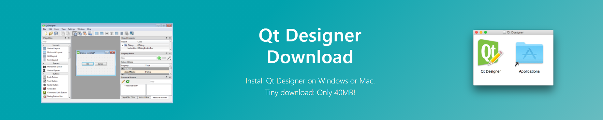

<h2 align="center">Learn Python Programming 🐍 from Zero to Hero #1 | Building Projects </h2>

<p align="center">
  
   </a>
    
  </a>
  <a href="https://github.com/BrianMarquez3/Python-Course/stargazers">
    
  </a>
  <a href="https://github.com/BrianMarquez3/Python-Course/network">
    
  </a>
    
  </a>
  
  </a>
    
  </a>
  
  </a>
    
  </a>
  
   </a>
   <a href="https://github.com/BrianMarquez3/Python-Course/network">
    
  </a><br>
 
  
  
  
</p>
  


## Tabla de contenidos


 Numeration   | Check  |    Topic      |   Quantization   |    Edit Gitpot    |    Downloads    |  link  |
| ------------ |--------|-------------- |----------------- |------------------ |---------------- |-------- |
|  002   |:heavy_check_mark: | [Que es Python](#Que-es-Python)  | :hourglass:     |✅ | 💾 | [ ⬅️ Atras](https://github.com/BrianMarquez3) | 
|  003   |:heavy_check_mark: | [Creador](#Creador)  | :hourglass: |✅ | 💾 |  [ ⬅️ Atras](https://github.com/BrianMarquez3) | 
|  004   |:heavy_check_mark: | [Historia](#historia)  | :hourglass: |✅ | 💾 |  [ ⬅️ Atras](https://github.com/BrianMarquez3) | 
|  005   |:heavy_check_mark: | [Ejemplos](#Ejemplos)  | :hourglass: | ✅ | 💾 |  [ ⬅️ Atras](https://github.com/BrianMarquez3) | 
|  006   |:heavy_check_mark: | [Comandos](#Comandos) | :hourglass: | ✅ | 💾 |  [ ⬅️ Atras](https://github.com/BrianMarquez3) | 
|  007   |:heavy_check_mark: | [Variables](#Variables ) | :hourglass: | ✅ | 💾 |  [ ⬅️ Atras](https://github.com/BrianMarquez3) |
|  008   |:heavy_check_mark: | [Tuplas](#Tuplas ) | :hourglass: | ✅ | 💾 |  [ ⬅️ Atras](https://github.com/BrianMarquez3) |
|  009   |:heavy_check_mark: | [Instalación](#Instalación)  | :hourglass: | ✅ | 💾 |  [ ⬅️ Atras](https://github.com/BrianMarquez3) | 
|  010   |:heavy_check_mark: | [Ramas](#Ramas)  | :hourglass: | ✅ | 💾 |  [ ⬅️ Atras](https://github.com/BrianMarquez3) | 
|  011   |:heavy_check_mark: | [POO Programación orientada a objetos](#POO-Programación-orientada-a-objetos)  | :hourglass: | ✅ | 💾 |  [ ⬅️ Atras](https://github.com/BrianMarquez3) | 
|  012   |:heavy_check_mark: | [Install Jupyter Notebook](#Install-Jupyter-Notebook) | :hourglass: | ✅ | 💾 |  [ ⬅️ Atras](https://github.com/BrianMarquez3) | 
|  013   |:heavy_check_mark: | [Anaconda](#Anaconda) | :hourglass: | ✅ | 💾 |  [ ⬅️ Atras](https://github.com/BrianMarquez3) | 
|  014   |:heavy_check_mark: | [Buenas Practicas En Commits De Git](#Buenas-Practicas-En-Commits-De-Git) | :hourglass: | ✅ | 💾 |  [ ⬅️ Atras](https://github.com/BrianMarquez3) | 
|  015  |:heavy_check_mark: | [Build A Foreign Language Flashcard App](#Build-A-Foreign-Language-Flashcard-App) | :hourglass: | ✅ | 💾 |  [ ⬅️ Atras](https://github.com/BrianMarquez3) | 
|  016   |:heavy_check_mark: | [Archivos Externos I](#Archivos-Externos-I)| :hourglass: | ✅ | 💾 |  [ ⬅️ Atras](https://github.com/BrianMarquez3) | 
|  017   |:heavy_check_mark: | [Archivos Externos II](#Archivos-Externos-II)| :hourglass: | ✅ | 💾 |  [ ⬅️ Atras](https://github.com/BrianMarquez3) | 
|  018   |:heavy_check_mark: | [BBDD](#BBDD) | :hourglass: | ✅ | 💾 |  [ ⬅️ Atras](https://github.com/BrianMarquez3) | 
|  019   |:heavy_check_mark: | [A I Programming with Python](#A-I-Programming-with-Python) | :hourglass: | ✅ | 💾 |  [ ⬅️ Atras](https://github.com/BrianMarquez3) | 
|  020  |:heavy_check_mark: | [Bucles](#Bucles) | :hourglass: | ✅ | 💾 |  [ ⬅️ Atras](https://github.com/BrianMarquez3) | 
|  021  |:heavy_check_mark: | [Cadenas](#Cadenas) | :hourglass: |  ✅| 💾 |  [ ⬅️ Atras](https://github.com/BrianMarquez3) | 
|  022  |:heavy_check_mark: | [Christmas Tree](#Christmas-tree) | :hourglass: | ✅ | 💾 |  [ ⬅️ Atras](https://github.com/BrianMarquez3) | 
|  023  |:heavy_check_mark: | [Colas](#colas) | :hourglass: | ✅ | 💾 |  [ ⬅️ Atras](https://github.com/BrianMarquez3) | 
|  024  |:heavy_check_mark: | [Condicionales](#Condicionales) | :hourglass: | ✅ | 💾 |  [ ⬅️ Atras](https://github.com/BrianMarquez3) | 
|  025  |:heavy_check_mark: | [Conjuntos](#Conjuntos) | :hourglass: | ✅ | 💾 |  [ ⬅️ Atras](https://github.com/BrianMarquez3) | 
|  026  |:heavy_check_mark: | [Datos por teclado](#Datos-por-teclado) | :hourglass: | ✅ | 💾 |  [ ⬅️ Atras](https://github.com/BrianMarquez3) | 
|  027  |:heavy_check_mark: | [Decoradores](#Decoradores) | :hourglass: | ✅ | 💾 |  [ ⬅️ Atras](https://github.com/BrianMarquez3) | 
|  028  |:heavy_check_mark: | [Diccionarios](#Diccionarios) | :hourglass: | ✅ | 💾 |  [ ⬅️ Atras](https://github.com/BrianMarquez3) |
|  029  |:heavy_check_mark: | [Documentacion y Pruebas](#Documentacion-y-Pruebas) | :hourglass: | ✅ |💾 |  [ ⬅️ Atras](https://github.com/BrianMarquez3) | 
|  030  |:heavy_check_mark: | [Email](#Email) | :hourglass: | ✅ | - |  [ ⬅️ Atras](https://github.com/BrianMarquez3) | 
|  031  |:heavy_check_mark: | [Errores y Excepciones](#Errores-y-Excepciones) | :hourglass: | ✅ | 💾 |  [ ⬅️ Atras](https://github.com/BrianMarquez3) | 
|  032  |:heavy_check_mark: | [Estructura General](#Estructura-General) | :hourglass: | ✅ | 💾 |  [ ⬅️ Atras](https://github.com/BrianMarquez3) |
|  033  |:heavy_check_mark: | [Excepciones](#Excepciones) | :hourglass: | ✅ | 💾 |  [ ⬅️ Atras](https://github.com/BrianMarquez3) |  
|  034  |:heavy_check_mark: | [Estructura General](#Estructura-General) | :hourglass: | ✅ | 💾 |  [ ⬅️ Atras](https://github.com/BrianMarquez3) |
|  035  |:heavy_check_mark: | [Funciones Establecidas](#Funciones-Establecidas) | :hourglass: | ✅ | 💾 |  [ ⬅️ Atras](https://github.com/BrianMarquez3) |  
|  036  |:heavy_check_mark: | [Funciones](#Funciones) | :hourglass: | ✅ | 💾 |  [ ⬅️ Atras](https://github.com/BrianMarquez3) |  
|  037  |:heavy_check_mark: | [Git](#Git) | :hourglass: | ✅ | 💾 |  [ ⬅️ Atras](https://github.com/BrianMarquez3) |  
|  038  |:heavy_check_mark: | [Generadores](#Generadores) | :hourglass: | ✅ | 💾 |  [ ⬅️ Atras](https://github.com/BrianMarquez3) |  
|  039  |:heavy_check_mark: | [Generacion Ejecutables](#Generacion-Ejecutables) | :hourglass: | ✅ | 💾 |  [ ⬅️ Atras](https://github.com/BrianMarquez3) |  
|  040  |:heavy_check_mark: | [Geographic Map of Peru](#Geographic-Map-of-Peru) | :hourglass: | ✅ | 💾 |  [ ⬅️ Atras](https://github.com/BrianMarquez3) |  
|  041  |:heavy_check_mark: | [Geographical plottings](#Geographical-plottings) | :hourglass: | ✅ | 💾 |  [ ⬅️ Atras](https://github.com/BrianMarquez3) |  
|  042  |:heavy_check_mark: | [Guardado Permanenete](#Guardado-Permanenete) | :hourglass: | ✅ | 💾 |  [ ⬅️ Atras](https://github.com/BrianMarquez3) | 
|  043  |:heavy_check_mark: | [Interfas Grafica](#Interfas-Grafica) | :hourglass: | ✅ | 💾 |  [ ⬅️ Atras](https://github.com/BrianMarquez3) | 
|  044  |:heavy_check_mark: | [Listas](#Listas) | :hourglass: | ✅ | 💾 |  [ ⬅️ Atras](https://github.com/BrianMarquez3) | 
|  045  |:heavy_check_mark: | [Metodos de Cadenas](#Metodos-de-Cadenas) | :hourglass: | ✅ | 💾 |  [ ⬅️ Atras](https://github.com/BrianMarquez3) | 
|  046  |:heavy_check_mark: | [Modulos Usabiidad](#Modulos-Usabiidad) | :hourglass: | ✅ | 💾 |  [ ⬅️ Atras](https://github.com/BrianMarquez3) | 
|  047  |:heavy_check_mark: | [Modulos](#Modulos) | :hourglass: | ✅ | 💾 |  [ ⬅️ Atras](https://github.com/BrianMarquez3) |
|  048  |:heavy_check_mark: | [POO](#POO) | :hourglass: | ✅ | 💾 |  [ ⬅️ Atras](https://github.com/BrianMarquez3) |
|  049  |:heavy_check_mark: | [Paquetes](#Paquetes) | :hourglass: | ✅ | 💾 |  [ ⬅️ Atras](https://github.com/BrianMarquez3) |
|  050  |:heavy_check_mark: | [Paquetes Distribuibles](#Paquetes-Distribuibles) | :hourglass: | ✅ | 💾 |  [ ⬅️ Atras](https://github.com/BrianMarquez3) |
|  051  |:heavy_check_mark: | [Simulando Pilas](#Simulando-Pilas) | :hourglass: | ✅ | 💾 |  [ ⬅️ Atras](https://github.com/BrianMarquez3) |
|  052  |:heavy_check_mark: | [Plotly and cufflinks](#Plotly-and-cufflinks) | :hourglass: | ✅ | 💾 |  [ ⬅️ Atras](https://github.com/BrianMarquez3) |
|  053  |:heavy_check_mark: | [Practica Guiada ](#Practica-Guiada ) | :hourglass: |✅ | 💾 |  [ ⬅️ Atras](https://github.com/BrianMarquez3) |
|  054  |:heavy_check_mark: | [Proyect Dictionary](#Proyect-Dictionary ) | :hourglass: | ✅ | 💾 |  [ ⬅️ Atras](https://github.com/BrianMarquez3) |
|  055  |:heavy_check_mark: | [Proyect Game hangmen](#Proyect-Game-hangmen ) | :hourglass: |✅ | 💾 |  [ ⬅️ Atras](https://github.com/BrianMarquez3) |
|  056  |:heavy_check_mark: | [Reconocimiento Facial](#Reconocimiento-Facial ) | :hourglass: | ✅ | 💾 |  [ ⬅️ Atras](https://github.com/BrianMarquez3) |
|  057  |:heavy_check_mark: | [Robot](#Robot ) | :hourglass: | ✅ | 💾 |  [ ⬅️ Atras](https://github.com/BrianMarquez3) |
|  058  |:heavy_check_mark: | [Salida por pantalla](#Salida-por-pantalla ) | :hourglass: |✅ | 💾 |  [ ⬅️ Atras](https://github.com/BrianMarquez3) |
|  059  |:heavy_check_mark: | [Screenpet](#Screenpet ) | :hourglass: | ✅ | 💾 |  [ ⬅️ Atras](https://github.com/BrianMarquez3) |
|  060  |:heavy_check_mark: | [Serializacion](#Serializacion ) | :hourglass: | ✅ | 💾 |  [ ⬅️ Atras](https://github.com/BrianMarquez3) |
|  062  |:heavy_check_mark: | [Sets](#Sets ) | :hourglass: | ✅ | 💾|  [ ⬅️ Atras](https://github.com/BrianMarquez3) |
|  062  |:heavy_check_mark: | [Strings](#Strings ) | :hourglass: | ✅ | 💾 |  [ ⬅️ Atras](https://github.com/BrianMarquez3) |
|  063  |:heavy_check_mark: | [Test SQLServer](#Test-SQLServer ) | :hourglass: | ✅| 💾 |  [ ⬅️ Atras](https://github.com/BrianMarquez3) |
|  064  |:heavy_check_mark: | [Tipos de datos](#Tipos-de-datos ) | :hourglass: | ✅| 💾 |  [ ⬅️ Atras](https://github.com/BrianMarquez3) |
|  065  |:heavy_check_mark: | [ValidacionEmail](#ValidacionEmail ) | :hourglass: | ✅ | 💾 |  [ ⬅️ Atras](https://github.com/BrianMarquez3) |

* Pyhotn QT Designer

 Numeration   | Check  |    Topic      |   Quantization   |    Edit Gitpot    |    Downloads    |  link  |
| ------------ |--------|-------------- |----------------- |------------------ |---------------- |-------- |
|  066   |:heavy_check_mark: | [QT Designer](#QT-Designer) | :hourglass: | ✅ | 💾 |  [ ⬅️ Atras](https://github.com/BrianMarquez3) | 
|  067  |:heavy_check_mark: | [QT-Formulario](#QT-Formulario ) | :hourglass: | ✅ | 💾 |  [ ⬅️ Atras](https://github.com/BrianMarquez3) |
|  068  |:heavy_check_mark: | [QT-Formulario](#QT-Formulario ) | :hourglass: | ✅ | 💾 |  [ ⬅️ Atras](https://github.com/BrianMarquez3) |
|  069  |:heavy_check_mark: | [QT-PySide](#QT-PySide ) | :hourglass: | ✅ |💾 |  [ ⬅️ Atras](https://github.com/BrianMarquez3) |
|  070  |:heavy_check_mark: | [QT-RegisterUI](#QT-RegisterUI ) | :hourglass: | ✅ | 💾 |  [ ⬅️ Atras](https://github.com/BrianMarquez3) |
|  071  |:heavy_check_mark: | [QT-RenderTimeCalculator](#QT-RenderTimeCalculator ) | :hourglass: | ✅ | 💾 |  [ ⬅️ Atras](https://github.com/BrianMarquez3) |
|  072  |:heavy_check_mark: | [QT-Toogle Menu](#QT-Toogle-Menu ) | :hourglass: | ✅ | 💾 |  [ ⬅️ Atras](https://github.com/BrianMarquez3) |

* Pyhotn Tkinter

 Numeration   | Check  |    Topic      |   Quantization   |    Edit Gitpot    |    Downloads    |  link  |
| ------------ |--------|-------------- |----------------- |------------------ |---------------- |-------- |
|  073   |:heavy_check_mark: | [Interface Grafica TKINTER](#Interface-Grafica-TKINTER) | :hourglass: | ✅ | 💾 |  [ ⬅️ Atras](https://github.com/BrianMarquez3) | 
|  074   |:heavy_check_mark: | [Pyhton Tkinter Add ZipCode](#Pyhton-Tkinter-Add-ZipCode)  | :hourglass:     | ✅ | 💾 | [ ⬅️ Atras](https://github.com/BrianMarquez3) | 
|  074   |:heavy_check_mark: | [Pyhton Tkinter Get Height and Width](#[Pyhton-Tkinter-Get-Height-and-Width)  | :hourglass:     | ✅ | 💾 | [ ⬅️ Atras](https://github.com/BrianMarquez3) | 
| ------------ |--------|-------------- |----------------- |------------------ |---------------- |-------- |
|  -    |:heavy_check_mark: | [Play List Spotify](#Spotify) | :hourglass: | ✅ | 💾 |  [ ⬅️ Atras](https://github.com/BrianMarquez3) | 
|  -    |:heavy_check_mark: | [Book](#book)| :hourglass: | ✅ | 💾|  [ ⬅️ Atras](https://github.com/BrianMarquez3) | 


---
## Que es Python

Python es un lenguaje de programación interpretado cuya filosofía hace hincapié en la legibilidad de su código. Se trata de un lenguaje de programación multiparadigma, ya que soporta orientación a objetos, programación imperativa y, en menor medida, programación funcional. Es un lenguaje interpretado, dinámico y multiplataforma.

Es administrado por la Python Software Foundation. Posee una licencia de código abierto, denominada Python Software Foundation License, que es compatible con la Licencia pública general de GNU a partir de la versión 2.1.1, e incompatible en ciertas versiones anteriores. [WIKIPEDIA](https://es.wikipedia.org/wiki/Python).<br>

---
## Creador

<h2> Guido van Rossum </h2>


<p>Guido van Rossum es un informático,1​ conocido por ser el autor del lenguaje de programación Python. Nació y creció en los Países Bajos.

En el ambiente de los desarrolladores del lenguaje Python también se le conoce por el título BDFL (Benevolent Dictator for Life), teniendo asignada la tarea de fijar las directrices sobre la evolución de Python, así como la de tomar decisiones finales sobre el lenguaje que todos los desarrolladores acatan. Van Rossum tiene fama de ser bastante conservador, realizando pocos cambios al lenguaje entre versiones sucesivas, intentando mantener siempre la compatibilidad con versiones anteriores. El 12 de julio de 2018, con un mensaje enviado a la lista de python-committers, anunció su retiro de los procesos de decisión. Desde noviembre del 2020 es parte de la División de Desarrolladores de la empresa Microsoft [WIKIPEDIA](https://es.wikipedia.org/wiki/Guido_van_Rossum).<br> </p>

---
## Historia

Python fue creado a finales de los ochenta por Guido van Rossum en el Centro para las Matemáticas y la Informática (CWI, Centrum Wiskunde & Informatica), en los Países Bajos, como un sucesor del lenguaje de programación ABC, capaz de manejar excepciones e interactuar con el sistema operativo Amoeba.

El nombre del lenguaje proviene de la afición de su creador por los humoristas británicos Monty Python.

Van Rossum es el principal autor de Python, y su continuo rol central en decidir la dirección de Python es reconocido, refiriéndose a él como Benevolente Dictador Vitalicio (en inglés: Benevolent Dictator for Life, BDFL); sin embargo el 12 de julio de 2018 declinó de dicha situación de honor sin dejar un sucesor o sucesora y con una declaración altisonante:

En 1991, van Rossum publicó el código de la versión 0.9.0 en alt.sources. En esta etapa del desarrollo ya estaban presentes clases con herencia, manejo de excepciones, funciones y los tipos modulares, como: str, list, dict, entre otros. Además en este lanzamiento inicial aparecía un sistema de módulos adoptado de Modula-3; van Rossum describe el módulo como «una de las mayores unidades de programación de Python». El modelo de excepciones en Python es parecido al de Modula-3, con la adición de una cláusula else. En el año 1994 se formó comp.lang.python, el foro de discusión principal de Python, marcando un hito en el crecimiento del grupo de usuarios de este lenguaje.
[WIKIPEDIA](https://es.wikipedia.org/wiki/Python).<br>

### Ejemplos

```js
print("Hello, World!")
```

```js
>>> 2 + 3
5
```
---
## Comandos

_Verifica la versión de Python_

```
python --version
```
_Actualizar Git_
```
git update
```

_Actualiza el  PIP de Python_

```
python -m pip install --upgrade pip
```

_Creacion de un Instalador_

```
pip install pyinstaller
```

_Creacion de un .exe_

```
pyinstaller --windowed nombreArchivo.py
```

_Creacion de un .exe - un solo archivo_

```
pyinstaller --windowed --onefile nombreArchivo.py
```

_Listado de Modulos instalados en Python_

```
pip list 
```

_Desinstalar Modulos_

```
pip uninstall nombreModulo
```

_Conector Base de datos - SQL SERVER_

```
pip install pyodbc
```

_Conector Base de datos - MariaDB_

```
pip3 install mariadb
```

_Conector Base de datos - Mysql_

```
pip install mysql-connector
```
```
pip install mysql-connector-python
```
```
pip install mysql-connector-python-rf
```

_Instalar Pillow_

```
pip install pillow
```

_Instalar Requests_

```
pip install requests
```

_Instalar Numpy_

```
pip install numpy
```

_Instalar Matplotlib_

```
pip install matplotlib
```

_Instalar tkcalendar_

```
pip install tkcalendar
```
_Instalar Pyttsx3_

```
pip install pyttsx3
```
_Instalar Pip Riview_

```
pip install pip-review
```

_Actualizar todos lo Paquetes_

```
pip-review --local --interactive
```

_Instalar Pygame_

```
pip install pygame
```

_Instalar Openpyxl_

```
pip install openpyxl
```

_Instalar Pandas_

```
pip install pandas
```

_Instalar xlrd_

```
pip install xlrd
```

_Instalar Jupyter_

```
pip install jupyter
```

_Instalar Freeze_

```
pip install freeze
```

_Instalar pyqt5_

```
pip install pyqt5
```

_Instalar pyside2_

```
pip install pyside2
```

_Instalar PyPDF2_

```
pip install PyPDF2
```

_Instalar pytimeparse_

```
pip install pytimeparse
```

_BeautifulSoup_
```
pip install beautifulsoup4
```

_Mysqlclient_
```
pip install mysqlclient
```

_pip install requests_

```
pip install requests
```

_Django_

[https://www.djangoproject.com/download/]

_Kivy_

```
python -m pip install kivy
```
---
## Instalación

📦 [Install Python](https://www.python.org/) Instalador de Python.<br>
📦 [Install Anaconda](https://www.anaconda.com/) Intalador de Anaconda.<br> [BLOG](https://www.anaconda.com/blog).<br>
📦 [Install Visual studio Code](https://code.visualstudio.com/) Intalador de Visual Studio Code
📦 [Install Pycharm](https://www.jetbrains.com/es-es/pycharm/download/#section=windows) Intalador de Pycharm


| Caracteristicas            | Visual Code |   Anaconda   |   
|----------------------------|:-----------:|:------------:|
| Codigo Abierto             |      ❌     |      ✔️     |      
| Multiplataforma            |      ✔️     |      ✔️     |     
| Soporte                    |      ✔️     |      ✔️     |      
| Ciencia de datos           |      ❌     |      ✔️     |  
| Rapidez                    |      ✔️     |      ✔️     |     

---
### Notas 

- Puedes utilizar otro editor de código pero no tendrás soporte. se recomienda usar los editores mencionados.

### Ramas

Ver todas las Ramas [Ramas](https://github.com/BrianMarquez3/Python-Course/settings/branches)
---

## POO Programación orientada a objetos

La programación orientada a objetos (POO, u OOP según sus siglas en inglés) es un paradigma de programación que viene a innovar la forma de obtener resultados. Los objetos manipulan los datos de entrada para la obtención de datos de salida específicos, donde cada objeto ofrece una funcionalidad especial.

- herencia.
- cohesión.
- abstracción.
- polimorfismo.
- acoplamiento.
- encapsulación.


Muchos de los objetos prediseñados de los lenguajes de programación actuales permiten la agrupación en bibliotecas o librerías, sin embargo, muchos de estos lenguajes permiten al usuario la creación de sus propias bibliote

```js
#!/usr/bin/env python3
import tkinter as tk

class Application(tk.Frame):
    def __init__(self, master=None):
        tk.Frame.__init__(self, master)
        self.grid()
        self.createWidgets()
    
    def createWidgets(self):
        self.mondialLabel = tk.Label(self, text='Hola, Mundo!')
        self.mondialLabel.config(bg="#00ffff")
        self.mondialLabel.grid()
        self.quitButton = tk.Button(self, text='Quit', command=self.quit)
        self.quitButton.grid()

if __name__ == '__main__':
    app = Application()
    app.master.title('Aplicación de muestra')
    app.mainloop()
```

Los siguientes son los pasos para crear una aplicación Tkinter junto con la sintaxis:

- Primero, necesitamos importar el módulo Tkinter.
- En segundo lugar, necesitamos crear una ventana de contenedor.
- Luego, agregamos cualquier número de widgets a la ventana del contenedor.
- Por último, aplicamos el activador de eventos en los widgets.

---
## Buenas Practicas En Commits De Git

 - Estructura del Mensaje

El mensaje de un commit consiste en 3 diferentes partes separadas por una linea en blanco: el titulo, un cuerpo opcional y un pie opcional. Algo como lo siguiente:

[Udacity Git Commit Message Style Guide](https://udacity.github.io/git-styleguide/)

```js
type: subject

body

footer
```

- Example Commit Message

```
feat: Summarize changes in around 50 characters or less

More detailed explanatory text, if necessary. Wrap it to about 72
characters or so. In some contexts, the first line is treated as the
subject of the commit and the rest of the text as the body. The
blank line separating the summary from the body is critical (unless
you omit the body entirely); various tools like `log`, `shortlog`
and `rebase` can get confused if you run the two together.

Explain the problem that this commit is solving. Focus on why you
are making this change as opposed to how (the code explains that).
Are there side effects or other unintuitive consequenses of this
change? Here's the place to explain them.

Further paragraphs come after blank lines.

 - Bullet points are okay, too

 - Typically a hyphen or asterisk is used for the bullet, preceded
   by a single space, with blank lines in between, but conventions
   vary here

If you use an issue tracker, put references to them at the bottom,
like this:

Resolves: #123
See also: #456, #789
```
---
## Install Jupyter Notebook


```
pip install jupyter
```

- Ejecuta Jupyter

```
jupyter notebook
```
- Instalar Temas

```
pip install jupyterthemes
```

- Actualizar Jupyter

```
pip install --upgrade jupyterthemes
```

```
pip install --upgrade notebook
```

- Seleccionar un Tema

Mostar listado

```
jt -l
```

Seleccionar

```
jt -t nombretema
```

---

## Anaconda

_Anaconda Navigator_

Anaconda es un distribución libre y abierta1​ de los lenguajes Python y R, utilizada en ciencia de datos, y aprendizaje automático (machine learning). Esto incluye procesamiento de grandes volúmenes de información, análisis predictivo y cómputos científicos. Está orientado a simplificar el despliegue y administración de los paquetes de software. [WIKIPEDIA](https://es.wikipedia.org/wiki/Anaconda_(distribuci%C3%B3n_de_Python)).<br>


📦 [Install Anaconda](https://www.anaconda.com/) Intalador de Anaconda.<br>

---

## Build A Foreign Language Flashcard App


| Carpeta      | Link         |   Home     |  Code       | Version     | Estado      |
|--------------|:-----------:|:-----------:|:-----------:|:-----------:|:-----------:| 
| [Build A Foreign Language Flashcard App](https://github.com/BrianMarquez3/Python-Course/tree/master/Python%20Tkinter%20Build%20A%20Foreign%20Language%20Flashcard%20App)          |     :heavy_check_mark:      | ⬅️ [Atras](#Tabla-de-contenidos) | yes | yes |  :heavy_check_mark:  |

## Archivos Externos I

| Carpeta      | Link         |   Home     |  Code       | Version     | Estado      |
|--------------|:-----------:|:-----------:|:-----------:|:-----------:|:-----------:| 
| [Archivos Externos I](https://github.com/BrianMarquez3/Python-Course/tree/master/Archivos%20Externos%20I)          |     :heavy_check_mark:      | ⬅️ [Atras](#Tabla-de-contenidos) | yes | yes |  :heavy_check_mark:  |

## Archivos Externos II

| Carpeta      | Link         |   Home     |  Code       | Version     | Estado      |
|--------------|:-----------:|:-----------:|:-----------:|:-----------:|:-----------:| 
| [Archivos Externos II](https://github.com/BrianMarquez3/Python-Course/tree/master/Archivos%20Externos%20I)          |     :heavy_check_mark:      | ⬅️ [Atras](#Tabla-de-contenidos) | yes | yes |  :heavy_check_mark:  |

## BBDD

| Carpeta      | Link         |   Home     |  Code       | Version     | Estado      |
|--------------|:-----------:|:-----------:|:-----------:|:-----------:|:-----------:| 
| [BBDD I](https://github.com/BrianMarquez3/Python-Course/tree/master/BBDD%20I)          |     :heavy_check_mark:      | ⬅️ [Atras](#Tabla-de-contenidos) | yes | yes |  :heavy_check_mark:  |
| [BBDD II](https://github.com/BrianMarquez3/Python-Course/tree/master/BBDD%20II)          |     :heavy_check_mark:      | ⬅️ [Atras](#Tabla-de-contenidos) | yes | yes |  :heavy_check_mark:  |
| [BBDD III](https://github.com/BrianMarquez3/Python-Course/tree/master/BBDD%20III)          |     :heavy_check_mark:      | ⬅️ [Atras](#Tabla-de-contenidos) | yes | yes |  :heavy_check_mark:  |
| [BBDD IV](https://github.com/BrianMarquez3/Python-Course/tree/master/BBDD%20IV)          |     :heavy_check_mark:      | ⬅️ [Atras](#Tabla-de-contenidos) | yes | yes |  :heavy_check_mark:  |

## Bucles 

| Carpeta      | Link         |   Home     |  Code       | Version     | Estado      |
|--------------|:-----------:|:-----------:|:-----------:|:-----------:|:-----------:| 
| [Bucles](https://github.com/BrianMarquez3/Python-Course/tree/master/Bucles)          |     :heavy_check_mark:      | ⬅️ [Atras](#Tabla-de-contenidos) | yes | yes |  :heavy_check_mark:  |


## Cadenas

| Carpeta      | Link         |   Home     |  Code       | Version     | Estado      |
|--------------|:-----------:|:-----------:|:-----------:|:-----------:|:-----------:| 
| [Cadenas](https://github.com/BrianMarquez3/Python-Course/tree/master/Cadenas)          |     :heavy_check_mark:      | ⬅️ [Atras](#Tabla-de-contenidos) | yes | yes |  :heavy_check_mark:  |


## Christmas Tree

| Carpeta      | Link         |   Home     |  Code       | Version     | Estado      |
|--------------|:-----------:|:-----------:|:-----------:|:-----------:|:-----------:| 
| [Christmas Tree](https://github.com/BrianMarquez3/Python-Course/tree/master/Christmas%20tree)          |     :heavy_check_mark:      | ⬅️ [Atras](#Tabla-de-contenidos) | yes | yes |  :heavy_check_mark:  |

## Colas

| Carpeta      | Link         |   Home     |  Code       | Version     | Estado      |
|--------------|:-----------:|:-----------:|:-----------:|:-----------:|:-----------:| 
| [Colas](https://github.com/BrianMarquez3/Python-Course/tree/master/Colas)          |     :heavy_check_mark:      | ⬅️ [Atras](#Tabla-de-contenidos) | yes | yes |  :heavy_check_mark:  |

## Condicionales

| Carpeta      | Link         |   Home     |  Code       | Version     | Estado      |
|--------------|:-----------:|:-----------:|:-----------:|:-----------:|:-----------:| 
| [Condicionales](https://github.com/BrianMarquez3/Python-Course/tree/master/Condicionales)          |     :heavy_check_mark:      | ⬅️ [Atras](#Tabla-de-contenidos) | yes | yes |  :heavy_check_mark:  |

## Conjuntos

| Carpeta      | Link         |   Home     |  Code       | Version     | Estado      |
|--------------|:-----------:|:-----------:|:-----------:|:-----------:|:-----------:| 
| [Conjuntos](https://github.com/BrianMarquez3/Python-Course/tree/master/Conjuntos)          |     :heavy_check_mark:      | ⬅️ [Atras](#Tabla-de-contenidos) | yes | yes |  :heavy_check_mark:  |

## Datos por teclado

| Carpeta      | Link         |   Home     |  Code       | Version     | Estado      |
|--------------|:-----------:|:-----------:|:-----------:|:-----------:|:-----------:| 
| [Datos por teclado](https://github.com/BrianMarquez3/Python-Course/tree/master/Datos%20por%20teclado)          |     :heavy_check_mark:      | ⬅️ [Atras](#Tabla-de-contenidos) | yes | yes |  :heavy_check_mark:  |
| [Ingreso por Teclado](https://github.com/BrianMarquez3/Python-Course/tree/master/Ingreso%20por%20Teclado)          |     :heavy_check_mark:      | ⬅️ [Atras](#Tabla-de-contenidos) | yes | yes |  :heavy_check_mark:  |


## Decoradores 

| Carpeta      | Link         |   Home     |  Code       | Version     | Estado      |
|--------------|:-----------:|:-----------:|:-----------:|:-----------:|:-----------:| 
| [Decoradores I](https://github.com/BrianMarquez3/Python-Course/tree/master/Decoradores%20I)          |     :heavy_check_mark:      | ⬅️ [Atras](#Tabla-de-contenidos) | yes | yes |  :heavy_check_mark:  |
| [Decoradores II](https://github.com/BrianMarquez3/Python-Course/tree/master/Decoradores%20II)          |     :heavy_check_mark:      | ⬅️ [Atras](#Tabla-de-contenidos) | yes | yes |  :heavy_check_mark:  |


## Diccionarios 

| Carpeta      | Link         |   Home     |  Code       | Version     | Estado      |
|--------------|:-----------:|:-----------:|:-----------:|:-----------:|:-----------:| 
| [Diccionarios](https://github.com/BrianMarquez3/Python-Course/tree/master/Diccionarios)          |     :heavy_check_mark:      | ⬅️ [Atras](#Tabla-de-contenidos) | yes | yes |  :heavy_check_mark:  |
| [Diccionario Simple](https://github.com/BrianMarquez3/Python-Course/tree/master/Diccionario%20Simple)          |     :heavy_check_mark:      | ⬅️ [Atras](#Tabla-de-contenidos) | yes | yes |  :heavy_check_mark:  |


## Documentacion y Pruebas 

| Carpeta      | Link         |   Home     |  Code       | Version     | Estado      |
|--------------|:-----------:|:-----------:|:-----------:|:-----------:|:-----------:| 
| [Documentacion y Pruebas I](https://github.com/BrianMarquez3/Python-Course/tree/master/Documentacion%20y%20Pruebas)          |     :heavy_check_mark:      | ⬅️ [Atras](#Tabla-de-contenidos) | yes | yes |  :heavy_check_mark:  |
| [Documentacion y Pruebas II](https://github.com/BrianMarquez3/Python-Course/tree/master/Documentacion%20y%20Pruebas%20II)          |     :heavy_check_mark:      | ⬅️ [Atras](#Tabla-de-contenidos) | yes | yes |  :heavy_check_mark:  |
| [Documentacion y Pruebas III](https://github.com/BrianMarquez3/Python-Course/tree/master/Documentacion%20y%20Pruebas%20III)          |     :heavy_check_mark:      | ⬅️ [Atras](#Tabla-de-contenidos) | yes | yes |  :heavy_check_mark:  |


## Email

| Carpeta      | Link         |   Home     |  Code       | Version     | Estado      |
|--------------|:-----------:|:-----------:|:-----------:|:-----------:|:-----------:| 
| [Email](https://github.com/BrianMarquez3/Python-Course/tree/master/Email)          |     :heavy_check_mark:      | ⬅️ [Atras](#Tabla-de-contenidos) | yes | yes |  :heavy_check_mark:  |


## Errores y Excepciones

| Carpeta      | Link         |   Home     |  Code       | Version     | Estado      |
|--------------|:-----------:|:-----------:|:-----------:|:-----------:|:-----------:| 
| [Errores y Excepciones](https://github.com/BrianMarquez3/Python-Course/tree/master/Errores%20y%20Excepciones)          |     :heavy_check_mark:      | ⬅️ [Atras](#Tabla-de-contenidos) | yes | yes |  :heavy_check_mark:  |

## Estructura General

| Carpeta      | Link         |   Home     |  Code       | Version     | Estado      |
|--------------|:-----------:|:-----------:|:-----------:|:-----------:|:-----------:| 
| [Estructura General](https://github.com/BrianMarquez3/Python-Course/tree/master/Estructura%20General)          |     :heavy_check_mark:      | ⬅️ [Atras](#Tabla-de-contenidos) | yes | yes |  :heavy_check_mark:  |


## Excepciones
| Carpeta      | Link         |   Home     |  Code       | Version     | Estado      |
|--------------|:-----------:|:-----------:|:-----------:|:-----------:|:-----------:| 
| [Excepciones](https://github.com/BrianMarquez3/Python-Course/tree/master/Excepciones)          |     :heavy_check_mark:      | ⬅️ [Atras](#Tabla-de-contenidos) | yes | yes |  :heavy_check_mark:  |
| [Expresiones Regulares I](https://github.com/BrianMarquez3/Python-Course/tree/master/Expresiones%20Regulares%20I)          |     :heavy_check_mark:      | ⬅️ [Atras](#Tabla-de-contenidos) | yes | yes |  :heavy_check_mark:  |
| [Expresiones Regulares II](https://github.com/BrianMarquez3/Python-Course/tree/master/Expresiones%20Regulares%20II)          |     :heavy_check_mark:      | ⬅️ [Atras](#Tabla-de-contenidos) | yes | yes |  :heavy_check_mark:  |
| [Expresiones Regulares II](https://github.com/BrianMarquez3/Python-Course/tree/master/Expresiones%20Regulares%20III)          |     :heavy_check_mark:      | ⬅️ [Atras](#Tabla-de-contenidos) | yes | yes | 
| [Expresiones Regulares IV](https://github.com/BrianMarquez3/Python-Course/tree/master/Expresiones%20Regulares%20IV)          |     :heavy_check_mark:      | ⬅️ [Atras](#Tabla-de-contenidos) | yes | yes | 

## Funciones Establecidas

| Carpeta      | Link         |   Home     |  Code       | Version     | Estado      |
|--------------|:-----------:|:-----------:|:-----------:|:-----------:|:-----------:| 
| [Funcion Filter](https://github.com/BrianMarquez3/Python-Course/tree/master/Funcion%20Filter)          |     :heavy_check_mark:      | ⬅️ [Atras](#Tabla-de-contenidos) | yes | yes |  :heavy_check_mark:  |
| [Funcion Map](https://github.com/BrianMarquez3/Python-Course/tree/master/Funcion%20Map)          |     :heavy_check_mark:      | ⬅️ [Atras](#Tabla-de-contenidos) | yes | yes |  :heavy_check_mark:  |
| [Funciones Integradas](https://github.com/BrianMarquez3/Python-Course/tree/master/Funciones%20Integradas)          |     :heavy_check_mark:      | ⬅️ [Atras](#Tabla-de-contenidos) | yes | yes |  :heavy_check_mark:  |
| [Funciones Lambda](https://github.com/BrianMarquez3/Python-Course/tree/master/Funciones%20Lambda)          |     :heavy_check_mark:      | ⬅️ [Atras](#Tabla-de-contenidos) | yes | yes |  :heavy_check_mark:  |
| [Lambda](https://github.com/BrianMarquez3/Python-Course/tree/master/Lambda)          |     :heavy_check_mark:      | ⬅️ [Atras](#Tabla-de-contenidos) | yes | yes |  :heavy_check_mark:  |


### Lambda

En Python, una función Lambda se refiere a una pequeña función anónima. Las llamamos “funciones anónimas” porque técnicamente carecen de nombre.

Al contrario que una función normal, no la definimos con la palabra clave estándar def que utilizamos en Python. En su lugar, las funciones Lambda se definen como una línea que ejecuta una sola expresión. Este tipo de funciones pueden tomar cualquier número de argumentos, pero solo pueden tener una expresión.

```python
#Escribo p1 y p2 como parámetros 1 y 2 de la función.
lambda p1, p2: expresión 
```

Como mejor te lo puedo explicar es enseñándote un ejemplo básico, vamos a ver una función normal y un ejemplo de Lambda:

```python
#Aquí tenemos una función creada para sumar.
def suma(x,y):
    return(x + y)

#Aquí tenemos una función Lambda que también suma.
lambda x,y : x + y

#Para poder utilizarla necesitamos guardarla en una variable.
suma_dos = lambda x,y : x + y
```

## Aplicación de Lambdas

Quiero darte algunas ideas de dónde se podrían aplicar las Lambdas. A continuación he creado algunos ejemplos aplicando las Lambdas con diferentes objetivos. Así podras entender mejor como funcionan.

## Lambda en Pandas DataFrame con el método apply()

Se me ocurre que podemos aplicar una función Lambda a data cleaning en Pandas con el método apply(), algo que creo nos puede ser de utilidad para evitar crear un bucle que vaya recorriendo todo el DataFrame:


## Funciones

| Carpeta      | Link         |   Home     |  Code       | Version     | Estado      |
|--------------|:-----------:|:-----------:|:-----------:|:-----------:|:-----------:| 
| [Funciones](https://github.com/BrianMarquez3/Python-Course/tree/master/Funciones)          |     :heavy_check_mark:      | ⬅️ [Atras](#Tabla-de-contenidos) | yes | yes |  :heavy_check_mark:  |


## Git

| Carpeta      | Link         |   Home     |  Code       | Version     | Estado      |
|--------------|:-----------:|:-----------:|:-----------:|:-----------:|:-----------:| 
| [Git](https://github.com/BrianMarquez3/Python-Course/blob/master/GIT/Commint/Commit.txt)          |     :heavy_check_mark:      | ⬅️ [Atras](#Tabla-de-contenidos) | yes | yes |  :heavy_check_mark:  |


## Generadores

| Carpeta      | Link         |   Home     |  Code       | Version     | Estado      |
|--------------|:-----------:|:-----------:|:-----------:|:-----------:|:-----------:| 
| [Generadores](https://github.com/BrianMarquez3/Python-Course/tree/master/Generadores)          |     :heavy_check_mark:      | ⬅️ [Atras](#Tabla-de-contenidos) | yes | yes |  :heavy_check_mark:  |


## Generacion Ejecutables

| Carpeta      | Link         |   Home     |  Code       | Version     | Estado      |
|--------------|:-----------:|:-----------:|:-----------:|:-----------:|:-----------:| 
| [Generacion Ejecutables](https://github.com/BrianMarquez3/Python-Course/tree/master/Generacion%20Ejecutables)          |     :heavy_check_mark:      | ⬅️ [Atras](#Tabla-de-contenidos) | yes | yes |  :heavy_check_mark:  |


## Geographic Map of Peru

| Carpeta      | Link         |   Home     |  Code       | Version     | Estado      |
|--------------|:-----------:|:-----------:|:-----------:|:-----------:|:-----------:| 
| [Geographic Map of Peru](https://github.com/BrianMarquez3/Python-Course/tree/master/Geographic%20Map%20of%20Peru)          |     :heavy_check_mark:      | ⬅️ [Atras](#Tabla-de-contenidos) | yes | yes |  :heavy_check_mark:  |


## Geographical plottings

| Carpeta      | Link         |   Home     |  Code       | Version     | Estado      |
|--------------|:-----------:|:-----------:|:-----------:|:-----------:|:-----------:| 
| [Geographical plottings](https://github.com/BrianMarquez3/Python-Course/tree/master/Geographical%20plottings)          |     :heavy_check_mark:      | ⬅️ [Atras](#Tabla-de-contenidos) | yes | yes |  :heavy_check_mark:  |


## Guardado Permanenete

| Carpeta      | Link         |   Home     |  Code       | Version     | Estado      |
|--------------|:-----------:|:-----------:|:-----------:|:-----------:|:-----------:| 
| [Guardado Permanenete](https://github.com/BrianMarquez3/Python-Course/tree/master/Guardado%20Permanenete)          |     :heavy_check_mark:      | ⬅️ [Atras](#Tabla-de-contenidos) | yes | yes |  :heavy_check_mark:  |


## Interfas Grafica

| Carpeta      | Link         |   Home     |  Code       | Version     | Estado      |
|--------------|:-----------:|:-----------:|:-----------:|:-----------:|:-----------:| 
| [Interfas Grafica I (GUI)](https://github.com/BrianMarquez3/Python-Course/tree/master/interfas%20Grafica%20I%20(GUI))          |     :heavy_check_mark:      | ⬅️ [Atras](#Tabla-de-contenidos) | yes | yes |  :heavy_check_mark:  |
| [Interfas Grafica II (GUI)](https://github.com/BrianMarquez3/Python-Course/tree/master/Interfas%20Grafica%20II%20(Gui))          |     :heavy_check_mark:      | ⬅️ [Atras](#Tabla-de-contenidos) | yes | yes |  :heavy_check_mark:  |
| [Interfas Grafica III (GUI))](https://github.com/BrianMarquez3/Python-Course/tree/master/Interfas%20Grafica%20III%20(GUI))          |     :heavy_check_mark:      | ⬅️ [Atras](#Tabla-de-contenidos) | yes | yes |  :heavy_check_mark:  |
| [Interfas Grafica IV (GUI)](https://github.com/BrianMarquez3/Python-Course/tree/master/Interfas%20Grafica%20IV%20(GUI))          |     :heavy_check_mark:      | ⬅️ [Atras](#Tabla-de-contenidos) | yes | yes |  :heavy_check_mark:  |
| [Interfas Grafica V (GUI)](https://github.com/BrianMarquez3/Python-Course/tree/master/Interfas%20Grafica%20V%20(GUI))          |     :heavy_check_mark:      | ⬅️ [Atras](#Tabla-de-contenidos) | yes | yes |  :heavy_check_mark:  |
| [Interfas Grafica VI (GUI)](https://github.com/BrianMarquez3/Python-Course/tree/master/Interfas%20Grafica%20VI%20(GUI))          |     :heavy_check_mark:      | ⬅️ [Atras](#Tabla-de-contenidos) | yes | yes |  :heavy_check_mark:  |
| [Interfas Grafica VII (GUI)](https://github.com/BrianMarquez3/Python-Course/tree/master/Interfas%20Grafica%20VII%20(GUI))          |     :heavy_check_mark:      | ⬅️ [Atras](#Tabla-de-contenidos) | yes | yes |  :heavy_check_mark:  |
| [Interfas Grafica VIII (GUI)](https://github.com/BrianMarquez3/Python-Course/tree/master/Interfas%20Grafica%20VIII%20(GUI))          |     :heavy_check_mark:      | ⬅️ [Atras](#Tabla-de-contenidos) | yes | yes |  :heavy_check_mark:  |
| [Interfas Grafica IX (GUI)](https://github.com/BrianMarquez3/Python-Course/tree/master/Interfas%20Grafica%20IX%20(GUI))          |     :heavy_check_mark:      | ⬅️ [Atras](#Tabla-de-contenidos) | yes | yes |  :heavy_check_mark:  |
| [Interfas Grafica X (GUI)](https://github.com/BrianMarquez3/Python-Course/tree/master/Interfas%20Grafica%20X%20(GUI))          |     :heavy_check_mark:      | ⬅️ [Atras](#Tabla-de-contenidos) | yes | yes |  :heavy_check_mark:  |
| [Interfas Grafica XI (GUI)](https://github.com/BrianMarquez3/Python-Course/tree/master/Interfas%20Grafica%20XI%20(GUI))          |     :heavy_check_mark:      | ⬅️ [Atras](#Tabla-de-contenidos) | yes | yes |  :heavy_check_mark:  |
| [Interfas Grafica XII (GUI)](https://github.com/BrianMarquez3/Python-Course/tree/master/Interfas%20Grafica%20XII%20(GUI))          |     :heavy_check_mark:      | ⬅️ [Atras](#Tabla-de-contenidos) | yes | yes |  :heavy_check_mark:  |
| [Interfas Grafica XIII (GUI)](https://github.com/BrianMarquez3/Python-Course/tree/master/Interfas%20Grafica%20XIII%20(GUI))          |     :heavy_check_mark:      | ⬅️ [Atras](#Tabla-de-contenidos) | yes | yes |  :heavy_check_mark:  |


## Listas

| Carpeta      | Link         |   Home     |  Code       | Version     | Estado      |
|--------------|:-----------:|:-----------:|:-----------:|:-----------:|:-----------:| 
| [Listas](https://github.com/BrianMarquez3/Python-Course/tree/master/Listas)          |     :heavy_check_mark:      | ⬅️ [Atras](#Tabla-de-contenidos) | yes | yes |  :heavy_check_mark:  |


## Metodos de Cadenas

| Carpeta      | Link         |   Home     |  Code       | Version     | Estado      |
|--------------|:-----------:|:-----------:|:-----------:|:-----------:|:-----------:| 
| [Metodos de Cadenas](https://github.com/BrianMarquez3/Python-Course/tree/master/Metodos%20de%20Cadenas)          |     :heavy_check_mark:      | ⬅️ [Atras](#Tabla-de-contenidos) | yes | yes |  :heavy_check_mark:  |


## Modulos Usabiidad

| Carpeta      | Link         |   Home     |  Code       | Version     | Estado      |
|--------------|:-----------:|:-----------:|:-----------:|:-----------:|:-----------:| 
| [Modulos Usabiidad](https://github.com/BrianMarquez3/Python-Course/tree/master/Modulos%20Usabiidad)          |     :heavy_check_mark:      | ⬅️ [Atras](#Tabla-de-contenidos) | yes | yes |  :heavy_check_mark:  |


## Modulos

| Carpeta      | Link         |   Home     |  Code       | Version     | Estado      |
|--------------|:-----------:|:-----------:|:-----------:|:-----------:|:-----------:| 
| [Modulos](https://github.com/BrianMarquez3/Python-Course/tree/master/Modulos)          |     :heavy_check_mark:      | ⬅️ [Atras](#Tabla-de-contenidos) | yes | yes |  :heavy_check_mark:  |


## POO

| Carpeta      | Link         |   Home     |  Code       | Version     | Estado      |
|--------------|:-----------:|:-----------:|:-----------:|:-----------:|:-----------:| 
| [POO](https://github.com/BrianMarquez3/Python-Course/tree/master/POO)          |     :heavy_check_mark:      | ⬅️ [Atras](#Tabla-de-contenidos) | yes | yes |  :heavy_check_mark:  |
| [POO 2](https://github.com/BrianMarquez3/Python-Course/tree/master/POO%202)          |     :heavy_check_mark:      | ⬅️ [Atras](#Tabla-de-contenidos) | yes | yes |  :heavy_check_mark:  |
| [POO - Polimorfismo](https://github.com/BrianMarquez3/Python-Course/tree/master/POO%202%20-%20Polimorfismo)          |     :heavy_check_mark:      | ⬅️ [Atras](#Tabla-de-contenidos) | yes | yes |  :heavy_check_mark:  |
| [POO - Herencia](https://github.com/BrianMarquez3/Python-Course/tree/master/POO%202%20-%20Herencia)          |     :heavy_check_mark:      | ⬅️ [Atras](#Tabla-de-contenidos) | yes | yes |  :heavy_check_mark:  |
| [POO - Herencia II](https://github.com/BrianMarquez3/Python-Course/tree/master/POO2%20-%20Herencia)          |     :heavy_check_mark:      | ⬅️ [Atras](#Tabla-de-contenidos) | yes | yes |  :heavy_check_mark:  |


## Paquetes

| Carpeta      | Link         |   Home     |  Code       | Version     | Estado      |
|--------------|:-----------:|:-----------:|:-----------:|:-----------:|:-----------:| 
| [Paquetes](https://github.com/BrianMarquez3/Python-Course/tree/master/Paquetes)          |     :heavy_check_mark:      | ⬅️ [Atras](#Tabla-de-contenidos) | yes | yes |  :heavy_check_mark:  |

## Paquetes Distribuibles

| Carpeta      | Link         |   Home     |  Code       | Version     | Estado      |
|--------------|:-----------:|:-----------:|:-----------:|:-----------:|:-----------:| 
| [Paquetes Distribuibles](https://github.com/BrianMarquez3/Python-Course/tree/master/Paquetes_Distribuibles)          |     :heavy_check_mark:      | ⬅️ [Atras](#Tabla-de-contenidos) | yes | yes |  :heavy_check_mark:  |


## Simulando Pilas

| Carpeta      | Link         |   Home     |  Code       | Version     | Estado      |
|--------------|:-----------:|:-----------:|:-----------:|:-----------:|:-----------:| 
| [Simulando Pilas](https://github.com/BrianMarquez3/Python-Course/tree/master/Pilas)          |     :heavy_check_mark:      | ⬅️ [Atras](#Tabla-de-contenidos) | yes | yes |  :heavy_check_mark:  |


## Plotly and cufflinks

| Carpeta      | Link         |   Home     |  Code       | Version     | Estado      |
|--------------|:-----------:|:-----------:|:-----------:|:-----------:|:-----------:| 
| [Plotly and cufflinks](https://github.com/BrianMarquez3/Python-Course/tree/master/Plotly%20and%20cufflinks)          |     :heavy_check_mark:      | ⬅️ [Atras](#Tabla-de-contenidos) | yes | yes |  :heavy_check_mark:  |


## Practica Guiada 

| Carpeta      | Link         |   Home     |  Code       | Version     | Estado      |
|--------------|:-----------:|:-----------:|:-----------:|:-----------:|:-----------:| 
| [Practica Guiada I](https://github.com/BrianMarquez3/Python-Course/tree/master/Practica%20Guiada%20I)          |     :heavy_check_mark:      | ⬅️ [Atras](#Tabla-de-contenidos) | yes | yes |  :heavy_check_mark:  |
| [Practica Guiada II](https://github.com/BrianMarquez3/Python-Course/tree/master/Practica%20Guiada%20II)          |     :heavy_check_mark:      | ⬅️ [Atras](#Tabla-de-contenidos) | yes | yes |  :heavy_check_mark:  |
| [Practica Guiada III](https://github.com/BrianMarquez3/Python-Course/tree/master/Practica%20Guiada%20III)          |     :heavy_check_mark:      | ⬅️ [Atras](#Tabla-de-contenidos) | yes | yes |  :heavy_check_mark:  |
| [Practica Guiada IV](https://github.com/BrianMarquez3/Python-Course/tree/master/Practica%20Guiada%20IV)          |     :heavy_check_mark:      | ⬅️ [Atras](#Tabla-de-contenidos) | yes | yes |  :heavy_check_mark:  |
| [Practica Guiada V](https://github.com/BrianMarquez3/Python-Course/tree/master/Practica%20Guiada%20V)          |     :heavy_check_mark:      | ⬅️ [Atras](#Tabla-de-contenidos) | yes | yes |  :heavy_check_mark:  |
| [Practica Guiada VI](https://github.com/BrianMarquez3/Python-Course/tree/master/Practica%20Guiada%20VI)          |     :heavy_check_mark:      | ⬅️ [Atras](#Tabla-de-contenidos) | yes | yes |  :heavy_check_mark:  |

## Proyect Dictionary

| Carpeta      | Link         |   Home     |  Code       | Version     | Estado      |
|--------------|:-----------:|:-----------:|:-----------:|:-----------:|:-----------:| 
| [Proyect Dictionary](https://github.com/BrianMarquez3/Python-Course/tree/master/Proyect%20Dictionary)          |     :heavy_check_mark:      | ⬅️ [Atras](#Tabla-de-contenidos) | yes | yes |  :heavy_check_mark:  |


## Proyect Game hangmen


| Carpeta      | Link         |   Home     |  Code       | Version     | Estado      |
|--------------|:-----------:|:-----------:|:-----------:|:-----------:|:-----------:| 
| [Proyect Game hangmen](https://github.com/BrianMarquez3/Python-Course/tree/master/Proyect%20Game%20hangmen)          |     :heavy_check_mark:      | ⬅️ [Atras](#Tabla-de-contenidos) | yes | yes |  :heavy_check_mark:  |


## Reconocimiento Facial

| Carpeta      | Link         |   Home     |  Code       | Version     | Estado      |
|--------------|:-----------:|:-----------:|:-----------:|:-----------:|:-----------:| 
| [Reconocimiento Facial](https://github.com/BrianMarquez3/Python-Course/tree/master/Reconocimiento%20Facial)          |     :heavy_check_mark:      | ⬅️ [Atras](#Tabla-de-contenidos) | yes | yes |  :heavy_check_mark:  |

## Robot

| Carpeta      | Link         |   Home     |  Code       | Version     | Estado      |
|--------------|:-----------:|:-----------:|:-----------:|:-----------:|:-----------:| 
| [Robot](https://github.com/BrianMarquez3/Python-Course/tree/master/Robot)          |     :heavy_check_mark:      | ⬅️ [Atras](#Tabla-de-contenidos) | yes | yes |  :heavy_check_mark:  |


## Salida por pantalla

| Carpeta      | Link         |   Home     |  Code       | Version     | Estado      |
|--------------|:-----------:|:-----------:|:-----------:|:-----------:|:-----------:| 
| [Salida por pantalla](https://github.com/BrianMarquez3/Python-Course/tree/master/Salida%20por%20pantalla)          |     :heavy_check_mark:      | ⬅️ [Atras](#Tabla-de-contenidos) | yes | yes |  :heavy_check_mark:  |
| [Salidas](https://github.com/BrianMarquez3/Python-Course/tree/master/Salidas)          |     :heavy_check_mark:      | ⬅️ [Atras](#Tabla-de-contenidos) | yes | yes |  :heavy_check_mark:  |


## Screenpet

| Carpeta      | Link         |   Home     |  Code       | Version     | Estado      |
|--------------|:-----------:|:-----------:|:-----------:|:-----------:|:-----------:| 
| [Screenpet](https://github.com/BrianMarquez3/Python-Course/tree/master/Screenpet)          |     :heavy_check_mark:      | ⬅️ [Atras](#Tabla-de-contenidos) | yes | yes |  :heavy_check_mark:  |


## Serializacion

| Carpeta      | Link         |   Home     |  Code       | Version     | Estado      |
|--------------|:-----------:|:-----------:|:-----------:|:-----------:|:-----------:| 
| [Screenpet I](https://github.com/BrianMarquez3/Python-Course/tree/master/Serializacion)          |     :heavy_check_mark:      | ⬅️ [Atras](#Tabla-de-contenidos) | yes | yes |  :heavy_check_mark:  |

| [Screenpet II](https://github.com/BrianMarquez3/Python-Course/tree/master/Serializacion%20II)          |     :heavy_check_mark:      | ⬅️ [Atras](#Tabla-de-contenidos) | yes | yes |  :heavy_check_mark:  |


## Sets

| Carpeta      | Link         |   Home     |  Code       | Version     | Estado      |
|--------------|:-----------:|:-----------:|:-----------:|:-----------:|:-----------:| 
| [Sets](https://github.com/BrianMarquez3/Python-Course/tree/master/Sets)          |     :heavy_check_mark:      | ⬅️ [Atras](#Tabla-de-contenidos) | yes | yes |  :heavy_check_mark:  |

## Strings

| Carpeta      | Link         |   Home     |  Code       | Version     | Estado      |
|--------------|:-----------:|:-----------:|:-----------:|:-----------:|:-----------:| 
| [String](https://github.com/BrianMarquez3/Python-Course/tree/master/Strings)          |     :heavy_check_mark:      | ⬅️ [Atras](#Tabla-de-contenidos) | yes | yes |  :heavy_check_mark:  |


## Test SQLServer


| Carpeta      | Link         |   Home     |  Code       | Version     | Estado      |
|--------------|:-----------:|:-----------:|:-----------:|:-----------:|:-----------:| 
| [Test SQLServer](https://github.com/BrianMarquez3/Python-Course/tree/master/Test%20SQLServer)          |     :heavy_check_mark:      | ⬅️ [Atras](#Tabla-de-contenidos) | yes | yes |  :heavy_check_mark:  |

## Tipos de datos


| Carpeta      | Link         |   Home     |  Code       | Version     | Estado      |
|--------------|:-----------:|:-----------:|:-----------:|:-----------:|:-----------:| 
| [Tipos de datos](https://github.com/BrianMarquez3/Python-Course/tree/master/Tipos%20de%20datos)          |     :heavy_check_mark:      | ⬅️ [Atras](#Tabla-de-contenidos) | yes | yes |  :heavy_check_mark:  |


## Tuplas

| Carpeta      | Link         |   Home     |  Code       | Version     | Estado      |
|--------------|:-----------:|:-----------:|:-----------:|:-----------:|:-----------:| 
| [Tuplas](https://github.com/BrianMarquez3/Python-Course/tree/master/Tuplas)          |     :heavy_check_mark:      | ⬅️ [Atras](#Tabla-de-contenidos) | yes | yes |  :heavy_check_mark:  |

## ValidacionEmail

| Carpeta      | Link         |   Home     |  Code       | Version     | Estado      |
|--------------|:-----------:|:-----------:|:-----------:|:-----------:|:-----------:| 
| [ValidacionEmail](https://github.com/BrianMarquez3/Python-Course/tree/master/ValidacionEmail)          |     :heavy_check_mark:      | ⬅️ [Atras](#Tabla-de-contenidos) | yes | yes |  :heavy_check_mark:  |


## Variables

| Carpeta      | Link         |   Home     |  Code       | Version     | Estado      |
|--------------|:-----------:|:-----------:|:-----------:|:-----------:|:-----------:| 
| [Variables](https://github.com/BrianMarquez3/Python-Course/tree/master/Variables)          |     :heavy_check_mark:      | ⬅️ [Atras](#Tabla-de-contenidos) | yes | yes |  :heavy_check_mark:  |


## Python Tkinter

### Interface Grafica TKINTER


<!---->

El Tkinter módulo ("interfaz Tk") es la interfaz estándar de Python para el kit de herramientas Tk GUI. Tanto Tk como Tkinterestán disponibles en la mayoría de las plataformas Unix, así como en los sistemas Windows. (Tk en sí no es parte de Python; se mantiene en ActiveState).

Ejecutar desde la línea de comando debería abrir una ventana que demuestre una interfaz Tk simple, que le permita saber que está instalado correctamente en su sistema y que también muestre qué versión de Tcl / Tk está instalada, para que pueda leer la documentación específica de Tcl / Tk versión.python -m TkinterTkinter

```
from tkinter import *
```

---

## QT Designer



Qt Designer es una herramienta para crear rápidamente interfaces gráficas de usuario con widgets del marco Qt GUI . Le brinda una interfaz simple de arrastrar y soltar para diseñar componentes como botones, campos de texto, cuadros combinados y más. Aquí hay una captura de pantalla de Qt Designer en Windows.

[Qt Designer Download](https://build-system.fman.io/qt-designer-download)

- Crear Entorno

 ```
 python -m venv entornoQt
 ``` 

- Ingreso al Entorno (Steps)

[`cd entornoQt`](https://github.com/BrianMarquez3/Python-Course) <br>
[`cd Scripts`](https://github.com/BrianMarquez3/Python-Course) <br>
[`activate`](https://github.com/BrianMarquez3/Python-Course) <br>
[`python --version`](https://github.com/BrianMarquez3/Python-Course) <br>

- Librerias

 _Instalar Freeze_

```
pip install freeze
```

_Instalar Freese_

```
pip install pyqt5
```

_Instalar pyside2_

```
pip install pyside2
```

- Generate Python

```
pyside2-uic example.iu.ui > ui_example.py
```

```
pyuic5 -x example.iu.ui -o ui_example5.py
```

```
pyrcc5 -o source5.py source.qrc
```

```
pyside2-rcc source.qrc > source2.py
```
- Home


- Example


- BUILD_UI

```
pyside2-uic.exe example.ui -o example.py
```
- BUILD_ICON
 
```
pyside2-rcc.exe example1.qrc -o example1_rc.py
```

- Python Menu


---
## QT-Formulario

| Carpeta      | Link         |   Home     |  Code       | Version     | Estado      |
|--------------|:-----------:|:-----------:|:-----------:|:-----------:|:-----------:| 
| [QT-Formulario](https://github.com/BrianMarquez3/Python-Course/tree/master/QT-Formulario)          |     :heavy_check_mark:      | ⬅️ [Atras](#Tabla-de-contenidos) | yes | yes |  :heavy_check_mark:  |

## QT-PySide


| Carpeta      | Link         |   Home     |  Code       | Version     | Estado      |
|--------------|:-----------:|:-----------:|:-----------:|:-----------:|:-----------:| 
| [QT-PySide](https://github.com/BrianMarquez3/Python-Course/tree/master/QT-PySide)          |     :heavy_check_mark:      | ⬅️ [Atras](#Tabla-de-contenidos) | yes | yes |  :heavy_check_mark:  |


## QT-RegisterUI


| Carpeta      | Link         |   Home     |  Code       | Version     | Estado      |
|--------------|:-----------:|:-----------:|:-----------:|:-----------:|:-----------:| 
| [QT-RegisterUI](https://github.com/BrianMarquez3/Python-Course/tree/master/QT-RegisterUI)          |     :heavy_check_mark:      | ⬅️ [Atras](#Tabla-de-contenidos) | yes | yes |  :heavy_check_mark:  |


## QT-RenderTimeCalculator


| Carpeta      | Link         |   Home     |  Code       | Version     | Estado      |
|--------------|:-----------:|:-----------:|:-----------:|:-----------:|:-----------:| 
| [QT-RenderTimeCalculator](https://github.com/BrianMarquez3/Python-Course/tree/master/QT-RenderTimeCalculator)          |     :heavy_check_mark:      | ⬅️ [Atras](#Tabla-de-contenidos) | yes | yes |  :heavy_check_mark:  |

## QT-Toogle Menu


| Carpeta      | Link         |   Home     |  Code       | Version     | Estado      |
|--------------|:-----------:|:-----------:|:-----------:|:-----------:|:-----------:| 
| [QT-Toogle Menu](https://github.com/BrianMarquez3/Python-Course/tree/master/QT-Toogle%20Menu)          |     :heavy_check_mark:      | ⬅️ [Atras](#Tabla-de-contenidos) | yes | yes |  :heavy_check_mark:  |

---

## Pyhton Tkinter Add ZipCode

| Carpeta      | Link         |   Home     |  Code       | Version     | Estado      |
|--------------|:-----------:|:-----------:|:-----------:|:-----------:|:-----------:| 
| [Pyhton Tkinter Add ZipCode](https://github.com/BrianMarquez3/Python-Course/tree/master/Pyhton%20Tkinter%20Add%20ZipCode)          |     :heavy_check_mark:      | ⬅️ [Atras](#Tabla-de-contenidos) | yes | yes |  :heavy_check_mark:  |

## Pyhton Tkinter Get Height and Width

| Carpeta      | Link         |   Home     |  Code       | Version     | Estado      |
|--------------|:-----------:|:-----------:|:-----------:|:-----------:|:-----------:| 
| [Pyhton Tkinter Get Height and Width](https://github.com/BrianMarquez3/Python-Course/tree/master/Pyhton%20Tkinter%20Get%20Height%20and%20Width)          |     :heavy_check_mark:      | ⬅️ [Atras](#Tabla-de-contenidos) | yes | yes |  :heavy_check_mark:  |


---
## A I Programming with Python

Fundamentos esenciales de la IA: las herramientas de programación (Python, NumPy, PyTorch), las matemáticas (cálculo y álgebra lineal) y las técnicas clave de las redes neuronales (descenso de gradiente y propagación hacia atrás).

### Artificial Intelligence

- Neural networks

Las redes neuronales son un modelo de aprendizaje automático que forma parte de paraguas gigante de la Inteligencia Artificial


- Curso de Inteligencia Artificial
[Artificial Intelligence Link repository](https://github.com/BrianMarquez3/Artificial-intelligence).<br>

---
## Spotify
🎵 Music Python [List on Spotify 🎤](https://open.spotify.com/playlist/11AwbhmXyh2jKlsHmaxcP9)

<!--<div align="center"></div>-->
---
## Book

Download book - [Clean Code- python-crash-course - pythonlearn](https://github.com/BrianMarquez3/Python-Course/tree/master/Book)

---
## Paypal

🩸 Hacer una donación [PAYPAL](https://www.paypal.com/donate?hosted_button_id=98U3T62494H9Y) 🍵

